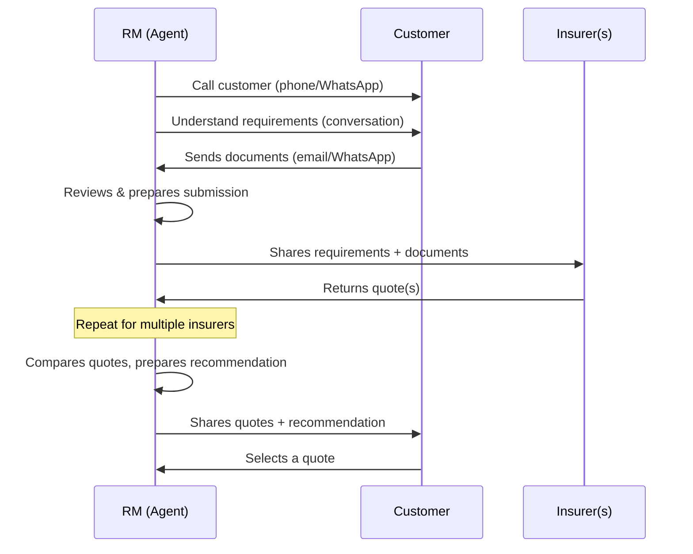
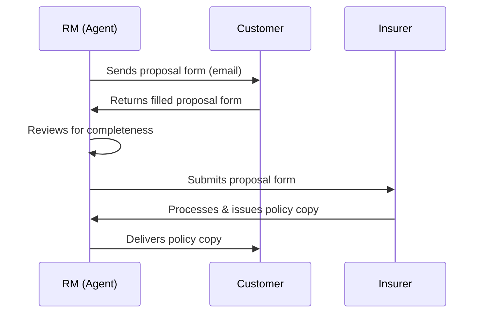
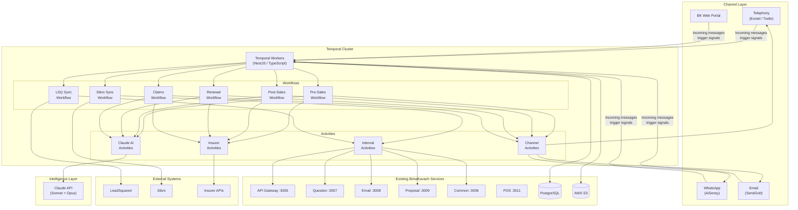
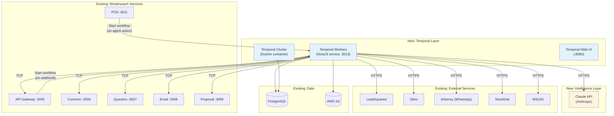
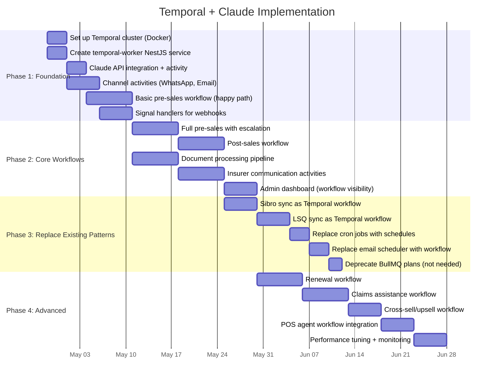

# BimaKavach — AI Agent Platform Analysis

## Table of Contents
- [1. Objective](#1-objective)
- [2. Workflows to Automate](#2-workflows-to-automate)
- [3. Platform Evaluations](#3-platform-evaluations)
  - [3.1 Claude (Anthropic API + Agent SDK)](#31-claude-anthropic-api--agent-sdk)
  - [3.2 Camunda](#32-camunda)
  - [3.3 Lyzr AI](#33-lyzr-ai)
  - [3.4 Temporal.io](#34-temporalio)
- [4. Comparison Matrix](#4-comparison-matrix)
- [5. Recommendation: Temporal + Claude](#5-recommendation-temporal--claude)
  - [5.1 Why This Combination](#51-why-this-combination)
  - [5.2 Architecture Overview](#52-architecture-overview)
  - [5.3 Pre-Sales Workflow Implementation](#53-pre-sales-workflow-implementation)
  - [5.4 Post-Sales Workflow Implementation](#54-post-sales-workflow-implementation)
  - [5.5 Integration with Existing BimaKavach Stack](#55-integration-with-existing-bimakavach-stack)
  - [5.6 Implementation Roadmap](#56-implementation-roadmap)
  - [5.7 Cost Estimate](#57-cost-estimate)

---

## 1. Objective

BimaKavach currently relies on manual processes for key insurance brokerage workflows — relationship managers (RMs) manually call customers, collect documents, communicate with insurers, gather quotes, and manage the post-sales proposal-to-policy lifecycle. These are repetitive, multi-party, multi-day workflows that are prime candidates for AI agent automation.

We evaluated four platforms to determine which best fits our need to replace these manual RM workflows with AI agents:

1. **Claude** (Anthropic) — LLM + Agent SDK
2. **Camunda** — BPMN-based process orchestration
3. **Lyzr AI** — Low-code AI agent platform
4. **Temporal.io** — Durable execution / workflow orchestration

---

## 2. Workflows to Automate

### 2.1 Pre-Sales Flow

The current manual flow that RMs execute:



**Key characteristics:**
- Multi-party: Customer, RM, multiple insurers
- Multi-channel: Phone calls, WhatsApp (AiSensy), email (SendGrid)
- Long-running: Can span days or weeks
- Document-heavy: Policy documents, financial statements, loss records
- Decision-intensive: Quote comparison, coverage analysis, risk assessment

### 2.2 Post-Sales Flow



**Key characteristics:**
- Sequential with wait states (waiting for customer/insurer responses)
- Document processing (proposal form review, completeness check)
- Status tracking needed (which stage is each policy at?)
- Error handling (incomplete forms, insurer rejections)

### 2.3 Other Flows to Automate

- **Renewal management** — Proactive outreach before policy expiry
- **Claims assistance** — Guiding customers through claims filing
- **Endorsement requests** — Policy modification coordination
- **Cross-sell/upsell** — Identifying coverage gaps and recommending additional products

---

## 3. Platform Evaluations

### 3.1 Claude (Anthropic API + Agent SDK)

**What it is:** Claude is a large language model from Anthropic, available via API with an Agent SDK for building autonomous AI agents. It provides the *intelligence layer* — understanding conversations, reading documents, and making decisions.

**Core Capabilities:**
- **Messages API** — Direct model interaction with tool use (function calling)
- **Agent SDK** — Python and TypeScript SDKs for building multi-turn autonomous agents
- **Vision** — Can read and understand PDFs, images, scanned documents
- **Extended Thinking** — Deep reasoning for complex analysis (quote comparison, risk assessment)
- **Tool Use** — Agents can call external APIs, databases, and systems
- **Structured Outputs** — Consistent, parseable responses for system integration
- **Batch API** — 50% cost reduction for non-time-sensitive processing

**Fit for BimaKavach:**

| Capability | Rating | Notes |
|-----------|--------|-------|
| Conversational AI (talking to customers/insurers) | ★★★★★ | Best-in-class for nuanced insurance conversations, Hindi/English |
| Document understanding (policies, proposals, quotes) | ★★★★★ | Can read PDFs, extract fields, compare quotes, understand insurance jargon |
| Decision making (which quote is best, what to ask) | ★★★★★ | Can reason about coverage gaps, premium comparison, risk assessment |
| Multi-channel orchestration | ☆☆☆☆☆ | Not built-in — need to build email/WhatsApp/telephony connectors |
| Workflow state management | ☆☆☆☆☆ | No native "wait for customer reply" or "track which stage we're at" |
| Long-running process management | ☆☆☆☆☆ | Agent SDK is for single-session tasks, not weeks-long processes |
| Human-in-the-loop | ★★☆☆☆ | Supports it within a session, but not across days/weeks |
| Retry/failure handling | ★☆☆☆☆ | No built-in retry, DLQ, or failure recovery for multi-step flows |

**Pricing:** Token-based.

| Model | Input (per 1M tokens) | Output (per 1M tokens) | Best For |
|-------|----------------------|------------------------|----------|
| Claude Sonnet 4.6 | ~$3 | ~$15 | Most agent tasks |
| Claude Opus 4.6 | ~$15 | ~$75 | Complex reasoning (quote comparison, risk analysis) |
| Claude Haiku 4.5 | ~$0.80 | ~$4 | Simple classification, routing |

**Estimated monthly cost for BimaKavach:** $200-800/month depending on conversation volume and model mix. Prompt caching and batch API can reduce this by 30-50%.

**What you'd still need to build:**
- Workflow orchestration (tracking which step each policy is at)
- State persistence (conversations spanning days/weeks)
- Channel connectors (WhatsApp via AiSensy, email via SendGrid, telephony)
- Retry/failure handling for multi-step flows
- Dashboard for RM oversight and escalation

**Verdict:** Claude is the **brain** but not the **body**. It provides exceptional intelligence for understanding customers, reading documents, and making decisions — but it needs workflow infrastructure around it to manage the multi-day, multi-party insurance processes.

---

### 3.2 Camunda

**What it is:** Camunda is a BPMN-based process orchestration platform. You design workflows visually as flowcharts (BPMN diagrams), and Camunda's Zeebe engine executes them — routing tasks to humans or systems, managing state, and handling failures.

**Core Capabilities:**
- **BPMN Process Engine (Zeebe)** — Executes workflows defined as BPMN diagrams
- **DMN Decision Tables** — Business rules engine (e.g., "if sum insured > 1Cr, route to senior RM")
- **User Tasks** — Assign work to humans, track completion, handle escalation
- **Service Tasks** — Call external APIs and systems
- **Connectors** — Pre-built integrations (REST, Kafka, email, Slack)
- **Operate Dashboard** — Monitor running workflows, incidents, metrics
- **Tasklist** — UI for human workers to see and complete their assigned tasks

**Fit for BimaKavach:**

| Capability | Rating | Notes |
|-----------|--------|-------|
| Workflow orchestration | ★★★★★ | This is literally what it's built for — multi-step, multi-party processes |
| Human-in-the-loop | ★★★★★ | Native user tasks — assign work to RMs, track completion, escalation |
| Long-running processes | ★★★★★ | Can manage workflows spanning weeks/months (policy lifecycle) |
| State management | ★★★★★ | Built-in process variables, audit trail, versioning |
| Decision tables (DMN) | ★★★★★ | Great for rules like routing, eligibility, approval thresholds |
| Conversational AI | ☆☆☆☆☆ | No native AI — would need external LLM integration |
| Document understanding | ☆☆☆☆☆ | No native capability — needs Claude/Document AI as a service task |
| Multi-channel support | ★★★☆☆ | Connector ecosystem exists, but custom connectors needed for AiSensy, SendGrid |
| Observability | ★★★★☆ | Operate dashboard shows all running processes and incidents |

**Pricing:**

| Tier | Cost | Notes |
|------|------|-------|
| Self-managed (Zeebe) | Free | Open-source engine, you manage infrastructure |
| Camunda Platform (SaaS) | ~$100-500/month | For small teams, includes Operate + Tasklist |
| Enterprise | $2,000-10,000+/month | Advanced features, SLA, support |

**Learning Curve:** Medium-High.
- Team needs to learn BPMN modeling (visual process design)
- Zeebe gateway concepts, job workers, message correlation
- JavaScript/TypeScript SDK exists but ecosystem is Java-centric
- DMN for business rules adds another learning dimension

**Strengths:**
- Battle-tested process orchestration (used by major banks, insurers)
- Excellent audit trail — every process step is logged
- Visual process designer makes workflows understandable by business stakeholders
- Strong human-in-the-loop patterns with Tasklist

**Weaknesses:**
- Zero AI intelligence — all cognitive tasks need external integration
- BPMN/visual-first approach doesn't match your team's code-first culture (NestJS/TypeScript)
- Java-centric ecosystem — TypeScript support is secondary
- Heavy platform overhead for what are essentially "call Claude, wait for response" flows
- Connector development for your specific integrations (AiSensy, MSG91) requires effort

**Verdict:** Excellent at process orchestration and human-in-the-loop, but adds significant platform complexity. The visual BPMN approach is a cultural mismatch for a code-first NestJS team. Would work, but heavier than needed.

---

### 3.3 Lyzr AI

**What it is:** Lyzr is an India-based startup offering a low-code AI agent platform for building enterprise AI agents quickly. It provides pre-built agent templates and a framework for creating conversational AI agents with minimal code.

**Core Capabilities:**
- **Pre-built Agent Types** — Sales agents, support agents, workflow agents
- **Low-code Agent Builder** — Visual or minimal-code agent configuration
- **RAG (Retrieval Augmented Generation)** — Knowledge base integration
- **Agent Chaining** — Connect multiple agents for multi-step workflows
- **Python SDK** — Programmatic agent creation and management
- **LLM Agnostic** — Can use Claude, GPT, or other models as the underlying LLM

**Fit for BimaKavach:**

| Capability | Rating | Notes |
|-----------|--------|-------|
| Conversational AI | ★★★☆☆ | Pre-built agent types handle basic conversations well |
| Agent building speed | ★★★★☆ | Low-code approach means faster prototyping |
| Pre-built templates | ★★★☆☆ | Sales, support, and workflow agent templates |
| Document understanding | ★★★☆☆ | RAG-based, works for structured docs |
| Multi-channel support | ★★☆☆☆ | Some integrations, but ecosystem is young |
| Workflow orchestration | ★★☆☆☆ | Agent chaining exists but not mature |
| Long-running processes | ★☆☆☆☆ | Not designed for week-long policy lifecycle management |
| Human-in-the-loop | ★★☆☆☆ | Basic escalation exists, not sophisticated |
| Enterprise maturity | ★☆☆☆☆ | Early-stage startup, smaller community |
| India-specific context | ★★★☆☆ | India-based, understands local market |
| Reliability/retry | ★☆☆☆☆ | No built-in durable execution or failure recovery |

**Pricing:** SaaS subscription model.

| Tier | Cost | Notes |
|------|------|-------|
| Starter | ~$50-200/month | Limited agents, limited conversations |
| Growth | ~$200-500/month | More agents, higher volume |
| Enterprise | Custom | Dedicated support, custom deployment |

*Plus underlying LLM costs (token-based, passed through).*

**Learning Curve:** Low — that's the primary selling point. Python SDK, pre-built templates, visual configuration.

**Strengths:**
- Fastest time to prototype — can have a working agent in hours
- India-based company — timezone alignment, understands local insurance context
- Low-code approach accessible to non-developers
- Can get early validation of AI agent concept quickly

**Weaknesses:**
- **Startup risk** — early-stage company, uncertain longevity
- **Vendor lock-in** — proprietary abstractions, hard to migrate away
- **Limited customization** — will hit walls when workflows get complex
- **Small community** — fewer resources for troubleshooting, fewer integrations
- **Python-only** — doesn't align with your NestJS/TypeScript stack
- **No durable execution** — workflows that span days/weeks need external orchestration
- **Unproven at scale** — no evidence of handling complex insurance workflows in production
- **Thin integration ecosystem** — custom connectors needed for your specific tools

**Verdict:** Good for quick prototyping and concept validation, but **risky for production** workloads. The combination of startup risk, limited maturity, Python-only SDK, and weak orchestration makes it unsuitable as the primary platform for BimaKavach's core workflows. Could be useful for a throwaway prototype to demo the concept.

---

### 3.4 Temporal.io

**What it is:** Temporal is a durable execution platform for orchestrating long-running, reliable workflows. It's code-first — you write workflows as regular TypeScript (or Go/Java/Python) functions that automatically survive failures, restarts, and deployments. Originally created at Uber (as Cadence), now an independent company.

**Core Capabilities:**
- **Durable Execution** — Workflows survive process crashes, server restarts, deployments
- **Workflows** — Long-running processes written as regular TypeScript code
- **Activities** — Individual steps that call external services (with automatic retry)
- **Signals** — Send data to a running workflow (e.g., "customer replied")
- **Queries** — Read workflow state without affecting execution (e.g., "what stage is this policy at?")
- **Timers & Schedules** — Wait for durations, schedule recurring tasks
- **Child Workflows** — Compose complex workflows from simpler ones
- **Workflow Visibility** — Query all running/completed workflows with SQL-like filters
- **TypeScript SDK** — First-class TypeScript support with full type safety
- **Web UI** — Built-in dashboard showing every workflow, its state, and history

**Fit for BimaKavach:**

| Capability | Rating | Notes |
|-----------|--------|-------|
| Workflow orchestration | ★★★★★ | Purpose-built for multi-step, long-running processes |
| Long-running processes | ★★★★★ | Workflows can run for months, survive server restarts |
| State management | ★★★★★ | Automatic — every step is durably persisted |
| Failure handling/retry | ★★★★★ | Best-in-class retry policies, timeouts, compensation |
| Human-in-the-loop | ★★★★☆ | Signals + queries — "customer replied" signal wakes a waiting workflow |
| TypeScript SDK | ★★★★★ | First-class support — perfect fit for NestJS team |
| Observability | ★★★★★ | Web UI shows every workflow, its state, and full execution history |
| Multi-channel support | ★★★★☆ | Write activities that call AiSensy, SendGrid, telephony APIs |
| Conversational AI | ☆☆☆☆☆ | No native AI — integrate Claude API as workflow activities |
| Document understanding | ☆☆☆☆☆ | No native capability — Claude/Document AI as activities |
| Scheduling & cron | ★★★★★ | Built-in schedules replace cron jobs |
| Scalability | ★★★★★ | Used by Netflix, Uber, Stripe at massive scale |
| Community/maturity | ★★★★★ | Large open-source community, well-documented, production-proven |

**Pricing:**

| Option | Cost | Notes |
|--------|------|-------|
| Self-hosted | Free | Apache 2.0 open source, you manage the cluster |
| Temporal Cloud (Basic) | ~$200/month | Managed service, pay per action |
| Temporal Cloud (Scaling) | ~$200-500/month | ~$25 per million actions |
| Temporal Cloud (Enterprise) | Custom | SLA, dedicated support, compliance |

**Learning Curve:** Medium. Key concepts to learn:
- **Workflows vs Activities** — Workflows are deterministic orchestration logic; activities are side-effect-producing steps
- **Signals & Queries** — How external events (customer replies) interact with running workflows
- **Retry Policies** — Configuring how activities retry on failure
- **Task Queues** — How work is distributed to workers

For a TypeScript team, the mental model typically clicks within 1-2 weeks. Workflows read like regular async/await TypeScript code.

**Strengths:**
- Code-first TypeScript aligns perfectly with your NestJS team
- Workflows are just TypeScript functions — easy to test, version, and review
- Automatic retry and failure recovery eliminates the fragile patterns in your current system
- Signals provide a clean pattern for "wait for customer response" (days/weeks)
- Built-in Web UI provides instant visibility into all running workflows
- Can replace BullMQ (from your data platform plans) — handles queuing, retry, scheduling
- Apache 2.0 license — no vendor lock-in
- Self-hosted option alongside your existing Docker infrastructure

**Weaknesses:**
- No AI intelligence — purely an orchestration layer
- No visual process designer (unlike Camunda) — business stakeholders can't design workflows
- Requires TypeScript developers to build/modify workflows (not low-code)
- Self-hosted cluster requires operational knowledge (PostgreSQL or Cassandra backend)
- Temporal Cloud adds a vendor dependency (mitigated by self-hosted option)

**Verdict:** The best workflow orchestration platform for a TypeScript team. Perfectly handles the long-running, multi-party, multi-day nature of insurance workflows. Needs an LLM (Claude) for the intelligence layer.

---

## 4. Comparison Matrix

| Parameter | Claude API | Camunda | Lyzr AI | Temporal |
|-----------|:---------:|:-------:|:-------:|:--------:|
| **AI / Conversational Intelligence** | ★★★★★ | ☆☆☆☆☆ | ★★★☆☆ | ☆☆☆☆☆ |
| **Workflow Orchestration** | ☆☆☆☆☆ | ★★★★★ | ★★☆☆☆ | ★★★★★ |
| **Long-running Process Mgmt** | ☆☆☆☆☆ | ★★★★★ | ★★☆☆☆ | ★★★★★ |
| **Human-in-the-Loop** | ★★☆☆☆ | ★★★★★ | ★★★☆☆ | ★★★★☆ |
| **Document Understanding** | ★★★★★ | ☆☆☆☆☆ | ★★★☆☆ | ☆☆☆☆☆ |
| **NestJS / TypeScript Fit** | ★★★★☆ | ★★★☆☆ | ★★☆☆☆ | ★★★★★ |
| **Multi-channel (Email/WhatsApp/Phone)** | ★★☆☆☆ | ★★★☆☆ | ★★★☆☆ | ★★★★☆ |
| **Reliability / Retry / DLQ** | ★☆☆☆☆ | ★★★★☆ | ★★☆☆☆ | ★★★★★ |
| **Observability** | ★★☆☆☆ | ★★★★☆ | ★★☆☆☆ | ★★★★★ |
| **Learning Curve (for your team)** | Low | Medium-High | Low | Medium |
| **Enterprise Maturity** | High | High | Low | High |
| **Monthly Cost (est.)** | $200-800 | $100-2,000+ | $50-500 | $200-500 |
| **Vendor Lock-in Risk** | Medium | Medium | High | Low (OSS) |
| **Existing Stack Integration** | Easy (REST) | Medium (SDK) | Medium (Python) | Easy (TS SDK) |
| **Can Replace BullMQ Plans** | No | Partial | No | Yes |
| **India Insurance Domain** | Via prompting | None | Some | None |

### Key Insight

No single platform solves both problems:

```
┌─────────────────────────────────────────────────────────────┐
│                    THE TWO PROBLEMS                          │
│                                                              │
│  1. INTELLIGENCE                    2. ORCHESTRATION         │
│     "Understand the customer"          "Manage the process"  │
│     "Read the documents"               "Wait for replies"    │
│     "Compare the quotes"               "Retry on failure"    │
│     "Draft the communication"          "Track every step"    │
│                                                              │
│  Claude ✓  Camunda ✗               Claude ✗  Camunda ✓      │
│  Lyzr   ~  Temporal ✗              Lyzr   ✗  Temporal ✓     │
└─────────────────────────────────────────────────────────────┘
```

---

## 5. Recommendation: Temporal + Claude

### 5.1 Why This Combination

**Temporal + Claude** is the recommended combination because each platform excels exactly where the other is weak:

| Need | Temporal Provides | Claude Provides |
|------|-------------------|-----------------|
| Managing multi-day, multi-party workflows | ★★★★★ Durable execution, signals, timers | — |
| Understanding customer needs | — | ★★★★★ Natural language understanding |
| Waiting for customer/insurer responses | ★★★★★ Signals + condition waits | — |
| Reading and extracting from documents | — | ★★★★★ Vision + document understanding |
| Retrying failed insurer API calls | ★★★★★ Activity retry policies | — |
| Comparing quotes intelligently | — | ★★★★★ Reasoning + structured output |
| Tracking every workflow's status | ★★★★★ Web UI + visibility API | — |
| Drafting emails/WhatsApp messages | — | ★★★★★ Natural language generation |
| Handling parallel insurer queries | ★★★★★ Promise.all on activities | — |
| Escalating to human RM when needed | ★★★★★ Signals + queries | ★★★★★ Confidence scoring |

**Why NOT the alternatives:**

- **Camunda instead of Temporal:** Camunda would work for orchestration, but it's BPMN/visual-first while your team is code-first TypeScript. Temporal's TypeScript SDK is a natural extension of how you already write NestJS code. Camunda's Java-centric ecosystem adds friction.

- **Lyzr AI instead of Claude + Temporal:** Lyzr tries to be both the brain and the body but does neither as well. It's too immature for production insurance workflows, has startup risk, Python-only SDK, and weak orchestration for long-running processes.

- **Claude alone:** You'd end up building a poor man's Temporal with BullMQ + custom state machines + manual retry logic. The DATA_PLATFORM.md already identified these patterns as technical debt.

- **Temporal alone:** Pure orchestration without intelligence just automates the plumbing, not the cognitive work of understanding customers and documents.

### 5.2 Architecture Overview



**Component Responsibilities:**

| Component | Role |
|-----------|------|
| **Temporal Workers** | NestJS services that host workflow and activity code. Run alongside existing microservices. |
| **Workflows** | TypeScript functions that define the step-by-step process. Durable — survive crashes. |
| **Claude Activities** | Activities that call Claude API for intelligence tasks (conversation, document analysis, quote comparison). |
| **Channel Activities** | Activities that send/receive messages via AiSensy (WhatsApp), SendGrid (email), telephony. |
| **Insurer Activities** | Activities that communicate with insurer APIs/portals to submit requirements and collect quotes. |
| **Internal Activities** | Activities that call existing BimaKavach microservices (Question Service for quotes, Email Service for templates, etc.). |
| **Signal Handlers** | Receive external events ("customer replied", "insurer sent quote", "document uploaded") and wake the waiting workflow. |

### 5.3 Pre-Sales Workflow Implementation

```typescript
// workflows/pre-sales.workflow.ts
import { proxyActivities, condition, setHandler, sleep } from '@temporalio/workflow';
import type * as activities from '../activities';

const {
  callCustomerWithClaude,
  processDocumentsWithClaude,
  compareQuotesWithClaude,
  draftCommunicationWithClaude,
  sendWhatsAppMessage,
  sendEmail,
  getQuoteFromInsurer,
  createLeadInLSQ,
  logActivityInLSQ,
  lookupProductDetails,
  notifyRMForEscalation,
} = proxyActivities<typeof activities>({
  startToCloseTimeout: '5 minutes',
  retry: { maximumAttempts: 3, backoffCoefficient: 2 },
});

interface PreSalesInput {
  customerId: number;
  customerName: string;
  customerPhone: string;
  customerEmail: string;
  companyId: number;
  productId: number;
  source: 'website' | 'referral' | 'campaign' | 'pos';
}

// State that external systems can query
let currentStage = 'initiated';
let documentsReceived: Document[] = [];
let quotesCollected: Quote[] = [];
let customerSelection: QuoteSelection | null = null;
let conversationHistory: Message[] = [];

export async function preSalesWorkflow(input: PreSalesInput): Promise<PolicyResult> {

  // ── Signal handlers (receive external events) ──────────────

  // When customer sends a document (via WhatsApp/email webhook)
  setHandler(documentReceivedSignal, (doc: Document) => {
    documentsReceived.push(doc);
  });

  // When insurer sends a quote (via email/portal webhook)
  setHandler(insurerQuoteSignal, (quote: Quote) => {
    quotesCollected.push(quote);
  });

  // When customer selects a quote
  setHandler(customerSelectionSignal, (selection: QuoteSelection) => {
    customerSelection = selection;
  });

  // When customer replies to a message
  setHandler(customerReplySignal, (message: Message) => {
    conversationHistory.push(message);
  });

  // ── Query handlers (check state without affecting workflow) ─

  setHandler(getStatusQuery, () => ({
    stage: currentStage,
    documentsCount: documentsReceived.length,
    quotesCount: quotesCollected.length,
    hasSelection: customerSelection !== null,
  }));

  // ── Step 1: Create lead in CRM ─────────────────────────────
  currentStage = 'lead_created';
  await createLeadInLSQ({
    name: input.customerName,
    phone: input.customerPhone,
    email: input.customerEmail,
    productId: input.productId,
    source: input.source,
  });

  // ── Step 2: Initial customer contact ───────────────────────
  currentStage = 'initial_contact';
  const productDetails = await lookupProductDetails(input.productId);

  const initialMessage = await draftCommunicationWithClaude({
    type: 'initial_outreach',
    context: {
      customerName: input.customerName,
      product: productDetails,
      tone: 'professional_friendly',
    },
  });

  await sendWhatsAppMessage({
    phone: input.customerPhone,
    message: initialMessage,
    template: 'pre_sales_intro',
  });

  // ── Step 3: Needs assessment conversation ──────────────────
  currentStage = 'needs_assessment';

  // Claude-powered conversation loop
  let needsAssessmentComplete = false;
  let requirements: InsuranceRequirements | null = null;

  while (!needsAssessmentComplete) {
    // Wait for customer reply (up to 24 hours, send reminder at 4 hours)
    const replied = await condition(
      () => conversationHistory.length > 0,
      '4 hours'
    );

    if (!replied) {
      // Send a gentle follow-up
      const reminder = await draftCommunicationWithClaude({
        type: 'follow_up_reminder',
        context: { customerName: input.customerName, product: productDetails },
      });
      await sendWhatsAppMessage({ phone: input.customerPhone, message: reminder });

      // Wait another 20 hours
      const repliedAfterReminder = await condition(
        () => conversationHistory.length > 0,
        '20 hours'
      );

      if (!repliedAfterReminder) {
        // Escalate to human RM
        currentStage = 'escalated_to_rm';
        await notifyRMForEscalation({
          reason: 'Customer unresponsive after 24 hours',
          customerId: input.customerId,
          context: conversationHistory,
        });
        // Wait for RM to resolve (up to 7 days)
        await condition(() => conversationHistory.length > 0, '7 days');
      }
    }

    // Process the latest customer message with Claude
    const latestMessage = conversationHistory.pop()!;
    const analysis = await callCustomerWithClaude({
      conversationHistory,
      latestMessage,
      product: productDetails,
      goal: 'assess_insurance_needs',
    });

    if (analysis.needsAssessmentComplete) {
      needsAssessmentComplete = true;
      requirements = analysis.requirements;
    } else {
      // Claude generates the next question/response
      await sendWhatsAppMessage({
        phone: input.customerPhone,
        message: analysis.nextMessage,
      });
    }
  }

  // ── Step 4: Wait for documents ─────────────────────────────
  currentStage = 'awaiting_documents';

  // Ask customer for required documents
  const docRequest = await draftCommunicationWithClaude({
    type: 'document_request',
    context: { requirements, customerName: input.customerName },
  });
  await sendWhatsAppMessage({ phone: input.customerPhone, message: docRequest });
  await sendEmail({
    to: input.customerEmail,
    template: 'document_request',
    data: { requirements, customerName: input.customerName },
  });

  // Wait for all required documents (up to 7 days)
  const allDocsReceived = await condition(
    () => documentsReceived.length >= requirements!.requiredDocuments.length,
    '7 days'
  );

  if (!allDocsReceived) {
    // Send reminders, escalate if needed
    await sendWhatsAppMessage({
      phone: input.customerPhone,
      message: `Hi ${input.customerName}, we're still waiting for some documents. Could you please share them so we can get you the best quotes?`,
    });
  }

  // ── Step 5: Process documents with Claude ──────────────────
  currentStage = 'processing_documents';

  const processedDocs = await processDocumentsWithClaude({
    documents: documentsReceived,
    requirements,
    product: productDetails,
  });

  // ── Step 6: Get quotes from multiple insurers (parallel) ───
  currentStage = 'collecting_quotes';

  const eligibleInsurers = processedDocs.eligibleInsurers;
  const quotePromises = eligibleInsurers.map(insurer =>
    getQuoteFromInsurer({
      insurer,
      requirements,
      processedDocs,
      product: productDetails,
    })
  );

  // Fire all insurer requests in parallel, collect results
  const insurerQuotes = await Promise.allSettled(quotePromises);

  // Also wait for manually-received quotes (via signal) up to 3 days
  await condition(
    () => quotesCollected.length >= eligibleInsurers.length,
    '3 days'
  );

  // Merge auto-collected and signal-received quotes
  const allQuotes = [
    ...insurerQuotes
      .filter(r => r.status === 'fulfilled')
      .map(r => (r as PromiseFulfilledResult<Quote>).value),
    ...quotesCollected,
  ];

  // ── Step 7: Compare quotes with Claude ─────────────────────
  currentStage = 'comparing_quotes';

  const comparison = await compareQuotesWithClaude({
    quotes: allQuotes,
    requirements,
    product: productDetails,
    customerProfile: { companyId: input.companyId, industry: processedDocs.industry },
  });

  // ── Step 8: Share recommendation with customer ─────────────
  currentStage = 'recommendation_shared';

  const recommendation = await draftCommunicationWithClaude({
    type: 'quote_recommendation',
    context: {
      customerName: input.customerName,
      comparison,
      topPick: comparison.recommended,
    },
  });

  await sendWhatsAppMessage({ phone: input.customerPhone, message: recommendation });
  await sendEmail({
    to: input.customerEmail,
    template: 'quote_comparison',
    data: { comparison, recommendation: comparison.recommended },
  });

  await logActivityInLSQ({
    leadId: input.customerId,
    activity: 'quotes_shared',
    data: { quotesCount: allQuotes.length, recommended: comparison.recommended.insurerName },
  });

  // ── Step 9: Wait for customer selection ────────────────────
  currentStage = 'awaiting_selection';

  await condition(() => customerSelection !== null, '14 days');

  if (!customerSelection) {
    // Follow up and eventually escalate
    currentStage = 'selection_follow_up';
    await notifyRMForEscalation({
      reason: 'Customer has not selected a quote after 14 days',
      customerId: input.customerId,
      context: { quotesShared: allQuotes.length },
    });
    await condition(() => customerSelection !== null, '30 days');
  }

  // ── Step 10: Initiate post-sales workflow ──────────────────
  currentStage = 'proceeding_to_post_sales';

  // Start the post-sales workflow as a child workflow
  const policyResult = await executeChild(postSalesWorkflow, {
    args: [{
      customerId: input.customerId,
      customerName: input.customerName,
      customerPhone: input.customerPhone,
      customerEmail: input.customerEmail,
      companyId: input.companyId,
      selectedQuote: customerSelection!,
      requirements,
      documents: documentsReceived,
    }],
    workflowId: `post-sales-${input.customerId}-${Date.now()}`,
  });

  currentStage = 'completed';
  return policyResult;
}
```

**What this workflow demonstrates:**
- **Durable state**: If the server crashes at any point, the workflow resumes exactly where it left off
- **Signal-driven**: External events (customer replies, documents, quotes) wake the workflow via signals
- **Queryable**: The `getStatusQuery` handler lets the admin dashboard show real-time status
- **Timeout + escalation**: If customer doesn't respond in 24h, remind; if still silent, escalate to human RM
- **Parallel execution**: Queries to multiple insurers run simultaneously
- **Claude integration**: Every cognitive task (conversation, document processing, quote comparison, drafting messages) calls Claude as an activity
- **Child workflows**: Post-sales is a separate workflow, triggered as a child

### 5.4 Post-Sales Workflow Implementation

```typescript
// workflows/post-sales.workflow.ts

export async function postSalesWorkflow(input: PostSalesInput): Promise<PolicyResult> {

  let proposalFormReceived: ProposalForm | null = null;
  let insurerPolicyCopy: PolicyDocument | null = null;
  let currentStage = 'initiated';

  // Signal handlers
  setHandler(proposalFormSignal, (form: ProposalForm) => {
    proposalFormReceived = form;
  });
  setHandler(policyCopySignal, (policy: PolicyDocument) => {
    insurerPolicyCopy = policy;
  });

  // ── Step 1: Generate and send proposal form ────────────────
  currentStage = 'sending_proposal_form';

  const proposalForm = await generateProposalForm({
    selectedQuote: input.selectedQuote,
    product: input.requirements.product,
    customerDetails: {
      name: input.customerName,
      companyId: input.companyId,
    },
  });

  // Pre-fill what we can using Claude
  const preFilled = await preFilledProposalWithClaude({
    form: proposalForm,
    existingDocuments: input.documents,
    customerProfile: input.requirements,
  });

  await sendEmail({
    to: input.customerEmail,
    template: 'proposal_form',
    data: { formLink: preFilled.link, customerName: input.customerName },
  });

  await sendWhatsAppMessage({
    phone: input.customerPhone,
    message: `Hi ${input.customerName}, I've sent the proposal form to your email. I've pre-filled what I could from our earlier conversation. Please review, complete the remaining fields, and send it back.`,
  });

  // ── Step 2: Wait for completed proposal form ───────────────
  currentStage = 'awaiting_proposal_form';

  // Reminder schedule: 2 days, 5 days, 7 days
  for (const reminderDays of [2, 5, 7]) {
    const received = await condition(
      () => proposalFormReceived !== null,
      `${reminderDays} days`
    );
    if (received) break;

    await sendWhatsAppMessage({
      phone: input.customerPhone,
      message: await draftCommunicationWithClaude({
        type: 'proposal_form_reminder',
        context: { customerName: input.customerName, daysSent: reminderDays },
      }),
    });
  }

  if (!proposalFormReceived) {
    await notifyRMForEscalation({
      reason: 'Proposal form not received after 7 days',
      customerId: input.customerId,
    });
    await condition(() => proposalFormReceived !== null, '30 days');
  }

  // ── Step 3: Review proposal form with Claude ───────────────
  currentStage = 'reviewing_proposal_form';

  const review = await reviewProposalWithClaude({
    form: proposalFormReceived!,
    product: input.requirements.product,
    insurer: input.selectedQuote.insurer,
  });

  if (!review.isComplete) {
    // Ask customer to fill missing fields
    await sendWhatsAppMessage({
      phone: input.customerPhone,
      message: review.missingFieldsMessage,
    });
    // Wait for updated form
    proposalFormReceived = null;
    await condition(() => proposalFormReceived !== null, '5 days');
  }

  // ── Step 4: Submit to insurer ──────────────────────────────
  currentStage = 'submitted_to_insurer';

  await submitProposalToInsurer({
    insurer: input.selectedQuote.insurer,
    proposalForm: proposalFormReceived!,
    supportingDocuments: input.documents,
  });

  await logActivityInLSQ({
    leadId: input.customerId,
    activity: 'proposal_submitted',
    data: { insurer: input.selectedQuote.insurerName },
  });

  // ── Step 5: Wait for policy copy from insurer ──────────────
  currentStage = 'awaiting_policy_copy';

  await condition(() => insurerPolicyCopy !== null, '14 days');

  if (!insurerPolicyCopy) {
    // Follow up with insurer
    await followUpWithInsurer({
      insurer: input.selectedQuote.insurer,
      proposalRef: proposalFormReceived!.referenceNumber,
    });
    await condition(() => insurerPolicyCopy !== null, '14 days');
  }

  // ── Step 6: Deliver policy to customer ─────────────────────
  currentStage = 'delivering_policy';

  // Store policy document
  const policyRecord = await createPolicyRecord({
    customerId: input.customerId,
    companyId: input.companyId,
    insurer: input.selectedQuote.insurer,
    policyCopy: insurerPolicyCopy!,
    premium: input.selectedQuote.premium,
  });

  // Send to customer
  await sendEmail({
    to: input.customerEmail,
    template: 'policy_issued',
    data: { policyNumber: policyRecord.policyNumber, customerName: input.customerName },
    attachments: [insurerPolicyCopy!.url],
  });

  await sendWhatsAppMessage({
    phone: input.customerPhone,
    message: `Great news ${input.customerName}! Your ${input.requirements.product.name} policy has been issued. Policy number: ${policyRecord.policyNumber}. I've sent the policy copy to your email.`,
  });

  // ── Step 7: Sync to external systems ───────────────────────
  currentStage = 'syncing';

  // These run as child workflows with their own retry logic
  await Promise.all([
    executeChild(sibroSyncWorkflow, {
      args: [{ policyId: policyRecord.id }],
    }),
    executeChild(lsqSyncWorkflow, {
      args: [{
        leadId: input.customerId,
        policyId: policyRecord.id,
        activity: 'policy_purchased',
      }],
    }),
  ]);

  currentStage = 'completed';
  return policyRecord;
}
```

### 5.5 Integration with Existing BimaKavach Stack

Temporal + Claude integrates cleanly with the existing architecture without replacing the current microservices:



**Key integration points:**

| Trigger | Source | Action |
|---------|--------|--------|
| New lead from website | API Gateway webhook | Start `preSalesWorkflow` |
| Customer WhatsApp reply | AiSensy webhook → API Gateway | Send signal to running workflow |
| Customer uploads document | BK Web / email | Send signal with document URL |
| Insurer sends quote (email) | Email parsing service | Send signal to running workflow |
| POS agent creates lead | POS Backend | Start `preSalesWorkflow` |
| Policy payment completed | Payment gateway webhook | Start `postSalesWorkflow` |
| Policy nearing expiry | Temporal schedule (replaces cron) | Start `renewalWorkflow` |

**Docker Compose addition:**

```yaml
# Addition to existing docker-compose.yml
services:
  temporal:
    image: temporalio/auto-setup:latest
    ports:
      - "7233:7233"   # gRPC frontend
    environment:
      - DB=postgresql
      - DB_PORT=5432
      - POSTGRES_USER=${DB_USER}
      - POSTGRES_PWD=${DB_PASSWORD}
      - POSTGRES_SEEDS=postgres  # or your RDS endpoint
    networks:
      - local

  temporal-ui:
    image: temporalio/ui:latest
    ports:
      - "8080:8080"
    environment:
      - TEMPORAL_ADDRESS=temporal:7233
    networks:
      - local

  temporal-worker:
    build: ./temporal-worker   # New NestJS service
    ports:
      - "3013:3013"
    environment:
      - TEMPORAL_ADDRESS=temporal:7233
      - CLAUDE_API_KEY=${CLAUDE_API_KEY}
      - COMMON_SERVICE_HOST=common
      - QUESTION_SERVICE_HOST=question
      - EMAIL_SERVICE_HOST=email
    networks:
      - local
```

### 5.6 Implementation Roadmap



**Phase 1 (Weeks 1-3): Foundation**
- Set up Temporal cluster alongside existing Docker services
- Create the `temporal-worker` NestJS service with Claude API integration
- Build channel activities (AiSensy WhatsApp, SendGrid email)
- Implement basic pre-sales workflow (happy path only)
- Set up webhook receivers to send signals to running workflows

**Phase 2 (Weeks 4-7): Core Workflows**
- Full pre-sales workflow with timeout handling, reminders, escalation
- Post-sales workflow (proposal form lifecycle)
- Document processing pipeline (upload → Claude analysis → structured data)
- Insurer communication activities
- Admin dashboard using Temporal's visibility API

**Phase 3 (Weeks 8-10): Replace Existing Patterns**
This is where Temporal replaces the BullMQ + PostgreSQL approach from DATA_PLATFORM.md:
- Sibro sync becomes a Temporal workflow (with built-in retry, visibility, DLQ)
- LSQ sync becomes a Temporal workflow (with rate limiting via activity config)
- Cron jobs become Temporal schedules
- Email scheduling becomes workflow timers
- **BullMQ/Redis is no longer needed** — Temporal handles all queuing, retry, and scheduling

**Phase 4 (Weeks 11-15): Advanced Workflows**
- Renewal management (proactive outreach before expiry)
- Claims assistance (guiding customers through filing)
- Cross-sell/upsell (Claude identifies coverage gaps)
- POS agent workflow integration

### 5.7 Cost Estimate

| Component | Monthly Cost | Notes |
|-----------|-------------|-------|
| **Temporal Cloud** | $200-500 | Or free if self-hosted on existing infrastructure |
| **Claude API** | $300-800 | Sonnet for most tasks, Opus for complex reasoning |
| **Additional AWS resources** | $50-100 | Temporal DB storage on RDS, worker ECS tasks |
| **Total (Temporal Cloud)** | **$550-1,400** | Managed, zero ops overhead |
| **Total (Self-hosted)** | **$350-900** | Requires ops knowledge for Temporal cluster |

**Cost optimization strategies:**
- Use **Claude Haiku** for simple routing/classification tasks (~80% cheaper)
- Use **Claude Sonnet** for conversations and document processing
- Use **Claude Opus** only for complex quote comparison and risk analysis
- Enable **prompt caching** for repeated document analysis patterns
- Use **batch API** (50% discount) for non-time-sensitive processing (analytics, bulk operations)

**Comparison with alternatives:**

| Approach | Monthly Cost | What You Get |
|----------|-------------|-------------|
| Temporal + Claude (recommended) | $550-1,400 | Full AI automation + reliable orchestration |
| Camunda + Claude | $600-2,500 | Same AI + heavier orchestration platform |
| Lyzr AI alone | $300-800 | Limited AI, weak orchestration, startup risk |
| Claude + custom BullMQ | $400-1,000 | AI works, but you build orchestration yourself |
| Manual RMs (current) | $15,000-40,000+ | RM salaries for equivalent throughput |

---

*This analysis was prepared based on the BimaKavach architecture as documented in ARCHITECTURE.md and DATA_PLATFORM.md, with evaluation of each platform's capabilities against the specific requirements of insurance brokerage workflow automation.*
