# BimaKavach Platform Architecture

## Table of Contents
- [1. System Overview](#1-system-overview)
- [2. Technical Architecture](#2-technical-architecture)
  - [2.1 High-Level System Diagram](#21-high-level-system-diagram)
  - [2.2 Service Details](#22-service-details)
  - [2.3 Inter-Service Communication](#23-inter-service-communication)
  - [2.4 Database Architecture](#24-database-architecture)
  - [2.5 External Integrations](#25-external-integrations)
  - [2.6 LeadSquared Integration](#26-leadsquared-integration)
  - [2.7 Sibro Integration](#27-sibro-integration)
  - [2.8 Underwriting Platform](#28-underwriting-platform)
  - [2.9 Agentic Workflow (RM Automation)](#29-agentic-workflow-rm-automation)
  - [2.10 Reporting Engine V2](#210-reporting-engine-v2)
  - [2.11 Document Signer](#211-document-signer)
  - [2.12 Infrastructure & Deployment](#212-infrastructure--deployment)
- [3. Usability Architecture](#3-usability-architecture)
  - [3.1 User Roles & Access](#31-user-roles--access)
  - [3.2 Customer Journey (BK Web)](#32-customer-journey-bk-web)
  - [3.3 Admin Journey (bi-admin)](#33-admin-journey-bi-admin)
  - [3.4 POS Agent Journey](#34-pos-agent-journey)
  - [3.5 Feature-to-Service Mapping](#35-feature-to-service-mapping)

---

## 1. System Overview

BimaKavach is a **B2B insurance aggregation platform** that enables businesses to compare, purchase, and manage commercial insurance policies from 25+ insurers across 20+ product categories.

```mermaid
graph TB
    subgraph "User-Facing Applications"
        WEB["BK Web V2.0<br/><i>Customer Portal</i><br/>Next.js 14 | Port 3000"]
        POS_APP["POS Mobile App<br/><i>Agent App</i><br/>React Native + Expo"]
        DOCSIGN["Document Signer<br/><i>PDF Signing Component</i><br/>Next.js 14"]
    end

    subgraph "Admin Dashboards"
        ADMIN["bi-admin V2<br/><i>Internal Admin Panel</i><br/>Next.js 13 | Port 3000"]
        POS_ADMIN["POS Admin<br/><i>POS Admin Panel</i><br/>Next.js 16 | Port 3012"]
        POS_REPORT["POS Reporting<br/><i>Analytics Dashboard</i><br/>React | CloudFront"]
    end

    subgraph "Underwriting Platform"
        UW_ENGINE["UW Engine (Multi-Product)<br/><i>Scoring & Decision</i><br/>NestJS 11 | Port 4000"]
        UW_DASH["UW Dashboard (Multi-Product)<br/><i>Underwriting UI</i><br/>Next.js 16 | Port 4001"]
        UW_DNO_ENGINE["UW Decision Engine (D&O)<br/><i>D&O Scoring & Policy Analytics</i><br/>NestJS 11 | Port 3000"]
        UW_DNO_DASH["UW Dashboard (D&O)<br/><i>D&O Underwriting UI</i><br/>Next.js 16 | Port 3001"]
    end

    subgraph "RM Automation"
        AGENTIC_BE["Agentic Workflow Backend<br/><i>Case Management + AI</i><br/>NestJS 10 | Port 3001"]
        AGENTIC_FE["Agentic Workflow Frontend<br/><i>RM Dashboard</i><br/>Next.js 14 | Port 3000"]
    end

    subgraph "Reporting & Analytics"
        REPORT_ENGINE["Reporting Engine V2<br/><i>ETL + Sync</i><br/>Express.js | Port 3000"]
        METABASE["Metabase<br/><i>BI Dashboards</i><br/>Port 3001"]
        CHATBOT["NL→SQL Chatbot<br/><i>Natural Language Queries</i>"]
        NGINX_REPORT["Nginx Proxy<br/>Port 3013"]
    end

    subgraph "Backend Services"
        GW["API Gateway<br/>NestJS | Port 3005"]
        POS_API["POS Backend<br/>NestJS | Port 3011"]
        COMMON["Common Service<br/>NestJS | Port 3006"]
        QUESTION["Question Service<br/>NestJS | Port 3007"]
        EMAIL["Email Service<br/>NestJS | Port 3008"]
        PROPOSAL["Proposal Form Service<br/>NestJS | Port 3009"]
    end

    WEB -->|HTTPS + HMAC| GW
    ADMIN -->|HTTPS + JWT| GW
    POS_APP -->|HTTPS + JWT| POS_API
    POS_ADMIN -->|NextAuth + HMAC| POS_API
    POS_REPORT -->|Google Sheets API| SHEETS[(Google Sheets)]

    GW -->|TCP| COMMON
    GW -->|TCP| QUESTION
    GW -->|TCP| EMAIL
    GW -->|TCP| PROPOSAL

    POS_API -->|TCP| COMMON
    POS_API -->|TCP| QUESTION

    QUESTION -->|TCP| COMMON
    QUESTION -->|TCP| EMAIL
    QUESTION -->|TCP| PROPOSAL
    PROPOSAL -->|TCP| COMMON
    PROPOSAL -->|TCP| EMAIL
    PROPOSAL -->|TCP| QUESTION
    EMAIL -->|TCP| COMMON

    UW_DASH -->|HTTPS + JWT| UW_ENGINE
    UW_DNO_DASH -->|HTTPS + JWT| UW_DNO_ENGINE
    UW_ENGINE -->|HTTPS| PROBE_EXT["Probe42 API"]
    UW_ENGINE -->|HTTPS| CLAUDE_EXT["Claude API"]
    UW_DNO_ENGINE -->|HTTPS| PROBE_EXT
    UW_DNO_ENGINE -->|HTTPS| CLAUDE_EXT

    AGENTIC_FE -->|HTTPS + NextAuth| AGENTIC_BE
    AGENTIC_BE -->|HTTPS| AISENSY_EXT["AiSensy WhatsApp"]
    AGENTIC_BE -->|HTTPS| SG_EXT["SendGrid"]
    AGENTIC_BE -->|HTTPS| CLAUDE_EXT

    REPORT_ENGINE -->|HTTPS| LSQ_EXT["LeadSquared API"]
    REPORT_ENGINE -->|HTTPS| SIBRO_EXT["Sibro API"]
    REPORT_ENGINE -->|SQL| SOURCE_DB[(Source PostgreSQL)]
    NGINX_REPORT --> METABASE
    NGINX_REPORT --> CHATBOT
    METABASE --> REPORT_DB[(Reporting PostgreSQL)]
    REPORT_ENGINE --> REPORT_DB
```

---

## 2. Technical Architecture

### 2.1 High-Level System Diagram

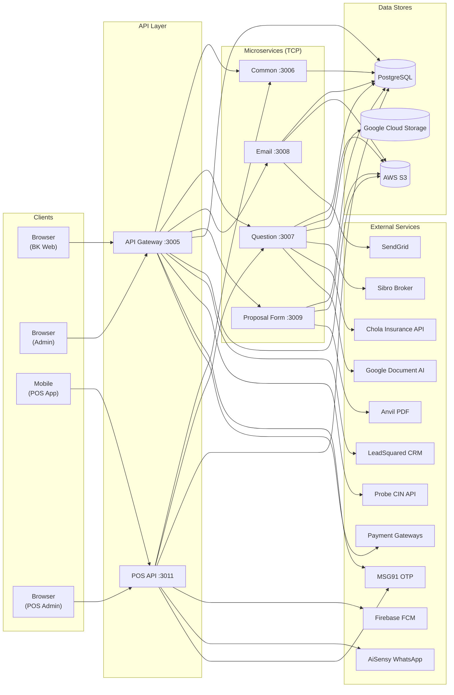

### 2.2 Service Details

| Service | Repo | Tech Stack | Port | Purpose |
|---------|------|-----------|------|---------|
| **BK Web V2.0** | `BK_Web_V2.0` | Next.js 14, React 18, MUI, Framer Motion | 3000 | Customer-facing insurance portal |
| **bi-admin V2** | `bi-admin-V2` | Next.js 13, TypeScript, Redux Toolkit, MUI, Tailwind, Ant Design | 3000 | Internal admin dashboard |
| **API Gateway** | `microservice-api-gateway` | NestJS 10, TypeScript, TypeORM | 3005 | Central API entry point, auth, routing |
| **Common Service** | `microservice-common` | NestJS 10, TypeScript, TypeORM | 3006 | Master data, products, pricing, CIN |
| **Question Service** | `microservice-question` | NestJS 10, TypeScript, TypeORM, Puppeteer | 3007 | Questions, quotes, policies, claims, OCR |
| **Email Service** | `microservice-email` | NestJS 10, TypeScript, TypeORM, Puppeteer | 3008 | Email templates, sending, scheduling |
| **Proposal Form Service** | `microservice-proposal-form` | NestJS 10, TypeScript, TypeORM | 3009 | Proposal form lifecycle, PDF generation |
| **POS Backend** | `pos/microservice-pos` | NestJS 11, TypeScript, TypeORM | 3011 | POS agent platform backend |
| **POS Admin** | `pos/pos-admin` | Next.js 16, React 19, NextAuth | 3012 | POS admin dashboard |
| **POS Mobile App** | `pos/pos-app` | React Native 0.81, Expo 54 | -- | Agent mobile application |
| **POS Reporting** | `pos/pos-reporting` | React 19, Google Sheets API | -- | Analytics & reporting (CloudFront) |
| **UW Engine (Multi-Product)** | `bk-underwriting/engine` | NestJS 11, TypeScript, TypeORM | 4000 | Multi-product underwriting scoring engine (D&O, E&O, Cyber, CGL, WC, Crime) |
| **UW Dashboard (Multi-Product)** | `bk-underwriting/dashboard` | Next.js 16, React 19, shadcn/ui, Tailwind | 4001 | Underwriting dashboard for multi-product scoring |
| **UW Decision Engine (D&O)** | `bk-underwriting-and-decision-engine` | NestJS 11, TypeScript, TypeORM | 3000 | D&O-focused scoring, policy extraction & QC via Claude AI |
| **UW Dashboard (D&O)** | `bk-underwriting-dashboard` | Next.js 16, React 19, shadcn/ui, Tailwind | 3001 | D&O underwriting dashboard with risk scoring, rater comparison, QC reports |
| **Agentic Workflow Backend** | `agentic-workflow` | NestJS 10, TypeScript, Prisma, BullMQ | 3001 | RM automation — case management, AI classification & drafts, WhatsApp/email |
| **Agentic Workflow Frontend** | `agentic-workflow/frontend` | Next.js 14, React 18, NextAuth, TanStack Query | 3000 | RM dashboard for case management |
| **Reporting Engine V2** | `reporting-engine-v2` | Express.js, TypeScript, Prisma | 3000 | ETL pipeline — syncs LSQ, Sibro, source DB into reporting DB + Metabase |
| **Document Signer** | `document-signer` | Next.js 14, TypeScript, pdf-lib, fabric.js | 3000 | Client-side PDF signing component (embeddable, no backend) |

### 2.3 Inter-Service Communication

All backend microservices communicate via **NestJS TCP Transport** using RPC-style message patterns.

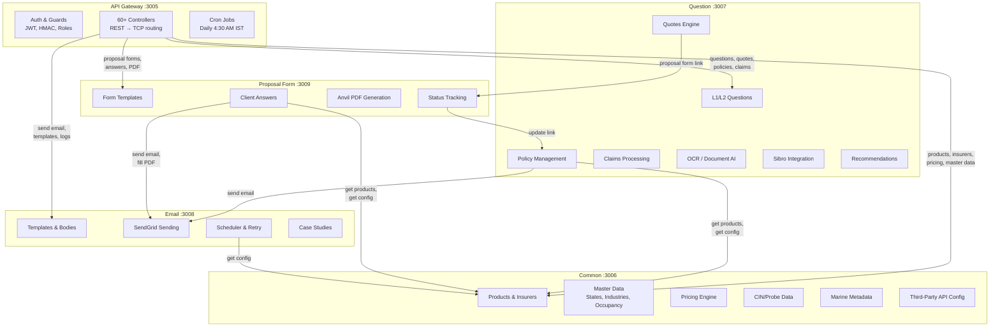

**Key Message Patterns:**

| From | To | Patterns |
|------|----|----------|
| Gateway → Common | | `get-product-list`, `get-insurer-list`, `get-pricing`, `get-configuration-details-by-key` |
| Gateway → Question | | `get-question-list`, `get-quotes`, `create-policy`, `get-policy-list` |
| Gateway → Email | | `send-email`, `get-email-template-list`, `create-email-trigger` |
| Gateway → Proposal | | `get-proposal-form`, `update-form`, `initiate-proposal-form` |
| Question → Common | | `get-product-by-id`, `get-short-insurer-list` |
| Question → Email | | `send-email`, `schedule-email` |
| Proposal → Email | | `send-email`, `proposal-form-fill`, `create-email-logs-and-scheduler` |
| Proposal → Common | | `get-product-by-id`, `get-configuration-details-by-key` |
| POS API → Common | | `get-product-list`, `get-insurer-list` |
| POS API → Question | | `get-question-list`, L1/L2 answers |

### 2.4 Database Architecture

All services connect to **PostgreSQL** (AWS RDS in production). Each service manages its own set of tables but shares the same database instance.

```mermaid
erDiagram
    API_GATEWAY {
        table User
        table Company
        table RefreshToken
        table UserCompany
        table Partner
        table LeadSquare
        table UserOtp
        table ProbeDetails
    }

    COMMON_SERVICE {
        table Product
        table ProductGroup
        table Insurer
        table Industry
        table Pricing
        table FireOccupancy
        table StateMaster
        table Roles
        table Resources
        table CinDetails
        table MarineMetadata
    }

    QUESTION_SERVICE {
        table L1Question
        table L2Question
        table Policy
        table Quote
        table QuoteItem
        table Claim
        table ClientAnswerForm
        table PolicyRequest
        table OcrAuditLog
        table SibroInsurer
    }

    EMAIL_SERVICE {
        table EmailLog
        table Template
        table EmailBody
        table Trigger
        table EmailVariables
        table ClientEmailScheduler
    }

    PROPOSAL_SERVICE {
        table ProposalForm
        table ProposalFormQuestion
        table ProposalFormAnswer
        table PolicyProposalFormDetails
        table ProposalFormTemplate
    }

    POS_SERVICE {
        table PosUser
        table PosClient
        table PosPolicy
        table PosBrokerage
        table PosQuote
        table PosClaim
        table PosCampaign
        table PosRegion
        table PosEndorsement
        table PosNotification
    }

    UNDERWRITING_SERVICE {
        table scoring_results
        table extracted_policies
        table insurer_raters
        table qc_results
        table probe_response_cache
        table company_overrides
        table users_uw
    }

    AGENTIC_WORKFLOW {
        table users_agentic
        table refresh_tokens
        table parties
        table insurers_agentic
        table cases
        table case_parties
        table messages
        table attachments
        table events
        table message_classifications
        table draft_suggestions
        table document_requirements
        table case_documents
        table case_submissions
        table case_quotes
        table eval_cases
        table eval_runs
    }

    REPORTING_ENGINE {
        table sync_logs
        table leadsquared_leads
        table leadsquared_activities
        table leadsquared_opportunities
        table leadsquared_custom_objects
        table sibro_business_statements
        table lead_stage_history
        table lead_owner_history
        table lead_policy_mappings
        table bk_mirror_tables
        table reporting_view_columns
    }
```

> **Note:** The core platform, underwriting, and agentic workflow services share the same PostgreSQL RDS instance (`bimakavach_dev`) but manage separate table sets. The reporting engine uses its own dedicated PostgreSQL instance (`reporting_db`).

### 2.5 External Integrations

```mermaid
graph TB
    subgraph "Payment Gateways"
        FG["Future Generali"]
        CHOLA_PAY["Chola Insurance"]
        MAGMA["Magma HDI"]
        CASHFREE["Cashfree"]
    end

    subgraph "CRM & Lead Management"
        LSQ["LeadSquared<br/>Lead tracking, activities"]
        SIBRO_EXT["Sibro<br/>Broker platform sync"]
    end

    subgraph "Communication"
        SG["SendGrid<br/>Transactional email"]
        MSG91_EXT["MSG91<br/>SMS OTP"]
        FIREBASE_EXT["Firebase FCM<br/>Push notifications"]
        AISENSY["AiSensy<br/>WhatsApp messaging"]
    end

    subgraph "Document & Data"
        ANVIL_EXT["Anvil.io<br/>PDF form filling"]
        PROBE_EXT["Probe API<br/>CIN/Company verification"]
        GDOCAI["Google Document AI<br/>OCR extraction"]
        TESSERACT["Tesseract.js<br/>Text extraction"]
    end

    subgraph "Cloud Infrastructure"
        S3_EXT["AWS S3<br/>File storage"]
        CW["AWS CloudWatch<br/>Centralized logging"]
        CF["AWS CloudFront<br/>CDN"]
        RDS["AWS RDS<br/>PostgreSQL"]
        GCS_EXT["Google Cloud Storage"]
    end

    subgraph "Analytics"
        GTM["Google Tag Manager"]
        GSHEETS["Google Sheets<br/>POS Reporting"]
    end

    subgraph "AI / LLM"
        CLAUDE["Anthropic Claude API<br/>Policy extraction, scoring,<br/>classification, drafts"]
    end

    subgraph "Data Enrichment"
        PROBE42["Probe42<br/>Company data (MCA, financials)"]
    end

    GW_NODE["API Gateway"] --> FG & CHOLA_PAY & MAGMA & LSQ & PROBE_EXT & MSG91_EXT
    Q_NODE["Question Service"] --> SIBRO_EXT & GDOCAI & TESSERACT & CASHFREE
    E_NODE["Email Service"] --> SG
    P_NODE["Proposal Service"] --> ANVIL_EXT
    POS_NODE["POS Backend"] --> FIREBASE_EXT & AISENSY & MSG91_EXT
    WEB_NODE["BK Web"] --> GTM
    UW_NODE["Underwriting Engines"] --> CLAUDE & PROBE42
    AGENTIC_NODE["Agentic Workflow"] --> CLAUDE & AISENSY & SG
    REPORT_NODE["Reporting Engine V2"] --> LSQ & SIBRO_EXT
```

| Integration | Service | Purpose |
|-------------|---------|---------|
| **SendGrid** | Email Service | Transactional emails, templates, bulk sending |
| **Anvil.io** | Proposal Form Service | PDF form filling and signing |
| **LeadSquared** | API Gateway | CRM - lead creation, activity tracking, webhooks |
| **Sibro** | Question Service | Insurance broker platform sync (policies, transactions) |
| **Probe API** | API Gateway | Company CIN/registration verification |
| **Google Document AI** | Question Service | Policy document OCR extraction |
| **Chola Insurance API** | Question Service | Premium calculation, occupancy data |
| **Future Generali** | API Gateway | Payment processing |
| **Magma HDI** | API Gateway | Payment processing |
| **Cashfree** | Question Service | Payment gateway |
| **MSG91** | API Gateway, POS | SMS OTP delivery |
| **Firebase FCM** | POS Backend | Mobile push notifications |
| **AiSensy** | POS Backend, Agentic Workflow | WhatsApp message automation |
| **Anthropic Claude API** | UW Engine, UW D&O Engine, Agentic Workflow | Policy PDF extraction, risk analysis, AI suggestions, message classification, draft generation |
| **Probe42** | UW Engine, UW D&O Engine | Company data enrichment (MCA filings, financials, directors, legal history) |
| **AWS S3** | Multiple | Document & file storage (ap-south-1) |
| **AWS CloudWatch** | Multiple | Centralized logging |
| **Google Sheets** | POS Reporting | Analytics data source |

### 2.6 LeadSquared Integration

LeadSquared is the CRM system used for lead lifecycle management -- from website visitor tracking through policy purchase and renewal.

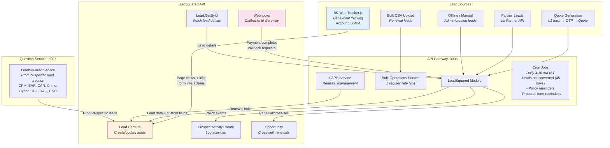

#### Data Flow Summary

**Outbound (BimaKavach → LeadSquared):**

| Trigger | Data Sent | Custom Fields (mx_*) |
|---------|-----------|---------------------|
| Quote generated | Lead: name, email, phone, company | Product_Name, Lead_Intent, OTP_Verification_Status |
| Payment completed | Activity update with policy details | Policy number, premium, insurer |
| Product-specific L1 form | Lead with product attributes | Sum_Insured, City, Policy_Type + product-specific fields |
| Bulk CSV upload | Multiple leads/activities | Renewal requirements, dates |
| Cron jobs (daily) | Reminder activities | Stale lead notifications, policy reminders |

**Inbound (LeadSquared → BimaKavach):**

| Trigger | Data Received | Action Taken |
|---------|--------------|-------------|
| Payment webhook (`/lead-square/byId/:id`) | Lead prospect ID | Fetch lead → create policy → send confirmation email |
| Cross-sell webhook (`/lead-square/byOpportunityId/:id`) | Opportunity ID | Process cross-sell payment |
| Callback request | Phone + prospect ID | Queue callback for sales team |
| Renewal webhook (`/lead-square/renewal-management/*`) | Lead ID | Send payment link or process renewal |

#### Database Tables

```
LeadSquare                      → Internal lead record (productId, isConverted, leadCreated source)
LeadSquareIdMapping             → Maps internal lead ID ↔ LSQ prospect ID
L1FormLsqActivityIdMapping      → Maps L1 form submission ↔ LSQ activity ID + opportunity ID
LsqCallbackRequests             → Stores phone + prospect_id for callback queue
LsqBulkOperation                → Tracks bulk upload jobs (QUEUED → COMPLETE/FAILED)
LsqBulkOperationResult          → Individual row results with payload + response + errors
LsqEntitySubtype                → Schema definitions for bulk operation field types
LsqFieldMaster                  → Field definitions per entity (key, name, dataType)
```

#### Lead Sources (leadCreated enum)
`Online` | `Offline` | `Bulk-Upload` | `Lead-Square` | `Recommendations` | `Partner-Lead`

---

### 2.7 Sibro Integration

Sibro is the insurance broker management platform used for policy record-keeping, regulatory compliance, and commission tracking. BimaKavach syncs master data FROM Sibro and pushes policy/transaction data TO Sibro.

```mermaid
graph TB
    subgraph "Sibro Platform"
        direction TB
        S_INSURERS["Insurers & Branches"]
        S_PRODUCTS["Products / Policies"]
        S_CRM["CRM Users"]
        S_BOWNERS["Business Owners"]
        S_CFIELDS["Policy Custom Fields"]
        S_CLIENT["Client Management"]
        S_POLICY["Policy Records"]
        S_PREMIUM["Premium Transactions"]
    end

    subgraph "Question Service :3007 (sibro module)"
        SYNC_SVC["Sync Service<br/><i>Master data pull</i>"]
        CLIENT_SVC["Client Service<br/><i>Search & create clients</i>"]
        POLICY_SVC["Policy Service<br/><i>Push policies on creation</i>"]
        MAPPING_SVC["Mapping Services<br/><i>Insurer, Product, CRM User</i>"]
    end

    subgraph "Internal Tables"
        direction TB
        T_INSURERS["sibro_insurers<br/>sibro_insurer_branches"]
        T_PRODUCTS["sibro_products"]
        T_CRM["sibro_crm_users"]
        T_BOWNERS["sibro_business_owners"]
        T_CFIELDS_T["sibro_policy_custom_fields<br/>sibro_policy_custom_field_options"]
        T_MAPPING["sibro_insurer_mapping<br/>sibro_product_mapping<br/>sibro_crm_user_mapping"]
        T_CLIENT["sibro_client_mapping"]
        T_TX["sibro_client_transactions"]
    end

    %% Inbound sync (Sibro → BK)
    S_INSURERS -->|"GET /insurers"| SYNC_SVC
    S_PRODUCTS -->|"GET /policies?page=N"| SYNC_SVC
    S_CRM -->|"GET /crm-users?page=N"| SYNC_SVC
    S_BOWNERS -->|"GET /business-owners"| SYNC_SVC
    S_CFIELDS -->|"GET /policy-custom-fields/{id}"| SYNC_SVC

    SYNC_SVC --> T_INSURERS & T_PRODUCTS & T_CRM & T_BOWNERS & T_CFIELDS_T
    MAPPING_SVC --> T_MAPPING

    %% Outbound sync (BK → Sibro)
    POLICY_SVC -->|"POST /add-policy"| S_POLICY
    POLICY_SVC -->|"POST /add-premium-transaction/{id}"| S_PREMIUM
    CLIENT_SVC -->|"POST /client (search)"| S_CLIENT
    CLIENT_SVC -->|"POST /client (create)"| S_CLIENT
    CLIENT_SVC --> T_CLIENT
    POLICY_SVC --> T_TX

    style S_INSURERS fill:#e8f5e9
    style S_PRODUCTS fill:#e8f5e9
    style S_CRM fill:#e8f5e9
    style S_POLICY fill:#fff3e0
    style S_PREMIUM fill:#fff3e0
    style S_CLIENT fill:#fff3e0
```

#### Sync Direction & Triggers

**Inbound (Sibro → BimaKavach) -- Master Data Pull:**

| Data | Endpoint | Message Pattern | Trigger | Strategy |
|------|----------|----------------|---------|----------|
| Insurers + Branches | `GET /insurers` | `sibro.sync.insurers` | Manual / scheduled | Upsert + deactivate stale |
| Products | `GET /policies?page=N` | `sibro.sync.products` | Manual / scheduled | Paginated upsert |
| CRM Users | `GET /crm-users?page=N` | `sibro.sync.crmUsers` | Manual / scheduled | Paginated upsert |
| Business Owners | `GET /business-owners` | `sibro.sync.businessOwners` | Manual / scheduled | Upsert + deactivate |
| Custom Fields | `GET /policy-custom-fields/{id}` | `sibro.sync.policyCustomFields` | Manual / scheduled | Per-product sync |

All master syncs follow an **upsert + deactivate** pattern: mark all existing records inactive → upsert from API response → stale records remain inactive.

**Outbound (BimaKavach → Sibro) -- On Policy Creation:**

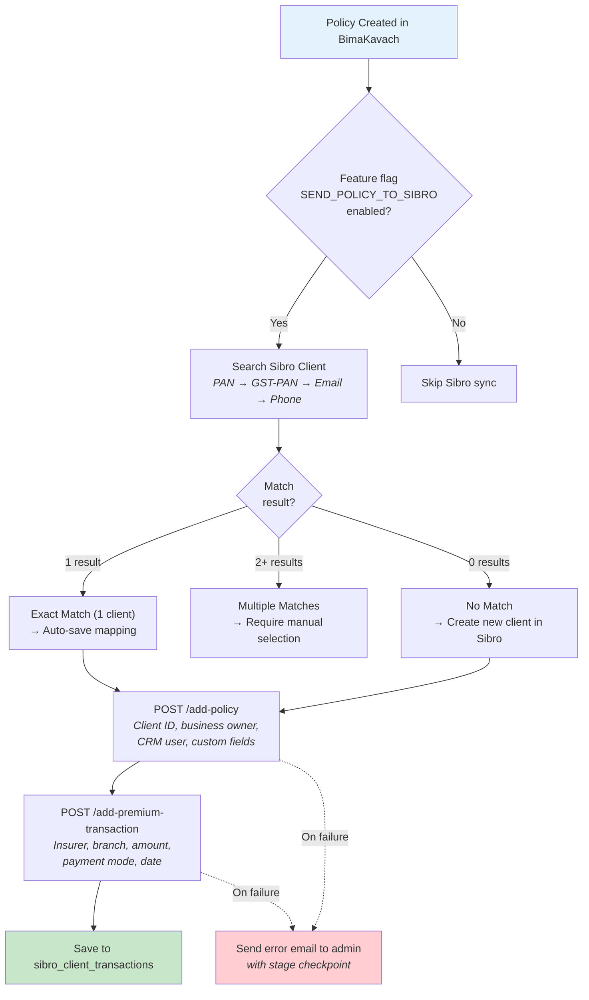

**Client Search Priority:** PAN → PAN extracted from GST → Email → Phone

#### Mapping Tables

| Table | Links | Purpose |
|-------|-------|---------|
| `sibro_insurer_mapping` | Sibro insurer ↔ BK insurer | Route policies to correct Sibro insurer |
| `sibro_product_mapping` | Sibro product ↔ BK product | Map product catalog between systems |
| `sibro_crm_user_mapping` | Sibro CRM user ↔ BK internal user | Assign policies to correct CRM owner |
| `sibro_client_mapping` | BK user+company ↔ Sibro client ID | Avoid duplicate client creation |
| `sibro_client_transactions` | Sibro policy ID ↔ BK policy ID | Track which policies have been synced |

#### Authentication
- **Method:** Bearer token (`SIBRO_AUTH_TOKEN` env var)
- **Base URL:** `https://bimakavachbroking.sibro.xyz/api/v1/`
- **Override:** Sync endpoints accept optional `auth_token` in payload

#### Error Handling
- Staged execution tracking (resolve_client → create_policy → create_premium_transaction → save_transaction)
- Email alerts to admin on any failure with exact failure stage
- CloudWatch logging for all operations

---

### 2.8 Underwriting Platform

The underwriting platform consists of two independent deployments — a **multi-product engine** (`bk-underwriting`) and a **D&O-specific engine** (`bk-underwriting-and-decision-engine`). Both share the same PostgreSQL database (BimaKavach RDS) but operate as standalone services with their own dashboards.

```mermaid
graph TB
    subgraph "Multi-Product Underwriting (bk-underwriting)"
        UW_DASH["Dashboard<br/>Next.js 16 | :4001"]
        UW_ENGINE["Engine<br/>NestJS 11 | :4000"]

        subgraph "Product Modules"
            DNO["D&O"]
            ENO["E&O"]
            CYBER["Cyber"]
            CGL["CGL"]
            WC["WC"]
            CRIME["Crime"]
        end
    end

    subgraph "D&O Decision Engine (bk-underwriting-and-decision-engine)"
        DNO_DASH["Dashboard<br/>Next.js 16 | :3001"]
        DNO_ENGINE["Engine<br/>NestJS 11 | :3000"]

        subgraph "D&O Features"
            SCORING["Risk Scoring"]
            EXTRACT["Policy Extraction"]
            QC["QC Reports"]
            RATERS["Rater Management"]
            RECOMMEND["Recommendations"]
            TRENDS["Trends & Analytics"]
        end
    end

    subgraph "Data Enrichment Sources"
        PROBE["Probe42<br/>(MCA/Corporate)"]
        SANDBOX["Sandbox.co.in<br/>(GST) — Placeholder"]
        CIBIL["TransUnion CIBIL<br/>(Credit) — Placeholder"]
        VAKEEL["Vakeel360<br/>(Litigation) — Placeholder"]
        SETU["Setu AA<br/>(Bank Data) — Placeholder"]
    end

    subgraph "AI Layer"
        CLAUDE["Claude API<br/>(claude-sonnet-4-6)"]
    end

    UW_DASH -->|"HTTPS + JWT"| UW_ENGINE
    UW_ENGINE --> DNO & ENO & CYBER & CGL & WC & CRIME
    UW_ENGINE -->|"Company enrichment"| PROBE
    UW_ENGINE -->|"PDF extraction"| CLAUDE

    DNO_DASH -->|"HTTPS + JWT"| DNO_ENGINE
    DNO_ENGINE --> SCORING & EXTRACT & QC & RATERS & RECOMMEND & TRENDS
    DNO_ENGINE -->|"Company enrichment"| PROBE
    DNO_ENGINE -->|"Policy extraction<br/>+ AI suggestions"| CLAUDE

    UW_ENGINE -.->|"Future"| SANDBOX & CIBIL & VAKEEL & SETU
    DNO_ENGINE -.->|"Future"| SANDBOX & CIBIL & VAKEEL & SETU

    UW_ENGINE & DNO_ENGINE --> PG[(PostgreSQL RDS)]
```

#### Underwriting Scoring Flow

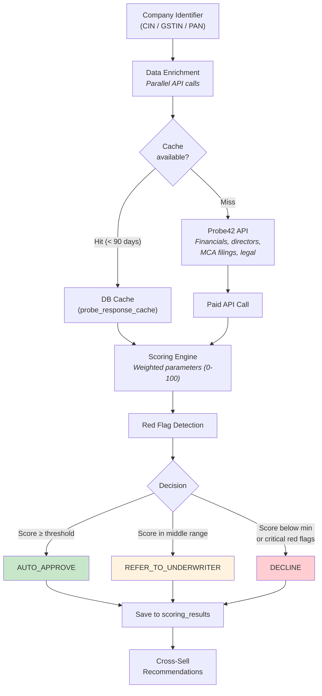

#### Underwriting Database Tables

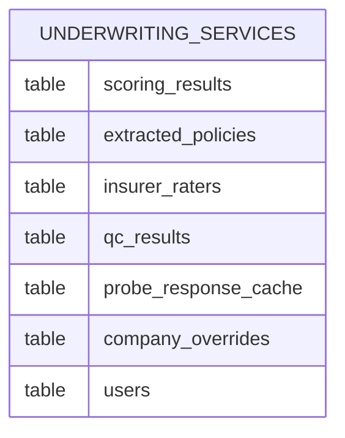

| Table | Engine | Purpose |
|-------|--------|---------|
| `scoring_results` | Both | Audit trail — composite score, decision, parameters, red flags, cross-sell |
| `extracted_policies` | Both | Claude-extracted policy data (coverages, limits, deductibles, exclusions) |
| `insurer_raters` | Both | Uploaded insurer rate cards (coverages, premium bands, occupancies) |
| `qc_results` | Multi-product | QC report results (standard & historical comparison, peer alignment) |
| `probe_response_cache` | Multi-product | Cached Probe42 API responses (CIN/PAN lookup, 90-day TTL) |
| `company_overrides` | Multi-product | Admin-applied scoring overrides for specific companies |
| `users` | Both | System users (admin, underwriter, viewer roles) |

---

### 2.9 Agentic Workflow (RM Automation)

The agentic workflow platform automates Relationship Manager (RM) operations — case management, multi-channel communication (WhatsApp + Email), and AI-powered message classification and draft suggestions.

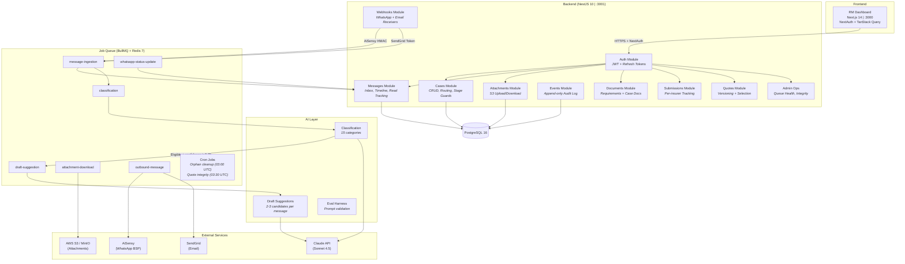

#### Agentic Workflow — Message Ingestion Pipeline

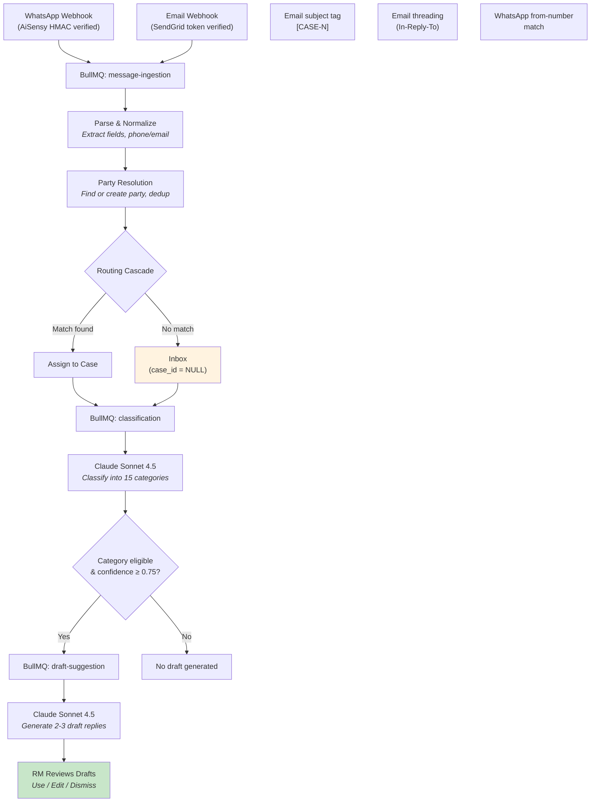

#### Agentic Workflow — Case Lifecycle

```
INTAKE → (receive messages, documents, submissions)
       → (receive quotes, compare, select)
       → CLOSED_WON  (requires selected quote + final premium + policy number)
       → CLOSED_LOST  (requires reason)
       → CLOSED_ABANDONED
       → REOPEN (nulls outcome, preserves quote selection)
```

#### Agentic Workflow Database Tables

| Table | Purpose |
|-------|---------|
| `users` | RM and Admin users (JWT auth, role-based access) |
| `refresh_tokens` | JWT refresh token rotation (bcrypt hashed) |
| `parties` | Customers, insurer contacts, RM shadows (dedup via linkedPartyId) |
| `insurers` | Insurer registry (name, code, default emails) |
| `cases` | Insurance cases (stage, product type, outcome, assigned RM) |
| `case_parties` | Many-to-many: cases ↔ parties with roles |
| `messages` | WhatsApp + email messages (inbound/outbound, status tracking) |
| `attachments` | File metadata + S3 keys (checksumSha256 for integrity) |
| `events` | Append-only audit log (every case action recorded) |
| `message_classifications` | AI classification results (category, confidence, rationale) |
| `draft_suggestions` | AI-generated reply drafts (candidates, RM outcome tracking) |
| `document_requirements` | Admin-managed per-product document catalog |
| `case_documents` | Per-case document state (REQUIRED/RECEIVED/WAIVED/REJECTED) |
| `case_submissions` | Per-insurer submission tracking (PENDING/SUBMITTED/ACKNOWLEDGED) |
| `case_quotes` | Quote versioning with auto-supersession and selection |
| `eval_cases` | Held-out test cases for AI prompt validation |
| `eval_runs` | Eval execution results (pass/fail, score) |

---

### 2.10 Reporting Engine V2

The reporting engine is an ETL pipeline that syncs data from LeadSquared, Sibro, and the source PostgreSQL database into a dedicated reporting database, powering Metabase dashboards and a natural-language SQL chatbot.

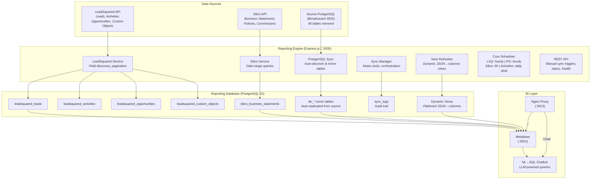

#### Reporting Engine — Sync Schedule

| Source | Frequency | Strategy |
|--------|-----------|----------|
| LeadSquared Leads | Hourly (minute 0) | Incremental (modified since last sync) |
| PostgreSQL Mirror | Hourly (minute 30) | Incremental (table-level timestamps) |
| Sibro Statements | Every 6 hours (minute 0) | Date-range query |
| LSQ Opportunities | Every 6 hours (minute 15) | Incremental |
| LSQ Activities | Daily at 3 AM IST | Incremental |

#### Reporting Engine — Docker Services

| Service | Image | Port | Purpose |
|---------|-------|------|---------|
| `reporting-engine` | Node.js 20 (multi-stage) | 3010→3000 | ETL API + sync workers |
| `postgres` | PostgreSQL 15-alpine | 5434→5432 | Reporting database |
| `metabase` | metabase:latest | 3001 | BI dashboard |
| `chatbot` | Node.js (custom) | -- | NL→SQL interface (Metabase-authenticated) |
| `nginx` | nginx:alpine | 3013→80 | Reverse proxy for Metabase + chatbot |

---

### 2.11 Document Signer

A **client-side PDF signing component** built as an embeddable Next.js module. All processing happens in the browser — no backend, no database, no external APIs.

**Key capabilities:**
- Upload PDF documents or load from URL
- Create signatures via Draw (freehand), Type (text fonts), or Upload (image)
- Drag-and-drop signature placement on PDF pages with resize
- Download signed PDF with embedded signatures

**Tech:** Next.js 14, TypeScript, pdf-lib (PDF manipulation), fabric.js (canvas drawing), react-pdf (rendering)

**Usage:** Designed to be embedded in other Next.js apps:
```tsx
import { DocumentSigner } from '@/components/document-signer';
<DocumentSigner height="100vh" pdfUrl="https://example.com/file.pdf" />
```

---

### 2.12 Infrastructure & Deployment

```mermaid
graph TB
    subgraph "Docker Network: local"
        subgraph "Frontend Containers"
            D_WEB["BK Web<br/>:3000<br/>Node 18.17"]
            D_ADMIN["bi-admin<br/>:3000<br/>Node 18.16"]
            D_POS_ADMIN["POS Admin<br/>:3012<br/>Node 22"]
        end
        subgraph "Backend Containers"
            D_GW["API Gateway<br/>:3005<br/>Node 18-slim"]
            D_COMMON["Common<br/>:3006<br/>Node 18-slim"]
            D_QUESTION["Question<br/>:3007<br/>Node 18-slim<br/>+ Chromium"]
            D_EMAIL["Email<br/>:3008<br/>Node 18-slim<br/>+ Puppeteer"]
            D_PROPOSAL["Proposal Form<br/>:3009<br/>Node 18-slim"]
            D_POS_API["POS API<br/>:3011<br/>Node 22-slim"]
        end
        subgraph "Underwriting Containers"
            D_UW_ENGINE["UW Engine<br/>:4000<br/>Node 20-alpine"]
            D_UW_DASH["UW Dashboard<br/>:4001<br/>Node 20-alpine"]
            D_DNO_ENGINE["UW D&O Engine<br/>:3000<br/>Node 20-alpine"]
            D_DNO_DASH["UW D&O Dashboard<br/>:3001<br/>Node 20-alpine"]
        end
        subgraph "Agentic Workflow Containers"
            D_AGENTIC_BE["Agentic Backend<br/>:3001<br/>Node 20-alpine"]
            D_AGENTIC_FE["Agentic Frontend<br/>:3000<br/>Node 20"]
            D_REDIS["Redis 7<br/>:6379"]
            D_MINIO["MinIO (S3)<br/>:9000"]
        end
        subgraph "Reporting Containers"
            D_REPORT["Reporting Engine<br/>:3010→3000<br/>Node 20"]
            D_REPORT_PG["Reporting PG 15<br/>:5434→5432"]
            D_METABASE["Metabase<br/>:3001"]
            D_CHATBOT["NL→SQL Chatbot"]
            D_NGINX["Nginx Proxy<br/>:3013"]
        end
    end

    subgraph "AWS (ap-south-1)"
        RDS_PG[(RDS PostgreSQL)]
        S3_BUCK["S3 Buckets<br/>bimakavach-v2<br/>bimakavach-policies<br/>bk-pos-policies<br/>bimakavach-attachments"]
        CW_LOGS["CloudWatch Logs"]
        CF_CDN["CloudFront CDN"]
    end

    subgraph "AI Services"
        CLAUDE_API["Anthropic Claude API"]
    end

    D_GW & D_COMMON & D_QUESTION & D_EMAIL & D_PROPOSAL & D_POS_API --> RDS_PG
    D_UW_ENGINE & D_DNO_ENGINE --> RDS_PG
    D_AGENTIC_BE --> RDS_PG
    D_REPORT --> RDS_PG

    D_GW & D_QUESTION & D_EMAIL & D_PROPOSAL & D_POS_API --> S3_BUCK
    D_AGENTIC_BE --> S3_BUCK
    D_GW --> CW_LOGS

    D_UW_ENGINE & D_DNO_ENGINE --> CLAUDE_API
    D_AGENTIC_BE --> CLAUDE_API

    D_AGENTIC_BE --> D_REDIS
    D_REPORT --> D_REPORT_PG
    D_METABASE --> D_REPORT_PG
    D_NGINX --> D_METABASE & D_CHATBOT
```

**Tech Stack Summary:**
- **Runtime:** Node.js 18 (core platform), Node.js 20 (underwriting, agentic, reporting), Node.js 22 (POS)
- **Backend Frameworks:** NestJS 10-11 (microservices + underwriting + agentic), Express.js (reporting engine)
- **Frontend Frameworks:** Next.js 13-16, React Native/Expo 54
- **Database:** PostgreSQL via TypeORM (core platform, underwriting) and Prisma (agentic workflow, reporting engine)
- **Transport:** TCP (NestJS Microservices) between core backend services; REST between independent platforms
- **Message Queue:** BullMQ + Redis 7 (agentic workflow); node-cron (reporting engine)
- **AI/LLM:** Anthropic Claude API — Sonnet 4.5 (agentic classification/drafts), Sonnet 4.6 (underwriting policy extraction/scoring)
- **Auth:** JWT + HMAC-SHA256 signing + OTP (MSG91) for core; JWT + refresh tokens (underwriting, agentic); NextAuth (agentic frontend)
- **Containerization:** Docker + Docker Compose, shared `local` network
- **Cloud:** AWS (RDS, S3, CloudWatch, CloudFront), Google Cloud (Document AI, Storage)
- **BI/Analytics:** Metabase + NL→SQL chatbot (reporting engine v2)
- **Region:** ap-south-1 (Mumbai)

---

## 3. Usability Architecture

### 3.1 User Roles & Access

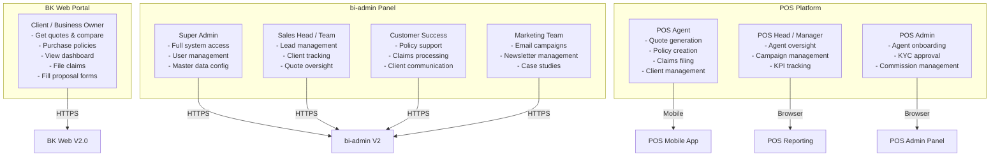

### 3.2 Customer Journey (BK Web)

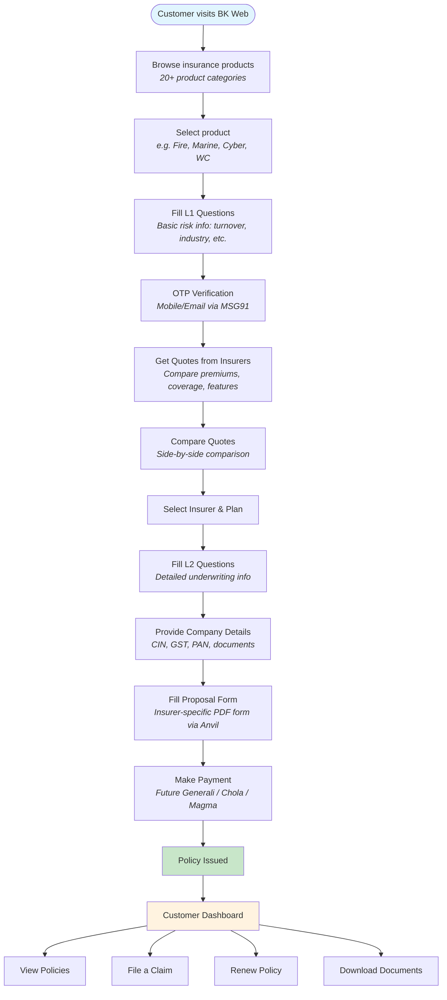

**Key Touchpoints:**

| Step | Service Involved | Key Action |
|------|-----------------|------------|
| Browse Products | Common Service | Fetch product groups, product list |
| L1 Questions | Question Service | Dynamic questionnaire per product |
| OTP Verification | API Gateway | MSG91 SMS/Email OTP |
| Get Quotes | Question Service | Calculate premiums per insurer |
| Compare Quotes | BK Web (client-side) | Side-by-side comparison UI |
| L2 Questions | Question Service | Insurer-specific detailed questions |
| Company Details | API Gateway | CIN verification via Probe API |
| Proposal Form | Proposal Form Service | Anvil PDF generation & signing |
| Payment | API Gateway | Payment gateway integration |
| Policy Issued | Question Service | Policy record creation, email trigger |
| Dashboard | Multiple | Policy listing, claims, documents |

### 3.3 Admin Journey (bi-admin)

```mermaid
flowchart TD
    LOGIN([Admin Login<br/><i>JWT + Role-based access</i>])

    LOGIN --> DASH["Dashboard<br/><i>Policy stats, KPIs</i>"]

    DASH --> CLIENT_MGMT["Client Management"]
    CLIENT_MGMT --> VIEW_CLIENTS["View Clients & Policies"]
    CLIENT_MGMT --> COMPANY_MGMT["Manage Company Details"]
    CLIENT_MGMT --> FILE_CLAIM_ADMIN["File Claim on behalf"]

    DASH --> LEAD_MGMT["Lead Management"]
    LEAD_MGMT --> LEADS["Track Leads<br/><i>LeadSquared sync</i>"]
    LEAD_MGMT --> NEWSLETTER["Newsletter Subscribers"]
    LEAD_MGMT --> CASE_STUDY["Case Study Distribution"]

    DASH --> PRODUCT_CONFIG["Product Configuration"]
    PRODUCT_CONFIG --> PRODUCTS["Products & Groups"]
    PRODUCT_CONFIG --> INSURERS["Insurance Companies"]
    PRODUCT_CONFIG --> PRICING_CFG["Pricing Setup"]
    PRODUCT_CONFIG --> QUESTIONS_CFG["L1/L2 Questions"]
    PRODUCT_CONFIG --> PROPOSAL_CFG["Proposal Forms"]

    DASH --> COMMS["Communications"]
    COMMS --> EMAIL_TEMPLATES["Email Templates & Bodies"]
    COMMS --> EMAIL_TRIGGERS["Email Triggers & Scheduling"]
    COMMS --> EMAIL_LOGS["Email History"]

    DASH --> QCR_MGMT["QCR Management<br/><i>Quick Clarification Requests</i>"]

    DASH --> MASTER_DATA["Master Data"]
    MASTER_DATA --> INDUSTRIES["Industries"]
    MASTER_DATA --> OCCUPANCIES["Fire/WC Occupancies"]
    MASTER_DATA --> GEO["States, Cities, Pincodes"]
    MASTER_DATA --> ROLES_RES["Roles & Permissions"]

    style LOGIN fill:#e1f5fe
    style DASH fill:#fff3e0
```

### 3.4 POS Agent Journey

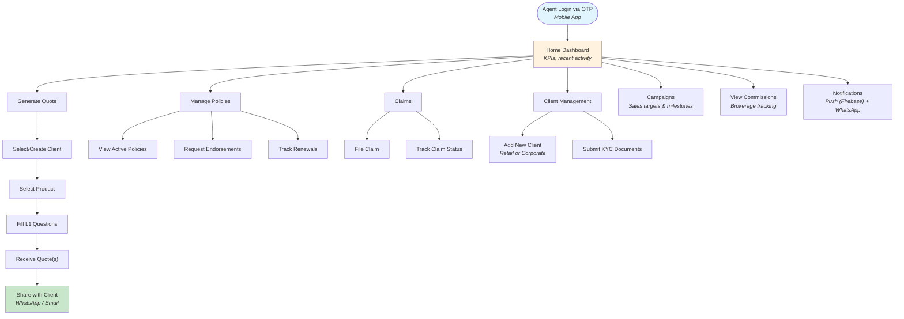

**POS Admin manages:** Agent onboarding, KYC approval, campaign creation, commission grids, WhatsApp templates, claims review.

**POS Reporting provides:** Premium trends, regional performance, agent leaderboards, KPI summaries.

### 3.5 Feature-to-Service Mapping

```mermaid
graph TB
    subgraph "Features"
        F_QUOTE["Quote<br/>Comparison"]
        F_POLICY["Policy<br/>Management"]
        F_CLAIMS["Claims<br/>Processing"]
        F_PROPOSAL["Proposal<br/>Forms"]
        F_EMAIL["Email<br/>Campaigns"]
        F_PAYMENT["Payment<br/>Processing"]
        F_CRM["CRM / Lead<br/>Management"]
        F_MASTER["Master Data<br/>Config"]
        F_OCR["Document<br/>OCR"]
        F_POS_AGENT["POS Agent<br/>Operations"]
        F_NOTIF["Push & WhatsApp<br/>Notifications"]
        F_ANALYTICS["Reporting &<br/>Analytics"]
        F_UNDERWRITING["Underwriting &<br/>Risk Scoring"]
        F_RM_AUTO["RM Automation<br/>& Case Mgmt"]
        F_DOCSIGN["Document<br/>Signing"]
        F_BI["BI Dashboards<br/>& ETL"]
    end

    subgraph "Services"
        S_GW["API Gateway"]
        S_COMMON["Common"]
        S_QUESTION["Question"]
        S_EMAIL["Email"]
        S_PROPOSAL["Proposal Form"]
        S_POS["POS Backend"]
        S_UW["Underwriting<br/>Engine(s)"]
        S_AGENTIC["Agentic<br/>Workflow"]
        S_REPORT["Reporting<br/>Engine V2"]
    end

    F_QUOTE --> S_QUESTION & S_COMMON
    F_POLICY --> S_QUESTION & S_GW
    F_CLAIMS --> S_QUESTION
    F_PROPOSAL --> S_PROPOSAL & S_EMAIL
    F_EMAIL --> S_EMAIL & S_GW
    F_PAYMENT --> S_GW & S_QUESTION
    F_CRM --> S_GW
    F_MASTER --> S_COMMON
    F_OCR --> S_QUESTION
    F_POS_AGENT --> S_POS & S_COMMON & S_QUESTION
    F_NOTIF --> S_POS & S_AGENTIC
    F_ANALYTICS --> S_POS & S_REPORT
    F_UNDERWRITING --> S_UW
    F_RM_AUTO --> S_AGENTIC
    F_DOCSIGN --> S_PROPOSAL
    F_BI --> S_REPORT
```

| Feature | Primary Service | Supporting Services | External Dependencies |
|---------|----------------|--------------------|-----------------------|
| **Quote Generation** | Question :3007 | Common :3006 (products, pricing) | Chola API |
| **Policy Management** | Question :3007 | Gateway :3005, Email :3008 | LeadSquared, Sibro |
| **Claims Processing** | Question :3007 | Email :3008 | -- |
| **Proposal Forms** | Proposal :3009 | Email :3008, Common :3006 | Anvil.io (PDF) |
| **Email Campaigns** | Email :3008 | Common :3006 | SendGrid |
| **Payment** | Gateway :3005 | Question :3007 | Future Generali, Chola, Magma, Cashfree |
| **CRM/Leads** | Gateway :3005 | -- | LeadSquared |
| **Master Data** | Common :3006 | -- | -- |
| **Document OCR** | Question :3007 | -- | Google Document AI, Tesseract |
| **Company Verification** | Gateway :3005 | -- | Probe API |
| **POS Operations** | POS :3011 | Common :3006, Question :3007 | Firebase, AiSensy, MSG91 |
| **POS Analytics** | POS Reporting | -- | Google Sheets |
| **Underwriting (Multi-Product)** | UW Engine :4000 | UW Dashboard :4001 | Probe42, Claude API |
| **Underwriting (D&O)** | UW D&O Engine :3000 | UW D&O Dashboard :3001 | Probe42, Claude API |
| **RM Automation / Cases** | Agentic Workflow :3001 | Agentic Frontend :3000 | AiSensy, SendGrid, Claude API |
| **BI Dashboards / ETL** | Reporting Engine V2 :3000 | Metabase :3001 | LeadSquared API, Sibro API, Source DB |
| **Document Signing** | Document Signer (client-side) | -- | -- |

---
