# BimaKavach — Unified Tech & Data Platform

## Table of Contents
- [1. What We're Solving](#1-what-were-solving)
- [2. Where We Are Today](#2-where-we-are-today)
- [3. Approaches We've Evaluated](#3-approaches-weve-evaluated)
  - [3.1 AWS Managed Services (EventBridge + SQS)](#31-approach-1-aws-managed-services-eventbridge--sqs)
  - [3.2 Kafka/Redpanda as Central Nervous System](#32-approach-2-kafkaredpanda-as-central-nervous-system)
  - [3.3 BullMQ + PostgreSQL (NestJS-Native)](#33-approach-3-bullmq--postgresql-nestjs-native)
  - [3.4 Hybrid Phased Approach](#34-approach-4-hybrid-phased-approach)
- [4. Comparison Matrix](#4-comparison-matrix)
- [5. Deep Dive: Kafka/Redpanda Architecture](#5-deep-dive-kafkaredpanda-architecture-for-bimakavach)
  - [5.1 Why Kafka Deserves a Closer Look](#51-why-kafka-deserves-a-closer-look)
  - [5.2 Cluster Architecture](#52-cluster-architecture)
  - [5.3 Complete Topic Design](#53-complete-topic-design)
  - [5.4 Event Schema Design](#54-event-schema-design)
  - [5.5 Consumer Groups — Who Consumes What](#55-consumer-groups--who-consumes-what)
  - [5.6 How Our Current Flows Change](#56-how-our-current-flows-change)
  - [5.7 Change Data Capture (CDC) with Debezium](#57-change-data-capture-cdc-with-debezium)
  - [5.8 Data Lake & Analytics Pipeline](#58-data-lake--analytics-pipeline)
  - [5.9 NestJS Integration](#59-nestjs-integration)
  - [5.10 Observability & Monitoring](#510-observability--monitoring)
  - [5.11 Migration Strategy from Current State](#511-migration-strategy-from-current-state)
  - [5.12 Cost Breakdown](#512-cost-breakdown)
- [6. Our Recommendation](#6-our-recommendation)

---

## 1. What We're Solving

We need to build a **unified tech platform** that acts as a single source of truth for BimaKavach. Here's what that means:

| Capability | What We Need |
|-----------|-------------|
| **Source of Truth** | One authoritative system for policy, lead, client, and transaction data |
| **Data Queuing & Relaying** | Reliable async message delivery between our services and external systems |
| **Data Ingestion & Aggregation** | Collect data from multiple sources (LSQ, Sibro, payment gateways) into a unified model |
| **Data Pipelines** | Automated flows for sync, transformation, and delivery of data across systems |

---

## 2. Where We Are Today

Let's look at the gaps in our current architecture that this platform needs to address.

### 2.1 No Single Source of Truth

Today, policy data lives simultaneously in PostgreSQL, LeadSquared, and Sibro — with sync logic scattered across different services. Each system holds its own version of the truth, and there's no guaranteed consistency between them.

```
PostgreSQL          LeadSquared           Sibro
┌──────────┐       ┌──────────┐        ┌──────────┐
│ Policy   │       │ Lead +   │        │ Policy + │
│ table    │  ???  │ Activity │  ???   │ Premium  │
│          │       │ records  │        │ Txn      │
└──────────┘       └──────────┘        └──────────┘
     No guaranteed consistency between these three
```

### 2.2 Point-to-Point Integrations

Every service directly calls external APIs with its own error handling. There's no centralized strategy for retries, failures, or observability.

| Service | What It Calls | The Problem |
|---------|-------|---------|
| API Gateway | LeadSquared, MSG91, Payment gateways, Probe | Custom retry logic per integration |
| Question Service | Sibro, Chola, Google Document AI | Staged execution with email-on-failure |
| Email Service | SendGrid | Custom scheduler tables for retry |
| POS Backend | Firebase, AiSensy, MSG91 | Independent error handling |

### 2.3 Fragile Data Flows

Several of our core data flows rely on brittle patterns:

| Current Pattern | The Risk |
|----------------|-----------|
| Cron jobs at 4:30 AM IST | Single daily run — if it fails, we wait 24 hours |
| 30-second `sleep` after payment webhook | Arbitrary wait, race condition risk |
| Manual Sibro master data sync | Human-dependent, can drift silently |
| CSV bulk uploads at 5 req/sec | Custom rate limiting via `LsqBulkOperation` tables |
| Error emails to admin on Sibro failure | No retry, no replay, someone has to manually intervene |

### 2.4 No Event History

If a Sibro push fails at the `create_premium_transaction` stage, we have no mechanism to replay from that checkpoint. The system sends an error email and moves on. Every failed state requires manual investigation and re-triggering.

### 2.5 Custom Tracking Tables That Shouldn't Exist

We've built infrastructure-level concerns into our database. These tables are essentially hand-rolled queues and job trackers — something a proper queue system would handle out of the box:

| Table | What It's Doing | What It Should Be |
|-------|----------------|-----------|
| `ClientEmailScheduler` | Job scheduling + status tracking | A delayed job queue |
| `ClientEmailSchedulerFailures` | Failure tracking + retry state | A dead letter queue |
| `LsqBulkOperation` | Job state machine (QUEUED → COMPLETE/FAILED) | A job queue with status |
| `LsqBulkOperationResult` | Per-row result tracking with payload/response | Job result storage |

---

## 3. Approaches We've Evaluated

We've looked at four approaches, ranging from fully managed cloud services to lightweight additions to our existing stack. Each has tradeoffs worth understanding.

### 3.1 Approach 1: AWS Managed Services (EventBridge + SQS)

Since we're already on AWS ap-south-1, this approach leans fully into the managed ecosystem.

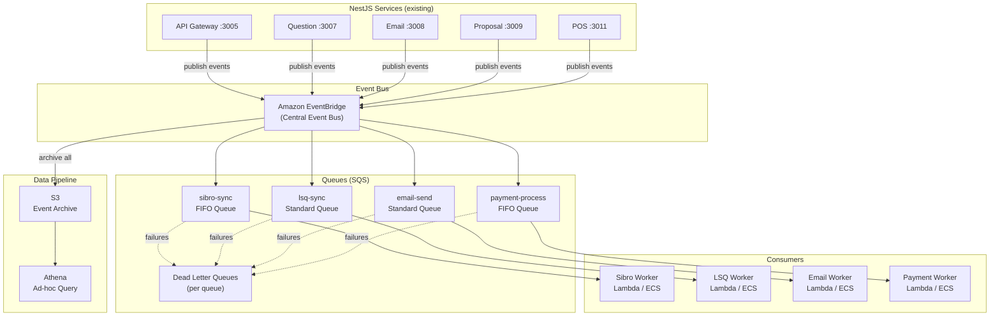

**How it works:**

| Component | Role |
|-----------|------|
| **EventBridge** | Central event bus — our services publish domain events (`policy.created`, `lead.captured`, `payment.completed`) instead of making direct calls |
| **SQS Standard** | Per-consumer queues for at-least-once delivery (email, LSQ sync) |
| **SQS FIFO** | Ordered queues for sequential operations (Sibro policy push, payment processing) |
| **DLQ** | Dead letter queues per consumer — replaces our current error emails with inspectable, replayable failures |
| **S3 + Athena** | Event archive for audit trail and analytics queries |
| **EventBridge Rules** | Route events to specific queues based on event type |

**Example event schema:**
```json
{
  "source": "bimakavach.question-service",
  "detail-type": "policy.created",
  "detail": {
    "policyId": "POL-12345",
    "productId": 42,
    "insurerId": 7,
    "companyId": 456,
    "userId": 123,
    "grossPremium": 150000,
    "timestamp": "2026-04-05T10:30:00Z"
  }
}
```

**What this replaces in our current system:**

| What We Have Today | What It Becomes |
|---------|------------|
| Direct TCP `send-email` for async operations | Publish `email.send.requested` → SQS → Email Worker |
| 30-second payment sleep | `payment.completed` event triggers policy creation |
| Sibro staged execution + error email | FIFO queue + DLQ with automatic retry |
| `LsqBulkOperation` tables | SQS batch processing with per-message tracking |
| 4:30 AM cron jobs | EventBridge Scheduler (granular scheduling) |

**Advantages:**
- Zero infrastructure management — fully managed by AWS
- Pay-per-use pricing, well suited for our current scale
- Native DLQ, retry, and visibility
- We're already on AWS — no new vendor relationship
- EventBridge archive gives us event replay for free

**Tradeoffs:**
- Vendor lock-in to AWS
- EventBridge has a 256KB event size limit
- SQS has no native topic fan-out (would need SNS or EventBridge rules)
- Team would need to learn AWS SDK patterns
- Cold start latency if we use Lambda consumers

**Estimated cost (our volume):** ~$50-200/month for EventBridge + SQS

---

### 3.2 Approach 2: Kafka/Redpanda as Central Nervous System

This approach introduces a central event streaming platform that all our services publish to and consume from. It's the most architecturally ambitious option.

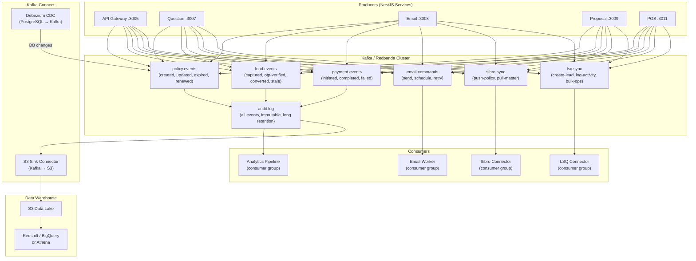

**Proposed topic design:**

| Topic | Key | Partitions | Retention | Purpose |
|-------|-----|-----------|-----------|---------|
| `policy.events` | policyId | 6 | 30 days | All policy lifecycle events |
| `lead.events` | leadId | 6 | 30 days | Lead lifecycle from capture to conversion |
| `payment.events` | transactionId | 3 | 30 days | Payment state transitions |
| `email.commands` | recipientEmail | 3 | 7 days | Email send requests |
| `sibro.sync` | policyId | 3 | 14 days | Sibro outbound sync commands |
| `lsq.sync` | leadId | 3 | 14 days | LeadSquared sync commands |
| `audit.log` | serviceId | 6 | 365 days | Immutable log of all events |

**What this replaces in our current system:**

| What We Have Today | What It Becomes |
|---------|------------|
| TCP message patterns between services | Kafka topics (for async operations) |
| 30-second payment sleep | Consumer on `payment.events` triggers policy creation |
| 4:30 AM cron for stale leads | Kafka Streams time-window aggregation on `lead.events` |
| Sibro staged execution + error email | Consumer with offset commit per stage — auto-retry from last committed offset |
| CSV bulk upload at 5 req/sec | Produce all rows to `lsq.sync`, consumer handles rate limiting |
| No event history | `audit.log` topic with 365-day retention |
| Google Sheets POS Reporting | Kafka → S3 → data warehouse → BI tool |

**If we go this route, Redpanda vs Kafka is worth considering:**

| | Apache Kafka | Redpanda |
|--|-------------|----------|
| Runtime | JVM (needs tuning) | C++ (single binary) |
| Ops complexity | High (ZooKeeper/KRaft) | Low (no JVM, no ZK) |
| Kafka API compatible | Native | Yes (drop-in replacement) |
| Resource usage | Heavy (8GB+ RAM) | Light (2GB viable) |
| Managed options | AWS MSK, Confluent Cloud | Redpanda Cloud |

**Advantages:**
- Full event replay — we can rebuild any state from the log
- Completely decoupled services — producers don't know about consumers
- Handles burst loads well (e.g. payment webhook spikes)
- Debezium CDC captures database changes automatically
- Industry standard for event-driven architectures
- Consumer groups provide natural load balancing

**Tradeoffs:**
- Significant operational overhead unless we use a managed service (MSK starts at ~$200-500/month)
- Steepest learning curve — team needs to understand consumer groups, offset management, exactly-once semantics
- Likely overkill for our current event volume (< 10K/day)
- Additional infrastructure to manage (Kafka cluster + Kafka Connect + Schema Registry)

**Estimated cost:** MSK ~$300-600/month (small cluster), Redpanda Cloud ~$200-400/month, or self-hosted on existing EC2

---

### 3.3 Approach 3: BullMQ + PostgreSQL (NestJS-Native)

This approach stays closest to our current stack. We add Redis + BullMQ for queuing while PostgreSQL remains the source of truth, enhanced with an event log.

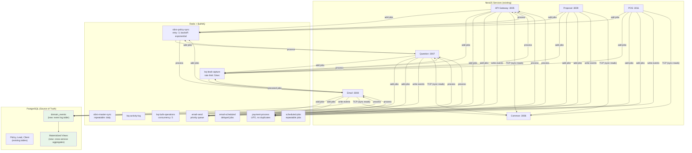

**Infrastructure change — we only add Redis:**

```yaml
# Addition to our docker-compose.yml
services:
  redis:
    image: redis:7-alpine
    command: redis-server --appendonly yes  # AOF persistence
    ports:
      - "6379:6379"
    volumes:
      - redis-data:/data
```

**Queue design:**

| Queue | Config | What It Replaces |
|-------|--------|----------|
| `sibro-policy-sync` | retry: 3, backoff: exponential, attempts track stage | Sibro staged execution + error emails |
| `sibro-master-sync` | repeatable: `0 4 * * *` (daily 4 AM) | Manual trigger / cron |
| `lsq-lead-capture` | rateLimiter: { max: 5, duration: 1000 } | Our custom 5 req/sec throttling |
| `lsq-bulk-operations` | concurrency: 5, per-job result tracking | `LsqBulkOperation` + `LsqBulkOperationResult` tables |
| `email-send` | priority: 1-10, immediate | Direct TCP `send-email` |
| `email-scheduled` | delay: calculated ms until send time | `ClientEmailScheduler` table |
| `payment-process` | removeDuplicates: by transactionId | 30-second sleep hack |
| `cron-stale-leads` | repeatable: `0 4 30 * * *` (daily) | 4:30 AM cron in API Gateway |
| `cron-policy-expiry` | repeatable: `0 4 30 * * *` (daily) | 4:30 AM cron in API Gateway |

**How BullMQ replaces our Sibro staged execution:**

Today, our Sibro push is a sequential chain (resolve_client → create_policy → create_premium_transaction) with an error email if any stage fails. With BullMQ, we model this as a Flow with parent-child dependencies and automatic retry:

```typescript
// Parent-child job dependency — if any child fails, parent fails
const flow = new FlowProducer(connection);
await flow.add({
  name: 'sibro-push-policy',
  queueName: 'sibro-policy-sync',
  data: { policyId: 'POL-12345' },
  children: [
    {
      name: 'resolve-client',
      queueName: 'sibro-policy-sync',
      data: { policyId: 'POL-12345', stage: 'resolve_client' },
    },
    {
      name: 'create-policy',
      queueName: 'sibro-policy-sync',
      data: { policyId: 'POL-12345', stage: 'create_policy' },
      opts: { depends: ['resolve-client'] },
    },
    {
      name: 'create-premium-txn',
      queueName: 'sibro-policy-sync',
      data: { policyId: 'POL-12345', stage: 'create_premium_transaction' },
      opts: { depends: ['create-policy'] },
    },
  ],
});
```

**PostgreSQL event log (new table we'd introduce):**

```sql
CREATE TABLE domain_events (
    id            BIGSERIAL PRIMARY KEY,
    event_type    VARCHAR(100) NOT NULL,  -- 'policy.created', 'lead.captured'
    aggregate_id  VARCHAR(100) NOT NULL,  -- 'POL-12345', 'LEAD-678'
    source        VARCHAR(50)  NOT NULL,  -- 'question-service', 'api-gateway'
    payload       JSONB        NOT NULL,
    created_at    TIMESTAMPTZ  DEFAULT NOW(),

    -- Indexes for common queries
    INDEX idx_events_type (event_type),
    INDEX idx_events_aggregate (aggregate_id),
    INDEX idx_events_created (created_at)
);

-- Partition by month for performance
CREATE TABLE domain_events_2026_04 PARTITION OF domain_events
    FOR VALUES FROM ('2026-04-01') TO ('2026-05-01');
```

**Materialized views for cross-service aggregates:**

One of the benefits of this approach is that we can build unified views that join data across service boundaries — something we can't easily do today.

```sql
-- Unified policy view: policy + lead + company + sibro status + LSQ status
CREATE MATERIALIZED VIEW policy_complete_view AS
SELECT
    p.id AS policy_id,
    p.policy_number,
    p.gross_premium,
    p.start_date,
    p.end_date,
    u.email AS client_email,
    c.name AS company_name,
    ls.prospect_id AS lsq_prospect_id,
    ls.is_converted AS lsq_converted,
    sct.sibro_policy_id,
    sct.stage AS sibro_sync_stage
FROM policy p
LEFT JOIN "user" u ON p.user_id = u.id
LEFT JOIN company c ON p.company_id = c.id
LEFT JOIN lead_square_id_mapping ls ON p.lead_id = ls.lead_id
LEFT JOIN sibro_client_transactions sct ON p.id = sct.policy_id;

-- Refresh periodically or on-demand
REFRESH MATERIALIZED VIEW CONCURRENTLY policy_complete_view;
```

**Tables we can deprecate with this approach:**

| Table | Replaced By |
|-------|------------|
| `ClientEmailScheduler` | BullMQ `email-scheduled` queue (delayed jobs) |
| `ClientEmailSchedulerFailures` | BullMQ failed jobs + DLQ |
| `LsqBulkOperation` | BullMQ job with status tracking |
| `LsqBulkOperationResult` | BullMQ per-job result (returnvalue) |

**Advantages:**
- Zero new languages — everything stays NestJS + TypeScript
- First-class NestJS support via the `@nestjs/bullmq` module
- Directly solves our immediate pain: retry, rate limiting, scheduling, dead letter queues
- Only one new dependency (Redis) — a few lines in our docker-compose
- We can adopt incrementally, one queue at a time
- BullMQ comes with Bull Board, giving us a dashboard for job visibility

**Tradeoffs:**
- Redis is not durable by default (we'd need AOF persistence enabled)
- No native event replay like Kafka (mitigated by the PostgreSQL event log)
- Not a full streaming platform — can't do windowed aggregations natively
- Two data stores to manage (PostgreSQL + Redis)

**Estimated cost:** Redis on ElastiCache ~$30-80/month (cache.t3.small), or self-hosted in Docker (free)

---

### 3.4 Approach 4: Hybrid Phased Approach

Rather than committing to one architecture upfront, this approach lets us start simple and evolve as our needs grow.

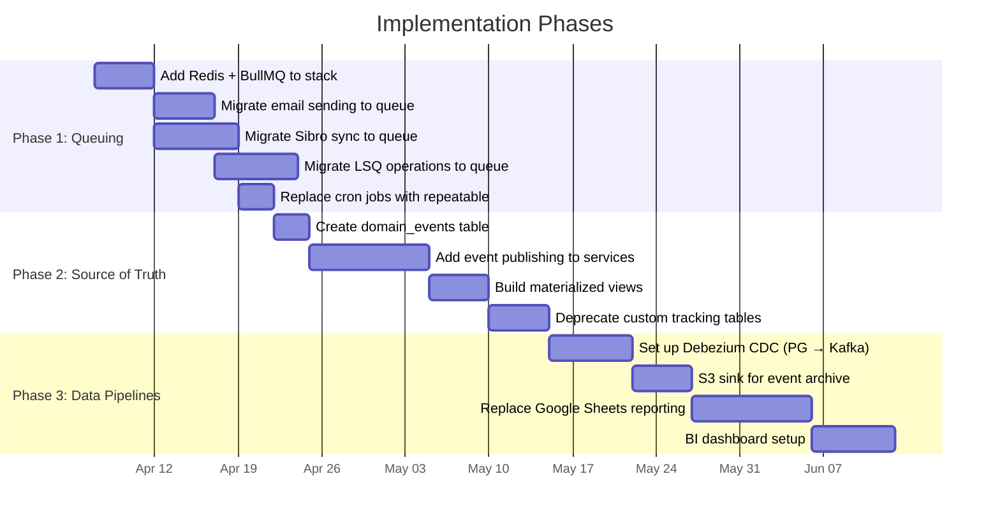

**Phase 1 — Queuing & Relaying (Weeks 1-4)**

The goal here is to get reliable async operations with retry and visibility. This phase alone eliminates the most painful issues we have today.

| Task | Effort | Impact |
|------|--------|--------|
| Add Redis to docker-compose + ElastiCache for prod | 1 day | Foundation for everything else |
| Install `@nestjs/bullmq`, set up Bull Board dashboard | 1 day | Immediate visibility into all async jobs |
| Migrate email sending (Email Service) | 3 days | Reliable delivery, priority queues |
| Migrate Sibro policy push (Question Service) | 5 days | Staged execution with auto-retry, no more error emails |
| Migrate LSQ lead creation + bulk ops (API Gateway) | 5 days | Rate limiting built-in, deprecate `LsqBulkOperation` tables |
| Replace 4:30 AM cron with BullMQ repeatable jobs | 2 days | Granular scheduling, per-job failure handling |
| Replace 30-second payment sleep with queue | 1 day | Event-driven payment processing |

**Phase 2 — Source of Truth (Weeks 5-8)**

The goal here is to make PostgreSQL the authoritative event log with cross-service views. After this phase, we have one place to look for the truth about any entity.

| Task | Effort | Impact |
|------|--------|--------|
| Create `domain_events` table (partitioned by month) | 1 day | Audit trail foundation |
| Add event publishing middleware to all NestJS services | 5 days | Every state change gets logged |
| Build `policy_complete_view` materialized view | 2 days | Unified policy + lead + Sibro + LSQ view |
| Build `lead_funnel_view` materialized view | 2 days | Lead → OTP → Quote → Policy conversion tracking |
| Set up pg_cron for materialized view refresh | 1 day | Auto-refresh views on schedule |
| Deprecate `ClientEmailScheduler*` tables | 2 days | Cleanup |
| Deprecate `LsqBulkOperation*` tables | 2 days | Cleanup |

**Phase 3 — Data Pipelines (Weeks 9-12)**

The goal here is real-time data flow from PostgreSQL to an analytics layer. This is where we graduate from ad-hoc Google Sheets reporting to a proper data platform.

| Task | Effort | Impact |
|------|--------|--------|
| Set up Debezium CDC (PostgreSQL → Kafka/Redpanda) | 5 days | Real-time change capture from our database |
| Configure S3 sink connector | 3 days | Event archive in our data lake |
| Set up Athena / Redshift for analytics queries | 3 days | Replace ad-hoc Google Sheets |
| Build BI dashboards (Metabase / Superset) | 5 days | Replace POS Reporting Google Sheets |
| Backfill historical events from existing tables | 3 days | Complete timeline from day one |

---

## 4. Comparison Matrix

Here's how all four approaches stack up across the criteria that matter to us:

| Criteria | AWS Managed (3.1) | Kafka/Redpanda (3.2) | BullMQ + PG (3.3) | Hybrid (3.4) |
|----------|:-----------------:|:--------------------:|:-----------------:|:------------:|
| **Implementation effort** | Medium | High | Low | Low → Medium |
| **Ops overhead** | Very Low | High (self-hosted) / Low (managed) | Low | Low → Medium |
| **NestJS compatibility** | SDK needed | kafkajs library | First-class (`@nestjs/bullmq`) | First-class |
| **Event replay** | Yes (EventBridge archive) | Yes (native) | Partial (PG event log) | Evolves to full |
| **Queuing & retry** | Yes (SQS + DLQ) | Yes (consumer offsets) | Yes (BullMQ native) | Yes |
| **Rate limiting** | Manual (Lambda concurrency) | Consumer-side | Native BullMQ feature | Native |
| **Data pipeline** | S3 + Athena | Kafka Connect ecosystem | Manual ETL or pg_dump | CDC in Phase 3 |
| **Team learning curve** | Medium (AWS SDK) | High (Kafka patterns) | Low (same NestJS) | Low → Medium |
| **Monthly cost (est.)** | $50-200 | $200-600 (managed) | $30-80 (ElastiCache) | $30 → $300 |
| **Vendor lock-in** | High (AWS) | Low (open source) | Low (Redis is universal) | Low |
| **Scales to 100K events/day** | Yes | Yes | Yes (with Redis Cluster) | Yes |
| **Scales to 10M events/day** | Yes | Yes | Needs Kafka migration | Yes (Phase 3) |

---

## 5. Deep Dive: Kafka/Redpanda Architecture for BimaKavach

This section walks through exactly how a Kafka-based architecture would work for our platform — every topic, every event, every consumer mapped to our actual flows. Whether we adopt Kafka from day one or evolve into it from BullMQ (Phase 3 of the hybrid approach), this is the target-state architecture.

### 5.1 Why Kafka Deserves a Closer Look

Our platform has a specific data characteristic that makes Kafka particularly interesting: **every policy event needs to fan out to multiple independent systems**. When a policy is created, we need to simultaneously:

1. Record it in Sibro (regulatory compliance)
2. Log it as an activity in LeadSquared (CRM)
3. Send confirmation emails to the client and ops team (communication)
4. Create cross-sell/renewal opportunities in LeadSquared (sales pipeline)
5. Log the event for audit/analytics (data platform)

Today, our Question Service handles all of this sequentially in a single function call. If Sibro fails, the email might still go out — or it might not, depending on where the failure happens. There's no consistency guarantee, and there's no way for a new consumer (say, a future analytics service) to tap into this flow without modifying the Question Service.

With Kafka, we publish `policy.created` once, and each of these concerns consumes independently.

### 5.2 Cluster Architecture

For our scale and AWS setup, here's what the cluster looks like:

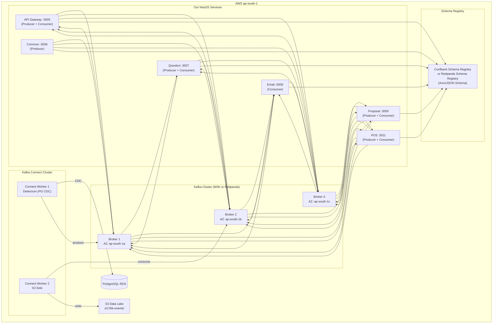

**MSK vs Redpanda — our recommendation within Kafka:**

For our team size and ops bandwidth, **Redpanda on ECS** or **Redpanda Cloud** is the better fit:

| Factor | AWS MSK | Redpanda (self-hosted) | Redpanda Cloud |
|--------|---------|----------------------|----------------|
| Minimum cost | ~$300/month (3 brokers) | ~$100/month (3 containers) | ~$200/month |
| Ops burden | Low (managed) | Medium (we run containers) | Very Low |
| Kafka compatibility | Native | Full API compatible | Full API compatible |
| Schema Registry | Glue Schema Registry | Built-in | Built-in |
| Console / UI | MSK metrics in CloudWatch | Redpanda Console (built-in) | Redpanda Console |
| JVM tuning needed | Yes (under the hood) | No (C++, single binary) | No |
| Our NestJS integration | kafkajs library | Same kafkajs library | Same kafkajs library |

### 5.3 Complete Topic Design

Here's every topic we'd need, mapped to our actual domain:

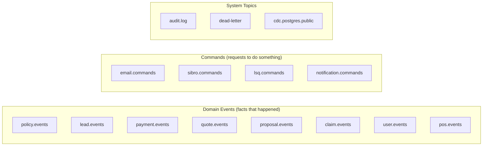

**Detailed topic specifications:**

| Topic | Partition Key | Partitions | Retention | Cleanup | Producers | Consumers |
|-------|--------------|-----------|-----------|---------|-----------|-----------|
| `policy.events` | policyId | 6 | 90 days | delete | Question Service, Gateway | Sibro Worker, LSQ Worker, Email Worker, Analytics |
| `lead.events` | leadId | 6 | 90 days | delete | Gateway, Question Service | LSQ Worker, Analytics, Cron Worker |
| `payment.events` | transactionId | 3 | 30 days | delete | Gateway | Question Service, LSQ Worker, Email Worker |
| `quote.events` | quoteId | 3 | 14 days | delete | Question Service | LSQ Worker, Analytics |
| `proposal.events` | proposalId | 3 | 30 days | delete | Proposal Service | Email Worker, Question Service, Analytics |
| `claim.events` | claimId | 3 | 90 days | delete | Question Service, POS | Email Worker, Analytics |
| `user.events` | userId | 3 | 30 days | delete | Gateway | Analytics |
| `pos.events` | agentId | 3 | 30 days | delete | POS Backend | Analytics, Notification Worker |
| `email.commands` | recipientEmail | 3 | 7 days | delete | Any service | Email Worker |
| `sibro.commands` | policyId | 3 | 14 days | delete | Question Service | Sibro Worker |
| `lsq.commands` | leadId | 3 | 14 days | delete | Gateway, Question Service | LSQ Worker |
| `notification.commands` | userId | 3 | 7 days | delete | Any service | POS Notification Worker |
| `audit.log` | source | 6 | 365 days | delete | All services | S3 Sink Connector, Analytics |
| `dead-letter` | originalTopic | 3 | 30 days | delete | Any consumer (on failure) | Alert Worker, Manual inspection |
| `cdc.postgres.public.*` | table PK | auto | 7 days | compact | Debezium | Analytics, Data Lake |

### 5.4 Event Schema Design

We'd use a standardized envelope for all events. This gives us consistency across services and makes consumers' lives easier.

**Base event envelope:**

```typescript
// shared/events/base-event.ts
interface BimaKavachEvent<T = unknown> {
  // Metadata
  eventId: string;          // UUID v4 — globally unique
  eventType: string;        // e.g., 'policy.created', 'lead.captured'
  eventVersion: number;     // schema version for evolution (start at 1)
  source: string;           // e.g., 'question-service', 'api-gateway'
  timestamp: string;        // ISO 8601 UTC

  // Correlation
  correlationId: string;    // trace ID across services
  causationId?: string;     // eventId of the event that caused this one

  // Domain
  aggregateType: string;    // 'policy', 'lead', 'quote', etc.
  aggregateId: string;      // the entity ID
  payload: T;               // the actual event data

  // Context
  userId?: number;          // who triggered this (if user-initiated)
  companyId?: number;       // which company context
}
```

**Our key domain events and their payloads:**

```typescript
// ─── Policy Events ───────────────────────────────────

interface PolicyCreatedPayload {
  policyNumber: string;
  productId: number;
  productName: string;
  insurerId: number;
  insurerName: string;
  companyId: number;
  companyName: string;
  userId: number;
  grossPremium: number;
  netPremium: number;
  startDate: string;          // ISO date
  endDate: string;            // ISO date
  paymentMode: string;
  leadSquareId?: number;      // if lead existed
  prospectId?: string;        // LSQ prospect ID
  source: 'online' | 'offline' | 'pos' | 'renewal';
}

interface PolicyExpiredPayload {
  policyNumber: string;
  productId: number;
  companyId: number;
  userId: number;
  expiryDate: string;
  daysUntilExpiry: number;    // 60, 21, 14, 7, 1, 0, or negative
  renewalEligible: boolean;
}

// ─── Lead Events ─────────────────────────────────────

interface LeadCapturedPayload {
  firstName: string;
  lastName: string;
  email: string;
  phone: string;
  company: string;
  productId: number;
  productName: string;
  leadSource: 'Online' | 'Offline' | 'Bulk-Upload' | 'Lead-Square' | 'Recommendations' | 'Partner-Lead';
  otpVerified: boolean;
  customFields: Record<string, unknown>;  // mx_* fields for LSQ
}

interface LeadConvertedPayload {
  leadId: number;
  prospectId: string;         // LSQ prospect ID
  policyId: number;
  conversionDays: number;     // days from capture to conversion
}

interface LeadStalePayload {
  leadId: number;
  prospectId: string;
  daysSinceCreation: number;  // 45+
  lastActivityDate: string;
}

// ─── Payment Events ──────────────────────────────────

interface PaymentCompletedPayload {
  transactionId: string;
  prospectId: string;         // LSQ prospect ID
  amount: number;
  paymentGateway: 'future-generali' | 'chola' | 'magma' | 'cashfree';
  paymentMode: string;
  isRenewal: boolean;
  opportunityId?: string;     // for cross-sell payments
}

// ─── Proposal Events ─────────────────────────────────

interface ProposalFormInitiatedPayload {
  proposalFormId: number;
  policyId: number;
  productId: number;
  templateId: number;
  clientEmail: string;
}

interface ProposalFormCompletedPayload {
  proposalFormId: number;
  policyId: number;
  pdfUrl: string;             // S3 URL of filled PDF
  completedAt: string;
}

// ─── Sibro Command Events ────────────────────────────

interface SibroPushPolicyCommand {
  policyId: number;
  policyNumber: string;
  companyId: number;
  userId: number;
  productId: number;
  insurerId: number;
  grossPremium: number;
  startDate: string;
  // Mapped Sibro IDs (looked up from mapping tables)
  sibroProductId?: number;
  sibroInsurerId?: number;
  sibroCrmUserId?: number;
  sibroBusinessOwnerId?: number;
}

interface SibroSyncMasterCommand {
  entity: 'insurers' | 'products' | 'crm-users' | 'business-owners' | 'policy-custom-fields';
  productId?: number;         // for policy-custom-fields only
  authToken?: string;         // optional override
}
```

### 5.5 Consumer Groups — Who Consumes What

This is the core of the architecture. Each consumer group processes events independently, at its own pace, with its own failure handling.

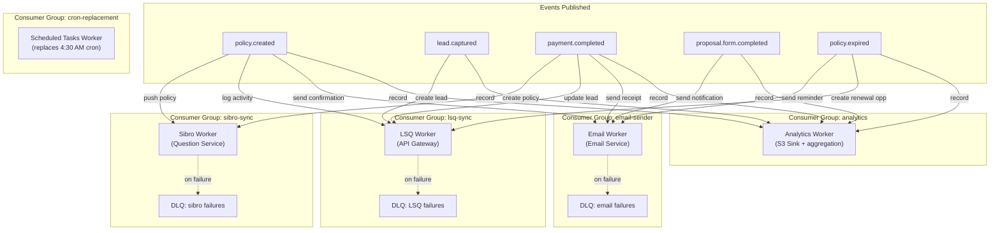

**Detailed consumer specifications:**

#### Consumer Group: `sibro-sync`

This replaces our current staged execution in the Question Service.

| Config | Value |
|--------|-------|
| Subscribes to | `policy.events` (type: `policy.created`), `sibro.commands` |
| Concurrency | 1 per partition (ordered processing per policy) |
| Retry strategy | 3 attempts, exponential backoff (1s, 5s, 30s) |
| DLQ topic | `dead-letter` with `originalTopic: sibro.commands` |
| Idempotency | Check `sibro_client_transactions` before processing |

**Processing flow for `policy.created`:**

```
policy.created event received
    │
    ├─ 1. Check feature flag (SEND_POLICY_TO_SIBRO)
    │     └─ disabled? → commit offset, skip
    │
    ├─ 2. Resolve Sibro client
    │     ├─ Search by PAN
    │     ├─ Search by GST-extracted PAN
    │     ├─ Search by email
    │     └─ Search by phone
    │     └─ 0 matches? → Create client in Sibro
    │     └─ 2+ matches? → Publish 'sibro.client.ambiguous' event, commit offset
    │
    ├─ 3. POST /add-policy to Sibro
    │     └─ Map our IDs → Sibro IDs using mapping tables
    │
    ├─ 4. POST /add-premium-transaction/{sibroPolicyId}
    │
    ├─ 5. Save to sibro_client_transactions
    │
    └─ 6. Commit offset ✓

    On failure at any stage:
    └─ Don't commit offset → Kafka redelivers automatically
    └─ After 3 failures → send to dead-letter topic
    └─ Alert Worker picks up DLQ → sends email to admin
       (same email as today, but now with automatic retry behind it)
```

#### Consumer Group: `lsq-sync`

This replaces our scattered LeadSquared API calls across Gateway and Question Service.

| Config | Value |
|--------|-------|
| Subscribes to | `lead.events`, `policy.events`, `quote.events`, `lsq.commands` |
| Concurrency | 5 (rate limited to LSQ API limits) |
| Retry strategy | 5 attempts, exponential backoff (2s, 10s, 60s, 300s, 900s) |
| Rate limiting | 5 requests/second to LeadSquared API |
| DLQ topic | `dead-letter` with `originalTopic: lsq.commands` |

**Event-to-action mapping:**

| Event | LSQ API Called | What It Does |
|-------|--------------|-------------|
| `lead.captured` | `Lead.Capture` | Create/update lead with core + custom (mx_*) fields |
| `lead.captured` (product-specific) | `Lead.Capture` | Add product-specific fields (CPM, EAR, CAR, etc.) |
| `quote.generated` | `ProspectActivity.Create` | Log quote activity with premium details |
| `policy.created` | `ProspectActivity.Create` | Log policy purchase activity |
| `policy.created` | `Opportunity.Create` | Create cross-sell + renewal opportunities |
| `policy.expired` (60/21/14/7/1 day) | `ProspectActivity.Create` | Create reminder activity for sales dashboard |
| `lead.stale` (45+ days) | `ProspectActivity.Create` | Create follow-up reminder activity |
| `proposal.form.initiated` | `ProspectActivity.Create` | Log proposal form start |
| Bulk CSV command | `Lead.Capture` / `ProspectActivity.Create` | Process at 5 req/sec |

#### Consumer Group: `email-sender`

This replaces our direct TCP calls and the `ClientEmailScheduler` infrastructure.

| Config | Value |
|--------|-------|
| Subscribes to | `email.commands`, `policy.events`, `proposal.events`, `lead.events` |
| Concurrency | 10 (SendGrid handles volume well) |
| Retry strategy | 3 attempts, fixed 30s backoff |
| Priority | Event-derived: policy confirmations (high) > reminders (medium) > marketing (low) |
| DLQ topic | `dead-letter` with `originalTopic: email.commands` |

**Event-to-email mapping:**

| Event | Email Template | Recipients |
|-------|---------------|------------|
| `policy.created` | Policy confirmation | Client + ops team |
| `policy.expired` (60 days) | Early renewal reminder | Client |
| `policy.expired` (21 days) | Renewal reminder | Client + CS team |
| `policy.expired` (14/7/1 days) | Urgent renewal reminder | Client + CS team + sales head |
| `proposal.form.initiated` | Proposal form link | Client |
| `proposal.form.stale` | Proposal form reminder | Client |
| `lead.stale` | Re-engagement email | Client |
| `sibro.push.failed` (from DLQ) | Sibro failure alert | Admin |

#### Consumer Group: `analytics-pipeline`

This is new capability — something we don't have today.

| Config | Value |
|--------|-------|
| Subscribes to | `audit.log` (all events) |
| Concurrency | 3 |
| Output | S3 data lake (Parquet format, partitioned by date + event type) |
| Downstream | Athena queries, Metabase/Superset dashboards |

### 5.6 How Our Current Flows Change

Let's walk through our three most critical flows and see exactly how they transform.

#### Flow 1: Payment → Policy Creation (replaces the 30-second sleep)

**Today:**
```
LSQ webhook hits /lead-square/byId/:id
    → sleep(30000)  // wait 30 seconds
    → fetch lead from LSQ
    → create policy in DB
    → (sequentially) update LSQ activity
    → (sequentially) create LSQ opportunities
    → (sequentially) push to Sibro
    → (sequentially) send confirmation emails

If anything fails midway → partial state, manual cleanup
```

**With Kafka:**
```
LSQ webhook hits /lead-square/byId/:id
    → Gateway publishes: payment.completed { prospectId, amount, gateway }
    → returns 202 Accepted immediately

    ┌─ Consumer: question-service (policy-creator group)
    │  → Fetch lead from LSQ (or from local cache)
    │  → Create policy in DB
    │  → Publish: policy.created { ...all details }
    │
    ├─ Consumer: sibro-sync
    │  → Resolve client, push policy, push premium txn
    │  → (independent, retries on its own)
    │
    ├─ Consumer: lsq-sync
    │  → Update activity, create opportunities
    │  → (independent, rate-limited)
    │
    └─ Consumer: email-sender
       → Send confirmation to client + ops
       → (independent, retries on its own)

Each consumer succeeds or fails independently.
Sibro being down doesn't block the email.
LSQ rate limiting doesn't delay the policy creation.
```

#### Flow 2: Stale Lead Processing (replaces 4:30 AM cron)

**Today:**
```
Cron fires at 4:30 AM IST
    → Query DB for leads older than 45 days with isConverted = false
    → For each lead:
        → Call LSQ API to create reminder activity
        → If fails → log error, move to next

If cron fails at lead #50 out of 200 → remaining 150 are skipped until tomorrow
```

**With Kafka:**
```
Option A: Kafka Streams (real-time)
    → KStream on lead.events
    → Window: tumbling 24h
    → Filter: no policy.created event for this leadId within 45 days
    → Produce: lead.stale { leadId, daysSinceCreation }
    → lsq-sync consumer picks it up → creates reminder

Option B: Scheduled producer (simpler, our recommendation to start)
    → BullMQ repeatable job runs at 4:30 AM
    → Queries DB for stale leads
    → Publishes lead.stale event for EACH lead individually to Kafka
    → lsq-sync consumer processes each independently
    → If consumer fails on lead #50 → Kafka retries #50,
      continues processing #51-200 in parallel

No single point of failure. Each lead is an independent message.
```

#### Flow 3: Sibro Policy Push (replaces staged execution + error emails)

**Today:**
```
Policy created → Question Service calls Sibro directly:
    Stage 1: resolve_client  → if fails → email admin, stop
    Stage 2: create_policy   → if fails → email admin, stop
    Stage 3: create_premium  → if fails → email admin, stop
    Stage 4: save_transaction → if fails → email admin, stop

Admin receives email → manually investigates → manually retriggers
No record of which policies are pending, which succeeded, which failed
```

**With Kafka:**
```
policy.created event published
    │
    ▼
sibro-sync consumer picks it up
    │
    ├─ Stage 1: resolve_client
    │     fail? → don't commit offset → Kafka retries in 1s
    │     fail 3x? → send to dead-letter, commit offset
    │
    ├─ Stage 2: create_policy (only if Stage 1 succeeded)
    │     fail? → don't commit offset → Kafka retries in 5s
    │     fail 3x? → send to dead-letter
    │
    ├─ Stage 3: create_premium_transaction
    │     fail? → don't commit offset → Kafka retries in 30s
    │     fail 3x? → send to dead-letter
    │
    └─ Stage 4: save to sibro_client_transactions
          ✓ commit offset

Dead letter consumer:
    → Sends the same admin email as today
    → BUT: the message is preserved in the DLQ topic
    → Admin can inspect, fix the issue, and replay from DLQ
    → Or: automated retry job checks DLQ every hour and retries

Visibility:
    → Consumer lag metric tells us: "12 policies pending Sibro sync"
    → DLQ depth tells us: "3 policies failed Sibro sync"
    → No more guessing from email threads
```

### 5.7 Change Data Capture (CDC) with Debezium

This is how we get data from our existing PostgreSQL tables into Kafka without changing any application code. Debezium watches the PostgreSQL WAL (write-ahead log) and publishes every INSERT/UPDATE/DELETE as a Kafka event.

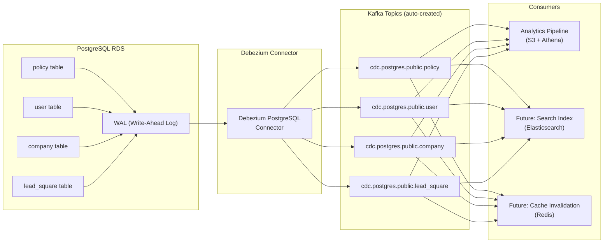

**What this gives us:**
- Every database change automatically shows up in Kafka — no application code changes
- We can build a complete data lake by sinking CDC topics to S3
- Future capabilities (search, cache invalidation, read replicas) can tap in without modifying our services
- Historical replay — we can rebuild any downstream system from the CDC log

**Debezium connector configuration for our setup:**

```json
{
  "name": "bk-postgres-cdc",
  "config": {
    "connector.class": "io.debezium.connector.postgresql.PostgresConnector",
    "database.hostname": "bk-production.xxxxx.ap-south-1.rds.amazonaws.com",
    "database.port": "5432",
    "database.dbname": "bimakavach",
    "database.server.name": "bk-prod",
    "plugin.name": "pgoutput",
    "publication.name": "bk_cdc_publication",

    "table.include.list": "public.policy,public.user,public.company,public.lead_square,public.quote,public.claim,public.proposal_form,public.sibro_client_transactions",

    "topic.prefix": "cdc.postgres",
    "key.converter": "org.apache.kafka.connect.json.JsonConverter",
    "value.converter": "org.apache.kafka.connect.json.JsonConverter",

    "transforms": "route",
    "transforms.route.type": "org.apache.kafka.connect.transforms.RegexRouter",
    "transforms.route.regex": "cdc\\.postgres\\.public\\.(.*)",
    "transforms.route.replacement": "cdc.postgres.public.$1",

    "snapshot.mode": "initial",
    "slot.name": "bk_debezium_slot",
    "heartbeat.interval.ms": 10000
  }
}
```

**RDS prerequisites:**
- Enable `rds.logical_replication` parameter (set to 1)
- Create a replication slot and publication for the tables we want to track
- No application code changes required

### 5.8 Data Lake & Analytics Pipeline

Once we have events flowing through Kafka (both application events and CDC), we can build a proper data pipeline that replaces our current Google Sheets reporting.

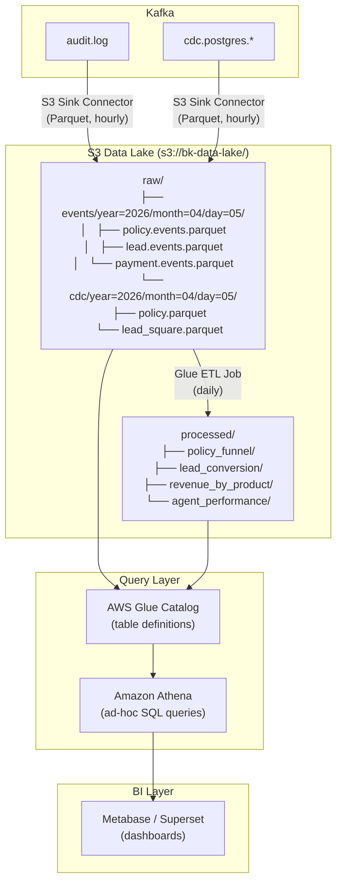

**Dashboards this enables (replacing Google Sheets):**

| Dashboard | Data Source | Replaces |
|-----------|------------|----------|
| Policy Funnel | `lead.events` → `quote.events` → `policy.events` | Manual tracking |
| Revenue by Product/Insurer | `policy.events` aggregated | Admin panel stats |
| Sibro Sync Health | `sibro.commands` + DLQ depth | Error emails |
| LSQ Sync Health | `lsq.commands` + DLQ depth | Error emails |
| Email Delivery Rate | `email.commands` + delivery events | `ClientEmailScheduler` queries |
| POS Agent Performance | `pos.events` + `policy.events` | Google Sheets POS Reporting |
| Lead Conversion Time | `lead.events` → `policy.events` time delta | Manual calculation |
| Stale Lead Report | `lead.stale` events | Cron job output |

### 5.9 NestJS Integration

Here's how our services would actually integrate with Kafka. NestJS has built-in Kafka transport support, so the code changes are contained.

**Module setup:**

```typescript
// shared/kafka/kafka.module.ts
import { Module } from '@nestjs/common';
import { ClientsModule, Transport } from '@nestjs/microservices';

@Module({
  imports: [
    ClientsModule.register([
      {
        name: 'KAFKA_SERVICE',
        transport: Transport.KAFKA,
        options: {
          client: {
            clientId: 'bk-api-gateway',
            brokers: process.env.KAFKA_BROKERS.split(','),
            ssl: true,
            sasl: {
              mechanism: 'scram-sha-256',
              username: process.env.KAFKA_USERNAME,
              password: process.env.KAFKA_PASSWORD,
            },
          },
          producer: {
            allowAutoTopicCreation: false,
            idempotent: true,        // exactly-once producing
          },
          consumer: {
            groupId: 'bk-api-gateway',
            sessionTimeout: 30000,
            heartbeatInterval: 10000,
          },
        },
      },
    ]),
  ],
  exports: [ClientsModule],
})
export class KafkaModule {}
```

**Publishing events (producer side):**

```typescript
// question-service/policy/policy.service.ts
import { Inject } from '@nestjs/common';
import { ClientKafka } from '@nestjs/microservices';
import { v4 as uuid } from 'uuid';

@Injectable()
export class PolicyService {
  constructor(
    @Inject('KAFKA_SERVICE') private readonly kafka: ClientKafka,
  ) {}

  async createPolicy(data: CreatePolicyDto): Promise<Policy> {
    // 1. Create policy in database (existing logic, unchanged)
    const policy = await this.policyRepository.save(data);

    // 2. Publish event (NEW — replaces direct TCP calls to Sibro, LSQ, Email)
    await this.kafka.emit('policy.events', {
      key: policy.id.toString(),
      value: {
        eventId: uuid(),
        eventType: 'policy.created',
        eventVersion: 1,
        source: 'question-service',
        timestamp: new Date().toISOString(),
        correlationId: data.correlationId,
        aggregateType: 'policy',
        aggregateId: policy.id.toString(),
        payload: {
          policyNumber: policy.policyNumber,
          productId: policy.productId,
          insurerId: policy.insurerId,
          companyId: policy.companyId,
          userId: policy.userId,
          grossPremium: policy.grossPremium,
          startDate: policy.startDate,
          endDate: policy.endDate,
          // ... all fields consumers need
        },
      },
    });

    // 3. Return policy (no need to wait for Sibro/LSQ/Email)
    return policy;
  }
}
```

**Consuming events (consumer side):**

```typescript
// question-service/sibro/sibro.consumer.ts
import { Controller } from '@nestjs/common';
import { EventPattern, Payload, Ctx, KafkaContext } from '@nestjs/microservices';

@Controller()
export class SibroConsumer {
  constructor(private readonly sibroService: SibroService) {}

  @EventPattern('policy.events')
  async handlePolicyCreated(
    @Payload() event: BimaKavachEvent<PolicyCreatedPayload>,
    @Ctx() context: KafkaContext,
  ) {
    // Only process policy.created events
    if (event.eventType !== 'policy.created') return;

    // Idempotency check — have we already processed this policy?
    const existing = await this.sibroService.findTransaction(event.payload.policyNumber);
    if (existing) {
      // Already synced, skip (safe reprocessing)
      return;
    }

    try {
      // Stage 1: Resolve client
      const sibroClientId = await this.sibroService.resolveClient(event.payload);

      // Stage 2: Create policy in Sibro
      const sibroPolicyId = await this.sibroService.createPolicy(sibroClientId, event.payload);

      // Stage 3: Create premium transaction
      await this.sibroService.createPremiumTransaction(sibroPolicyId, event.payload);

      // Stage 4: Save transaction record
      await this.sibroService.saveTransaction(event.payload.policyNumber, sibroPolicyId);

      // Offset committed automatically on success
    } catch (error) {
      // Throwing causes Kafka to NOT commit the offset → automatic retry
      // After max retries, NestJS Kafka transport sends to DLQ
      throw error;
    }
  }
}
```

### 5.10 Observability & Monitoring

With Kafka, we get operational visibility that we simply don't have today.

**Key metrics to monitor:**

| Metric | What It Tells Us | Alert Threshold |
|--------|-----------------|-----------------|
| Consumer lag (per group) | How far behind a consumer is | > 100 messages for > 5 minutes |
| DLQ depth | How many events have permanently failed | > 0 (any DLQ message needs attention) |
| Producer throughput | Events published per second per service | Anomaly detection (sudden drop = service issue) |
| Consumer processing time (p99) | How long each event takes to process | > 10s for Sibro, > 5s for LSQ, > 2s for email |
| End-to-end latency | Time from publish to all consumers done | > 60s for policy.created fan-out |
| Partition skew | Uneven load across partitions | > 3x difference between most/least loaded |

**How we'd surface this:**

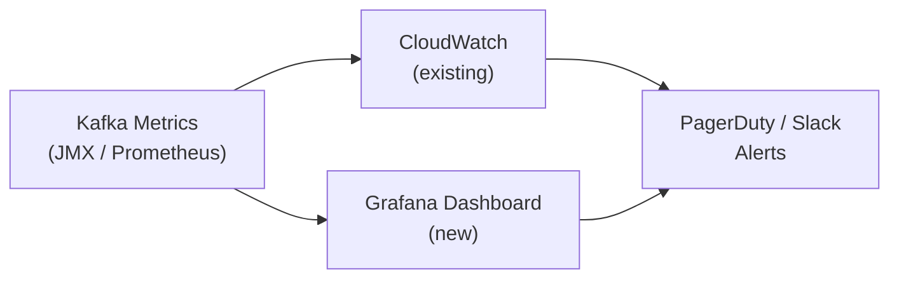

**Alert examples mapped to our operations:**

| Alert | Condition | What's Happening | Action |
|-------|-----------|-----------------|--------|
| "Sibro sync backed up" | sibro-sync consumer lag > 50 | Sibro API might be down or slow | Check Sibro API status, review DLQ |
| "LSQ rate limit hit" | lsq-sync consumer lag growing steadily | We're producing faster than 5 req/sec | Expected during bulk uploads, monitor |
| "Emails failing" | email-sender DLQ depth > 0 | SendGrid issues or invalid templates | Check SendGrid dashboard, review failed payloads |
| "Policy events not flowing" | policy.events producer rate = 0 for 6 hours (business hours) | Question Service might be down | Check service health |
| "CDC slot growing" | Debezium replication slot size > 1GB | CDC consumer is stuck | Restart Debezium connector, check for schema changes |

### 5.11 Migration Strategy from Current State

We wouldn't flip a switch. Here's how we'd migrate to Kafka without disrupting production.

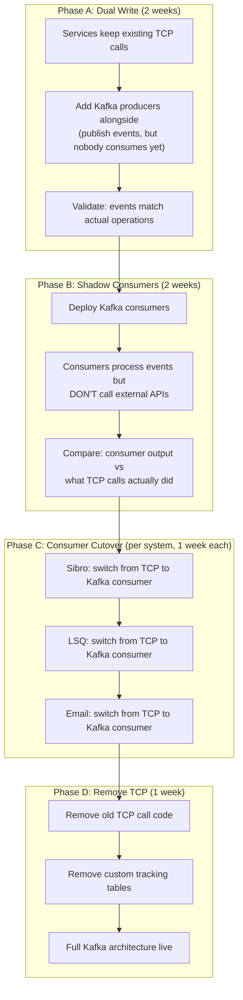

**Phase A — Dual Write (weeks 1-2):**
Our services continue working exactly as today. We add Kafka producers alongside existing logic. Both the TCP call AND the Kafka event happen. Nobody consumes the Kafka events yet — we're just validating that the events look correct and that the throughput is manageable.

**Phase B — Shadow Consumers (weeks 3-4):**
We deploy Kafka consumers that read events and log what they WOULD do — but don't actually call Sibro, LSQ, or SendGrid. We compare the shadow output against what the TCP path actually did. This catches schema mismatches, missing fields, ordering issues.

**Phase C — Consumer Cutover (weeks 5-7, one system at a time):**
We flip each external integration from TCP to Kafka, one at a time. Start with email (lowest risk, easiest to verify), then LSQ (most volume), then Sibro (most complex). Each cutover has a feature flag so we can revert instantly.

**Phase D — Cleanup (week 8):**
Remove the old TCP call paths, deprecate the custom tracking tables, clean up dual-write code.

### 5.12 Cost Breakdown

| Component | Option A: AWS MSK | Option B: Redpanda Cloud | Option C: Self-hosted Redpanda |
|-----------|:-----------------:|:------------------------:|:------------------------------:|
| Kafka cluster (3 brokers) | $350/month | $250/month | $90/month (3x t3.medium) |
| Kafka Connect (2 workers) | included in MSK Connect | $50/month | $60/month (2x t3.small) |
| Schema Registry | Glue (free tier) | included | included (built-in) |
| S3 storage (events) | ~$10/month | ~$10/month | ~$10/month |
| Athena queries | ~$5-20/month | ~$5-20/month | ~$5-20/month |
| Monitoring (Grafana) | CloudWatch ($15) | included | Grafana Cloud free tier |
| **Total** | **~$380-400/month** | **~$315-330/month** | **~$165-180/month** |

For comparison, our current approach costs $0 in infrastructure but carries hidden costs: manual admin intervention on failures, data inconsistencies between systems, no analytics capability, and engineering time spent debugging sync issues.

---

## 6. Our Recommendation

### Start with Approach 3 (BullMQ + PostgreSQL), evolve into Approach 4 (Hybrid)

Here's why we believe this is the right path for where we are today:

**1. Zero new paradigms for the team.** We write NestJS + TypeScript today, and `@nestjs/bullmq` is a first-class NestJS module. No new languages, no new frameworks — the team can be productive from day one.

**2. One new dependency.** Redis. That's it. Three lines in our `docker-compose.yml`, ElastiCache in production. We're already managing PostgreSQL, S3, and Docker — Redis is the simplest thing we can add.

**3. It solves every pain point we identified:**

| Pain Point | How BullMQ Solves It |
|-----------|----------------|
| Sibro staged execution + error emails | FlowProducer with parent-child job dependencies + automatic retry |
| 30-second payment sleep | `payment-process` queue — job triggers on webhook receipt, no arbitrary wait |
| 4:30 AM monolithic cron | Individual repeatable jobs per task, each with its own retry/DLQ |
| CSV bulk upload at 5 req/sec | BullMQ `rateLimiter: { max: 5, duration: 1000 }` — built-in |
| `ClientEmailScheduler` tables | BullMQ delayed jobs with built-in status tracking |
| `LsqBulkOperation` tables | BullMQ job tracking with per-job results |
| No visibility into async operations | Bull Board dashboard — we can see every job, its status, and its history |

**4. Incremental adoption.** We migrate one queue at a time. Start with email (lowest risk), then Sibro sync (highest pain), then LSQ operations. No big-bang migration, no service outage.

**5. It doesn't close any doors.** If we grow to 10M events/day or need cross-team event contracts, BullMQ producers can be swapped to Kafka producers without rewriting consumer logic. The PostgreSQL event log provides the audit trail until we're ready for Kafka CDC in Phase 3.

**When we should revisit this decision:**
- If event volume exceeds 100K/day → evaluate Kafka/Redpanda
- If multiple new services need to independently consume the same events → EventBridge or Kafka fan-out
- If real-time analytics becomes a core requirement → Kafka Streams or Flink

---
