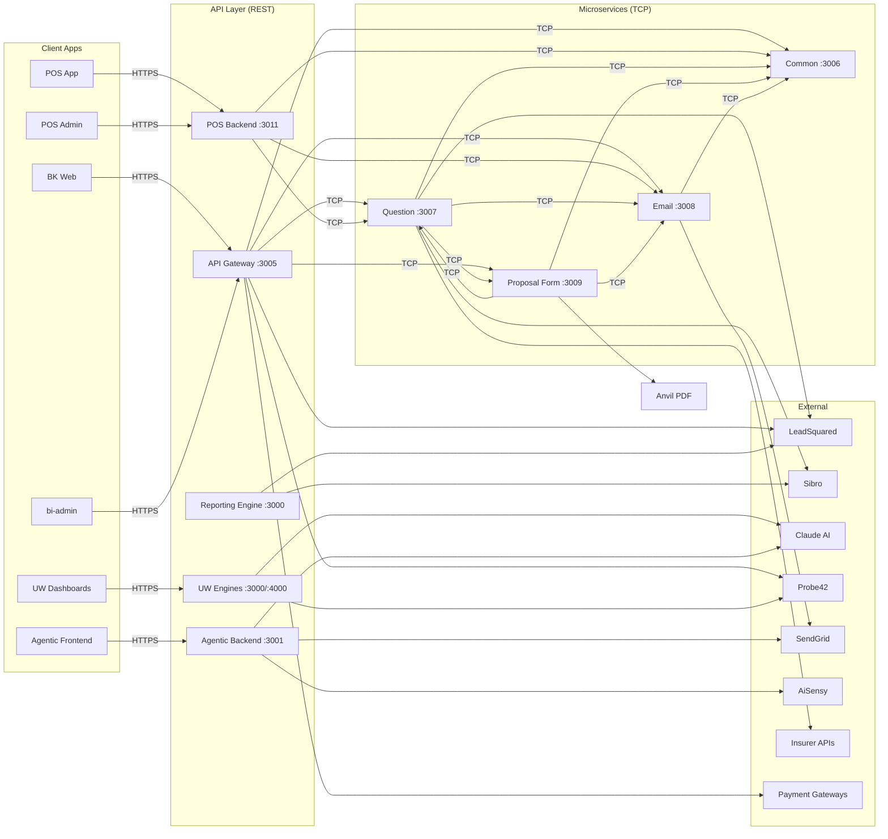

# BimaKavach — Service Reference Guide

A comprehensive guide explaining what each service does, how it works internally, and how it communicates with other services.

## Table of Contents

- [1. API Gateway](#1-api-gateway)
- [2. Common Service](#2-common-service)
- [3. Question Service](#3-question-service)
- [4. Email Service](#4-email-service)
- [5. Proposal Form Service](#5-proposal-form-service)
- [6. POS Platform](#6-pos-platform)
- [7. BK Web V2.0 (Customer Portal)](#7-bk-web-v20-customer-portal)
- [8. bi-admin V2 (Admin Panel)](#8-bi-admin-v2-admin-panel)
- [9. Underwriting Engine — Multi-Product](#9-underwriting-engine--multi-product)
- [10. Underwriting Decision Engine — D&O](#10-underwriting-decision-engine--do)
- [11. Agentic Workflow (RM Automation)](#11-agentic-workflow-rm-automation)
- [12. Reporting Engine V2](#12-reporting-engine-v2)
- [13. Document Signer](#13-document-signer)

---

## 1. API Gateway

| | |
|---|---|
| **Repo** | `microservice-api-gateway` |
| **Stack** | NestJS 10, TypeScript, TypeORM |
| **Port** | 3005 |
| **Role** | Central REST API entry point. All client-facing apps (BK Web, bi-admin) hit this service. It authenticates requests, applies authorization, and routes to downstream microservices via TCP. |

### What It Does

The API Gateway is the **front door** of the platform. Every HTTP request from the customer portal or admin panel passes through it. It handles:

- **Authentication** — JWT token generation/validation, OTP via MSG91, HMAC signature verification
- **User & Company Management** — CRUD for users, companies, documents, and user-company associations
- **Lead Management** — Full LeadSquared CRM integration (lead capture, activities, opportunities, bulk operations, renewal management)
- **Quote Routing** — Proxies quote requests to Question Service, handles payment gateway integration (Paytm, HDFC, Magma)
- **Policy Routing** — Proxies policy CRUD, claims, requests, proposal forms to downstream services
- **Product Catalog Routing** — Proxies product, insurer, pricing, master data requests to Common Service
- **Email Routing** — Proxies template, trigger, and email sending requests to Email Service
- **Cron Jobs** — Daily scheduled tasks at 4:30 AM IST for lead follow-ups, policy reminders, proposal form reminders, declaration emails
- **Phone/AI Integration** — Greylabs phone calls, RevRag AI voice bot webhooks
- **Partner Management** — Partner onboarding and partner-lead tracking

### Controllers (60+)

| Area | Controllers | Key Endpoints |
|------|------------|---------------|
| **Auth** | `auth.controller.ts` | `POST /auth/login`, `POST /auth/client-dashboard-login`, `POST /auth/otp-verify`, `POST /auth/refresh-token`, `POST /auth/probe-cin` |
| **Users** | `users.controller.ts`, `company.controller.ts` | `GET/POST/PUT /users`, `GET/POST/PUT /users/company` |
| **Leads** | `lead-square.controller.ts`, `lsq-bulk-operations.controller.ts` | `POST /lead-square/`, `POST /lead-square/byId/:id`, `POST /lead-square/lsq-renewal-bulk-upload` |
| **Quotes** | `quote.controller.ts` | `GET/POST/PUT /quotes`, `POST /quotes/schedule-call` |
| **Policies** | `policy.controller.ts`, `policy-claims.controller.ts`, `policy-request.controller.ts` | `GET/POST/PUT /policy`, `POST /policy/:id/claim` |
| **Payments** | `payment.controller.ts` | `POST /payment/callback`, `POST /payment/initiate-chola-payment`, `POST /payment/initiate-hdfc-payment-url-generation`, `POST /payment/initiate-magma-payment-url-generation` |
| **Products** | `product.controller.ts`, `insurer.controller.ts`, `pricing.controller.ts` | Proxied to Common Service |
| **Questions** | `question-l1.controller.ts`, `question-l2.controller.ts` | Proxied to Question Service |
| **Email** | `email.controller.ts`, `email-template.controller.ts`, `email-trigger.controller.ts` | Proxied to Email Service |
| **Proposal** | `proposal-form.controller.ts`, `proposal-form-answer.controller.ts` | Proxied to Proposal Form Service |
| **Config** | `configuration-details.controller.ts`, `roles.controller.ts`, `state-masters.controller.ts` | Proxied to Common Service |
| **Integrations** | `sibro.controller.ts`, `probe-cin.controller.ts`, `qcr.controller.ts` | Sibro sync triggers, Probe CIN lookups, QCR management |
| **AI/Phone** | `greylabs.controller.ts`, `revrag-ai.controller.ts`, `ai-rest.controller.ts` | Greylabs webhook, RevRag callback, AI chat endpoints |

### How It Talks to Other Services

```
API Gateway ──TCP──> Common Service (:3006)
            ──TCP──> Question Service (:3007)
            ──TCP──> Email Service (:3008)
            ──TCP──> Proposal Form Service (:3009)
```

**To Common Service** — Product/insurer/pricing/master data lookups. Example patterns: `get-product-by-id`, `get-insurer-list`, `get-pricing`, `get-configuration-details-by-key`, `get-state-master-data`, `get-roles`

**To Question Service** — Quotes, policies, claims, L1/L2 questions, OCR, Sibro. Example patterns: `get-quotes`, `create-policy`, `get-policy-list`, `create-policy-claim`, `get-document-number-ocr`, `sibro.sync.insurers`

**To Email Service** — Email sending, templates, triggers, scheduling. Example patterns: `send-email`, `create-email-trigger`, `get-template-list-admin`, `create-case-study`

**To Proposal Form Service** — Proposal forms, questions, answers. Example patterns: `create-proposal-form-question`, `get-proposal-form`, `update-client-answer-proposal-form`

### External APIs Called

| API | Purpose |
|-----|---------|
| **LeadSquared** | CRM — lead capture, activities, opportunities, bulk operations, renewal management |
| **MSG91** | SMS OTP delivery for login and verification |
| **Probe42** | Company CIN/LLP verification (sandbox + production) |
| **Paytm** | Payment gateway (legacy) |
| **HDFC Bank** | Payment gateway with SHA-512 HMAC signature validation |
| **Magma (GC Pay)** | Payment gateway for e-commerce/renewals |
| **SendGrid** | Direct email sending for OTP emails |
| **Greylabs** | Phone call integration (automated dialing, recording, transcription) |
| **RevRag AI** | AI voice bot (call events, transcription, lead feedback) |
| **AWS S3** | Document and file storage |
| **AWS CloudWatch** | Centralized logging |

### Database Tables Owned

| Table | Purpose |
|-------|---------|
| `user` | System users (admin, sales, client, etc.) |
| `company` | Client companies |
| `user_company` | User-company associations |
| `user_company_document` | Documents attached to user-company |
| `user_otp` | OTP management (type, expiry, retry count) |
| `refresh_token` | JWT refresh tokens |
| `lead_square` | Internal lead records |
| `lead_square_id_mapping` | Internal ID <-> LSQ prospect ID mapping |
| `l1_form_lsq_activity_id_mapping` | L1 form <-> LSQ activity mapping |
| `lsq_callback_requests` | LSQ webhook callbacks |
| `lsq_bulk_operation` | Bulk lead import job state (QUEUED -> COMPLETE/FAILED) |
| `lsq_bulk_operation_result` | Per-row bulk import results |
| `lsq_field_master` | LSQ field definitions |
| `lsq_entity_subtype` | LSQ entity subtype config |
| `probe_details` | Probe API response cache |
| `probe_search_logs` | Probe API search history |
| `company_details` | Detailed company info |
| `partner` | Partner/referral records |
| `reward_redemption` | Reward redemption tracking |
| `notification_event`, `notification_user` | Notification system |
| `ai_chat_session`, `ai_chat_message` | AI chat history |
| `greylabs_call_log`, `greylabs_pending_lead` | Phone call tracking |
| `revrag_ai_call_record` | AI voice bot call records |

### Key Business Flows

**OTP Login Flow:**
1. User submits email/mobile -> `POST /auth/client-dashboard-login`
2. Generate 6-digit OTP, send via MSG91 (SMS) or SendGrid (email)
3. Store OTP in `user_otp` with 10-min expiry, 3 retries
4. User verifies -> `POST /auth/otp-verify`
5. Generate JWT access + refresh tokens

**Payment Flow (HDFC example):**
1. `POST /payment/initiate-hdfc-payment-url-generation` -> get payment URL
2. User completes payment on HDFC portal
3. HDFC calls `POST /payment/hdfc-payment-callback`
4. Validate SHA-512 HMAC signature
5. Check payment status with HDFC status API
6. Update quote payment status -> trigger policy creation

**Cron Jobs (Daily 4:30 AM IST):**
- Leads not converted after 45 days -> engagement email
- L1 forms not completed in 1 day -> reminder email
- Policies nearing expiry -> renewal reminder emails
- Proposal forms pending -> reminder emails
- Declaration-type policies -> declaration reminder
- Company incorporation anniversary -> birthday email

### Guards & Middleware

| Guard | Purpose |
|-------|---------|
| `JwtAuthGuard` | Validates JWT tokens, checks user is active, verifies token_version |
| `RolesGuard` | Role-based access control via `@Roles()` decorator |
| `HmacGuard` | HMAC-SHA256 signature validation for public endpoints |
| `@Public()` | Decorator to bypass JWT auth (login, OTP, payment callbacks) |
| `@SkipHmac()` | Bypass HMAC validation (payment gateway callbacks) |

---

## 2. Common Service

| | |
|---|---|
| **Repo** | `microservice-common` |
| **Stack** | NestJS 10, TypeScript, TypeORM |
| **Port** | 3006 |
| **Role** | Master data service. Manages products, insurers, pricing, geographic data, fire occupancies, marine metadata, roles/permissions, and third-party insurer API configurations. **No REST endpoints** — all communication via TCP message patterns. |

### What It Does

The Common Service is the **data backbone** of the platform. It owns all master/reference data that other services need. It has **241+ TCP message patterns** across 7 modules:

### Modules

#### 2.1 Commons Module (Master Data) — 120+ patterns

Manages the full product catalog and configuration:

| Entity Group | Patterns | What It Manages |
|-------------|----------|-----------------|
| **Products** | `get-product-list`, `get-product-by-id`, `create-product`, `update-product` | Products, product groups, product meta, insurer-product mapping |
| **Insurers** | `get-insurer-list`, `get-insurer-by-id`, `create-insurer`, `update-insurer` | Insurers, logos, RHL templates, lead schema |
| **Insurer Covers** | `get-insurer-cover`, `create-insurer-cover-group`, `create-insurer-cover-item` | Coverage hierarchies (groups -> items -> covers), policy dashboard coverages |
| **Annual Turnover** | `get-annual-turnover`, `create-annual-turnover` | Turnover brackets per product |
| **Limit of Liability** | `get-limit-of-liability`, `create-limit-of-liability` | LOL brackets per product |
| **Industries** | `get-industries`, `create-industry` | Industry classifications with premium parameter mapping |
| **Business Locations** | `get-business-location-name`, `get-business-location-number` | Location types and count ranges |
| **Categories** | `get-categories`, `create-category`, `get-sub-category` | Product categorization hierarchy |
| **Fire Occupancies** | `get-all-fire-occupancies`, `create-fire-occupancy-insurer-rate` | Fire risk classification, insurer rates, discount handling |
| **Geographic Masters** | `get-state-master-data`, `get-city-district-master-data`, `get-pincode-master-data` | State -> City -> Pincode hierarchy, fire zones, Chola area codes |
| **Roles & Permissions** | `get-roles`, `create-role`, `get-role-actions` | User roles, permissions, role actions |
| **Configuration** | `get-configuration-details-by-key`, `create-configuration-details` | Dynamic key-value configuration |
| **Others** | Various | Newsletters, star features, policy wordings, premium parameters, placement RFQ emails, product documents, insurer OCR pages |

#### 2.2 Pricing Module — 5 patterns

| Pattern | Purpose |
|---------|---------|
| `create-pricing` | Create pricing rule |
| `get-pricing` | Get pricing for product |
| `get-pricing-by-insurerIds` | Get pricing by insurers, LOL, product, premium parameter |
| `update-pricing` | Update pricing rule |

#### 2.3 Probe-CIN Module — 25+ patterns

Company verification using CIN (Corporate Identification Number):
- CIN Details (company master, directors, shareholders, contacts, charges, GST, credit ratings, defaulters, revenue)
- Bulk upload/update support
- S3 file upload for documents

#### 2.4 Third-Party API Integration Module — 28 patterns

Manages dynamic API configurations for insurer integrations:
- **API Endpoints** — Configurable endpoint definitions
- **Metadata Fields** — Field definitions per API
- **Field Mappings** — Map internal fields to insurer API fields
- **Templates** — Handlebars-based request templates
- **Transformation Rules** — Response transformation rules
- **Occupancy Metadata** — WC occupations, Digit/Magma occupancy codes

#### 2.5 TP Quote Calculation Module — 19 patterns

Calculates quotes from third-party insurers:
- `get-tp-quotes` — Get available quotes
- `call-cpm-tata-quote` — Tata AIG CPM quote
- KYC verification (Magma, Chola, Digit, HDFC)
- Payment URL generation (Magma, Digit)
- Policy document retrieval

**External APIs called:** Magma, Digit, Chola (Basic Auth), HDFC (Corporate KYC), Tata AIG (OAuth2 via Cognito)

#### 2.6 Marine Module — 22 patterns

Marine insurance metadata: countries, cover maps, QMS commodities, voyage metadata, voyage maps.

#### 2.7 Reward Module — 14 patterns

Loyalty rewards: providers, rewards, learn-more sections with tabs and points.

### How It Talks to Other Services

```
Common Service does NOT call other services.
It is called BY:
  - API Gateway (via TCP)
  - Question Service (via TCP)
  - Email Service (via TCP)
  - Proposal Form Service (via TCP)
  - POS Backend (via TCP)
```

This service is **read-heavy** — it serves as the single source of truth for product, insurer, and configuration data.

### Database Tables Owned (70+)

Products: `product`, `product_group`, `product_meta` | Insurers: `insurer`, `insurer_cover`, `insurer_cover_group`, `insurer_cover_item` | Pricing: `pricing`, `premium_parameter` | Master Data: `annual_turnover`, `limit_of_liability`, `industry`, `industry_combined`, `category`, `sub_category`, `section` | Geography: `state_master`, `city_district_master`, `pincode_master`, `chola_pincode_master`, `pincode_zones_master` | Fire: `fire_occupancy`, `fire_occupancy_insurer_rates`, `fire_insurer_discounts_handling` | Third-Party: `third_party_api_endpoints`, `third_party_api_field_mappings`, `third_party_api_templates`, `third_party_transformation_rules`, `third_party_api_call_logs`, `third_party_api_quotes` | Occupancy: `occupation_metadata`, `wc_occupancy_metadata`, `digit_occupancy_metadata`, `magma_occupancy_metadata` | CIN: `cin_details`, `cin_directors`, `cin_contacts`, `cin_charge_details`, `cin_credit_ratings`, `cin_gst_details` | Marine: `marine_country_metadata`, `marine_cover_map_metadata`, `marine_qms_commodity_metadata`, `marine_voyage_metadata` | Rewards: `reward_provider`, `reward`, `reward_learn_more_section` | Config: `configuration_details`, `roles`, `role_actions`, `resources` | Others: `news_letter`, `star_features`, `policy_wording`, `product_documents`, `placement_rfq_email`

---

## 3. Question Service

| | |
|---|---|
| **Repo** | `microservice-question` |
| **Stack** | NestJS 10, TypeScript, TypeORM, Puppeteer/Chromium |
| **Port** | 3007 |
| **Role** | Core business logic service. Handles quotes, policies, claims, L1/L2 questions, client answers, QCR, OCR, Sibro integration, and LeadSquared product-specific leads. **No REST endpoints** — all communication via TCP (256+ message patterns). |

### What It Does

This is the **brain** of the insurance operations. It manages the complete policy lifecycle:

### Modules & Key Flows

#### 3.1 Quotes (47 patterns)

**Quote Generation Flow:**
1. Gateway sends `get-quotes` with product, user, company details
2. Service fetches L1 client answers
3. Calls Chola API for premium calculation
4. Generates quote variants per insurer
5. Stores in `quote` + `quote_item` tables
6. Returns quotes with premiums

**Payment Flow:**
1. `initiate-future-pg` — Creates Cashfree/Chola/Magma transaction
2. Stores in `quote_payments` + `quote_transactions`
3. Returns payment gateway URL
4. On callback: `update-quote-payment-by-transaction-id`
5. Cron polls pending transactions via `fetch-initiated-transactions-and-update`

**Key patterns:** `get-quotes`, `get-quotes-by-uuid`, `initiate-future-pg`, `initiate-chola-payment`, `initiate-magma-payment-url-generation`, `get-quote-details-by-quote-item-uuid`, `send-pricing-quote-email`

#### 3.2 Policies (33 patterns)

**Policy Creation Flow:**
1. After payment success, `create-policy` called
2. Creates `policy` record from quote data
3. Pushes to Sibro (if feature flag enabled)
4. Sends policy email to client
5. Creates LeadSquared activity

**Key patterns:** `create-policy`, `create-policy-bulk-upload`, `get-policy-list`, `get-policy-by-id`, `update-policy`, `update-proposal-form-link`, `send-policy-details-email`

**Policy-specific queries (cron-driven):** `get-policies-2-months-from-start-date`, `get-policies-6-months-old`, `get-policies-by-ending-before-days`, `get-policies-with-declaration-monthly`

#### 3.3 Claims (28 patterns)

**Claims Flow:**
1. `create-policy-claim` — File new claim
2. `create-policy-claim-form` — Present claim form with questions
3. `create-policy-claim-answer` — Collect answers
4. `create-policy-claim-field-query` — Admin raises clarifications
5. `create-policy-claim-status-history` — Track status changes

#### 3.4 Policy Requests / Endorsements (29 patterns)

Same structure as claims but for policy amendments: `create-policy-request`, request forms, answers, field queries, status history.

#### 3.5 Client Answers (8 patterns)

Manages L1 (basic risk) and L2 (detailed underwriting) form responses:
- `update-client-answer-form-l1` — Save L1 answers (used for quote generation)
- `update-client-answer-form-l2` — Save L2 answers (insurer-specific detail)
- `update-wc-classification-answers` — Workers Compensation classification
- `get-worker-details` — Worker details for WC policies

#### 3.6 L1 Questions (12 patterns) & L2 Questions (8 patterns)

Question CRUD with options, groups, and conditional logic.

#### 3.7 QCR (Quality Check Reports) — 17 patterns

**QCR Flow:**
1. `create-request-flow` — Upload documents, initiate QCR
2. Files uploaded to Google Cloud Storage
3. Google Document AI/Vision extracts data
4. Admin downloads comparison Excel or generates PDF report
5. Tracks usage analytics

#### 3.8 OCR (1 pattern)

`get-document-number-ocr` — Extracts document numbers from Aadhar, PAN, GST, Policy documents using Google Vision API and Gemini.

#### 3.9 Sibro Integration (60+ patterns)

**Inbound Sync (Sibro -> BimaKavach):**
- `sibro.sync.insurers` — Pull insurers + branches (upsert + deactivate stale)
- `sibro.sync.products` — Pull products (paginated)
- `sibro.sync.crmUsers` — Pull CRM users (paginated)
- `sibro.sync.businessOwners` — Pull business owners
- `sibro.sync.policyCustomFields` — Pull custom fields per product

**Outbound Push (BimaKavach -> Sibro):**
On policy creation: resolve Sibro client (PAN -> GST-PAN -> Email -> Phone) -> create policy -> create premium transaction -> save to `sibro_client_transactions`.

**Mapping patterns:** `sibro.insurer.mapping.upsert`, `sibro.product.mapping.upsert`, `sibro.crmUser.mapping.upsert`

#### 3.10 LeadSquared Product-Specific Leads

Sends product-specific leads to LeadSquared with custom attributes (mx_* fields):
- `sendCPMLeadSquared` — Plant & Machinery
- `sendEarLeadSquared` — Erection All Risk
- `sendCarLeadSquared` — Contractor's All Risk
- `sendCrimeLeadSquared` — Commercial Crime
- `sendCyberLeadSquared` — Cyber Insurance
- `sendCglLeadSquared` — Commercial General Liability
- `sendProductLiabilityLeadSquared` — Product Liability

### How It Talks to Other Services

```
Question Service ──TCP──> Common Service (:3006)    [product/insurer lookups]
                ──TCP──> Email Service (:3008)       [send emails]
                ──TCP──> Proposal Form Service (:3009) [form links, status updates]

Question Service <──TCP── API Gateway (:3005)        [receives requests]
                 <──TCP── POS Backend (:3011)        [receives requests]
```

### External APIs Called

| API | Purpose |
|-----|---------|
| **Chola Insurance** | OAuth2 auth, occupancy/occupation lookup, premium calculation, quote generation, payment initiation |
| **Sibro** | Broker platform sync (insurers, products, CRM users, policies, transactions) |
| **LeadSquared** | Product-specific lead creation with custom attributes |
| **Google Cloud Storage** | QCR file storage, signed URL generation |
| **Google Vision API** | OCR for Aadhar/PAN/GST documents |
| **Google Document AI** | Advanced document extraction for policies |
| **Google Gemini** | AI-powered policy details extraction |
| **Cashfree** | Payment gateway |
| **SendGrid** | Direct email sending for specific flows |

### Database Tables Owned (81)

Quotes: `quote`, `quote_item`, `quote_payments`, `quote_transactions`, `user_quote_actions`, `quote_pdf_usages` | Policies: `policy`, `direct_policy_pf`, `policy_additional_files`, `lead_square_policy`, `file_a_claim_policy`, `policy_audit`, `policy_email_triggers`, `policy_renewal_details` | Claims: `claim`, `policy_claim_question`, `policy_claim_form`, `policy_claim_answer`, `policy_claim_field_query`, `policy_claim_status_history` | Requests: `policy_request`, `request_type`, `policy_request_question`, `policy_request_form`, `policy_request_answer` | Client Answers: `l1_client_answer_form`, `l1_question_client_answer`, `l2_client_answer_form`, `l2_question_client_answer`, `worker_details` | Questions: `l1_question`, `l1_question_option`, `l1_question_group`, `l2_question`, `l2_question_option` | QCR: `qcr_template`, `qcr_template_attributes`, `qcr_request`, `qcr_request_attributes`, `qcr_files`, `qcr_data` | Sibro (18 tables): `sibro_insurer`, `sibro_insurer_branch`, `sibro_insurer_mapping`, `sibro_product`, `sibro_product_mapping`, `sibro_business_owner`, `sibro_crm_user`, `sibro_crm_user_mapping`, `sibro_client_mapping`, `sibro_client_transaction`, `sibro_policy_custom_field`, etc. | Others: `recommendations`, `fire_and_machine_loss`, `policy_other_brokers`, `unique_sequence`, `ocr_audit_log`, `feedback_question`, `feedback_answer_form`

---

## 4. Email Service

| | |
|---|---|
| **Repo** | `microservice-email` |
| **Stack** | NestJS 10, TypeScript, TypeORM, Playwright |
| **Port** | 3008 |
| **Role** | Handles all email operations — template management, composition, sending via SendGrid, scheduling with retry logic, and case study distribution. **42 TCP message patterns.** |

### What It Does

#### Template System

The email system uses a 3-layer template architecture:
1. **Email Template** — Master wrapper HTML with `{{emailBody}}` and `{{heading}}` placeholders
2. **Email Body** — Versioned HTML content for specific emails, linked to triggers
3. **Email Variables** — Dynamic content blocks (POC tables, payment details)

**Composition Flow:**
1. Trigger name provided -> fetch trigger config (to/cc, from, image)
2. Fetch latest email body version for trigger
3. Load master template, replace `{{emailBody}}` with body content
4. Replace `{{heading}}` with body heading
5. Replace all `{{variableName}}` placeholders with actual values

#### Email Sending

**Patterns:** `send-email`, `send-email-bulk`, `proposal-form-fill`

**Flow:**
1. Compose email from trigger + template + body + variables
2. Download attachments from S3 via presigned URLs
3. Send via SendGrid API
4. On success (HTTP 202): update `client_email_logs` with `is_email_sent = true`
5. On failure: create `client_email_scheduler_failures` record, increment retry count

#### Email Scheduling

**Patterns:** `create-email-logs-and-scheduler`, `create-email-logs-and-scheduler-for-policy-reminders`, `reschedule-policy-triggers`

**Flow:**
1. Create email logs with `is_scheduled_email = true`
2. Calculate scheduled date (N days from now)
3. Create `client_email_scheduler` record
4. Background process fetches pending schedulers (2-day lookback + today)
5. For each: compose, send, update status
6. Failed sends tracked with retry counter

#### Proposal Form PDF Generation

**Pattern:** `proposal-form-fill`

Uses Playwright to convert HTML template with `{{questionAnswer}}` placeholders into A4 PDF, uploads to S3, returns URL.

#### Case Studies

**Patterns:** `create-case-study`, `create-case-study-files`, `get-case-study-list-admin`

Manages case study subscribers and PDF distribution via email.

### How It Talks to Other Services

```
Email Service ──TCP──> Common Service (:3006)  [get config, product data for log enrichment]

Email Service <──TCP── API Gateway (:3005)     [receives requests]
              <──TCP── Question Service (:3007) [receives requests]
              <──TCP── Proposal Form Service (:3009) [receives requests]
```

### External APIs: SendGrid (email sending), AWS S3 (attachments, PDF storage)

### Database Tables Owned

`email_template`, `email_body`, `trigger` (email triggers), `variables` (email variables), `email_log`, `client_email_logs`, `client_email_scheduler`, `client_email_scheduler_failures`, `case_study_subscribers`, `case_study_details`

---

## 5. Proposal Form Service

| | |
|---|---|
| **Repo** | `microservice-proposal-form` |
| **Stack** | NestJS 10, TypeScript, TypeORM |
| **Port** | 3009 |
| **Role** | Manages the proposal form lifecycle — form creation, question hierarchy, client answer collection, PDF generation via Anvil, and status tracking. **44 TCP message patterns.** |

### What It Does

#### Proposal Form Structure

Forms have a 3-level question hierarchy:
- **Sections** — Group questions logically
- **Questions** — With types (text, select, date, etc.) and optional/readonly flags
- **Options** — Each with an Anvil identifier key (maps to PDF field)
- **Conditional logic** — Child questions appear when parent answer matches a value (supports 3 levels deep)

#### Prefill System

Admin configures data sources that auto-populate form fields:
- **Prefill Sources** — Data source definitions (e.g., "Company Details from Lead DB")
- **Prefill Source Maps** — Link questions to data sources
- When form loads, mapped fields are pre-populated

#### Answer Collection & PDF Generation

**Flow:**
1. Client receives email with proposal form link
2. Opens form in browser, fills section by section
3. Each save calls `update-client-answer-proposal-form`
4. Builds `answerData` JSON: `{ anvilKey: answer_value }`
5. On completion: generates filled PDF via Email Service (Playwright) or Anvil API
6. PDF uploaded to S3
7. Calls Question Service to update policy with filled form URL

#### Lifecycle Tracking

**Patterns:** `initiate-proposal-form`, `send-proposal-form-link-email`, `update-policy-proposal-form-details`

**States:** NOT_STARTED -> STARTED -> FILLED -> SIGNED

**Initiation Flow:**
1. `initiate-proposal-form` — Check if form exists for insurer-product pair
2. Send initiation email with direct link
3. Create 3-day and 5-day reminder schedulers (via Email Service)
4. Track in `policy_proposal_form_details`

### How It Talks to Other Services

```
Proposal Form ──TCP──> Common Service (:3006)    [product/insurer data enrichment]
              ──TCP──> Email Service (:3008)      [send emails, create schedulers, generate PDFs]
              ──TCP──> Question Service (:3007)   [update policy with filled form URL]

Proposal Form <──TCP── API Gateway (:3005)       [receives requests]
              <──TCP── Question Service (:3007)  [receives requests]
```

### External APIs: Anvil.io (PDF form filling)

### Database Tables Owned

`proposal_form`, `proposal_form_template`, `proposal_form_question`, `proposal_form_question_option`, `proposal_form_question_section`, `proposal_form_question_prefill_source`, `proposal_form_question_prefill_source_map`, `proposal_form_client_answer_form`, `proposal_form_answer`, `policy_proposal_form_details`, `proposal_form_collaborators`

---

## 6. POS Platform

| | |
|---|---|
| **Repos** | `pos/microservice-pos`, `pos/pos-admin`, `pos/pos-app`, `pos/pos-reporting` |
| **Stack** | NestJS 11 (backend), Next.js 16 (admin), React Native/Expo (app), React 19 (reporting) |
| **Port** | 3011 (backend), 3012 (admin) |
| **Role** | Complete insurance agent management platform — agent onboarding, client management, quote generation, policy lifecycle, claims, commissions, campaigns, and payouts. |

### POS Backend (microservice-pos)

#### Controllers (21)

| Controller | Route | Key Endpoints |
|-----------|-------|---------------|
| **Auth** | `/pos-auth` | `POST /login`, `POST /mobile-otp`, `POST /verify-otp`, `POST /register` |
| **Users** | `/users` | Agent CRUD, pending/rejected registrations, master-agent mappings, audit logs |
| **Agent KYC** | `/users/:userId/kyc` | KYC CRUD, document upload, activation |
| **Clients** | `/clients` | Client CRUD, search, POS-agent scoping |
| **Client KYC** | `/clients/:clientId/kyc` | Client KYC CRUD, document upload |
| **Policies** | `/policies` | Full policy CRUD, dashboard stats, renewals overview, co-sharing groups |
| **Quotes** | `/pos-quotes` | Product groups, questions, quote generation, admin toggles, conversations |
| **Campaigns** | `/pos-campaigns` | Campaign CRUD, milestones, user performance, policy assignment |
| **Claims** | `/claims` | Claim CRUD, file uploads (max 10), messages (max 5 files), actions |
| **Payouts** | `/payouts` | Agent summary, home dashboard, admin payout management, recalculation |
| **Commission Grids** | `/commission-grids` | Grid CRUD, agent's active grid view |
| **Policy Requests** | `/policy-requests` | Request CRUD, cancellation |
| **Brokerages** | `/pos-brokerages` | Brokerage CRUD, summary, payment breakdown |
| **Endorsements** | `/endorsements` | Endorsement requests, status updates, messages |
| **Notifications** | `/notifications` | Push token registration, read tracking, unread count |
| **WhatsApp** | `/whatsapp` | Config, templates, message sending, connection test |
| **Others** | Various | Regions, cities, insurer branches, training modules, product decks, conversations, co-sharing, policy status config |

#### Role Hierarchy

`POS_ADMIN` > `POS_HEAD` > `POS_ZONAL_HEAD` > `POS_MANAGER` > `POS_MASTER_AGENT` > `POS_AGENT`

- Each role can only see users/data at or below their level
- Master agents see rolled-up views of their mapped sub-agents
- Write operations disabled when master agent is viewing others' data

#### How It Talks to Other Services

```
POS Backend ──TCP──> Common Service (:3006)    [products, insurers]
            ──TCP──> Question Service (:3007)  [questions, quote generation]
            ──TCP──> Email Service (:3008)     [email sending]
```

#### External APIs

| API | Purpose |
|-----|---------|
| **Expo Push / Firebase FCM** | Mobile push notifications |
| **MSG91** | WhatsApp/SMS OTP delivery |
| **AiSensy** | WhatsApp message sending (templates, campaigns) |

#### Cron Jobs

- **Policy Expiry Notifications** — Daily at 8 AM, sends alerts at 30/15/7/1 days before expiry

#### Database Tables (60+)

Users: `pos_user`, `pos_user_otp`, `pos_refresh_token`, `pos_head`, `pos_zonal_head`, `pos_manager`, `pos_master_agent`, `pos_master_agent_mapping`, `pos_agent_kyc`, `user_audit_log` | Clients: `pos_client`, `pos_client_kyc` | Policies: `pos_policy`, `pos_brokerage`, `pos_quote`, `pos_quote_item`, `pos_l1_client_answer_form` | Campaigns: `pos_campaign`, `pos_campaign_milestone` | Claims: `pos_claim`, `pos_claim_action`, `pos_endorsement` | Commissions: `pos_commission_grid`, `pos_commission_grid_entry`, `pos_policy_payout`, `pos_agent_payout_payment` | Workflow: `pos_policy_status_config`, `pos_policy_stage_config`, `pos_stage_field_config`, `pos_policy_action`, `pos_policy_request` | Notifications: `pos_notification`, `pos_push_token`, `pos_whatsapp_config`, `pos_whatsapp_template`, `pos_whatsapp_message_log` | Others: `pos_region`, `pos_city`, `pos_insurer_branch`, `pos_conversation`, `pos_cosharing_group`

### POS Admin (pos-admin)

Next.js 16 dashboard for admin operations. Uses NextAuth + HMAC for auth. Key pages: users, KYC, clients, policies, quotes, campaigns, claims, endorsements, policy requests, brokerages, commission grids, payouts, notifications, training modules.

### POS App (pos-app)

React Native (Expo Router) mobile app for agents. Key screens: clients, policies, quotes, campaigns, claims, renewals, policy requests, endorsements, payouts, commission grid, notifications, profile. Uses OTP-based login. Master-agent roll-up view supported.

### POS Reporting (pos-reporting)

React 19 dashboard with Recharts for analytics — sales charts, category breakdowns, KPI summaries, milestone tracking.

---

## 7. BK Web V2.0 (Customer Portal)

| | |
|---|---|
| **Repo** | `BK_Web_V2.0` |
| **Stack** | Next.js 14 (Pages Router), React 18, MUI, JavaScript (no TypeScript) |
| **Port** | 3000 |
| **Role** | Customer-facing insurance portal. Browse products, get quotes, compare, purchase policies, manage dashboard. |

### How It Works

**Auth Flow:** HMAC-SHA256 signature on every request (`X-Timestamp` + `X-Signature` headers) + OTP-based login -> JWT tokens stored in sessionStorage + cookies. Auto-refresh with 100-second pre-expiration buffer.

**Key Journeys:**

1. **Browse -> Quote -> Purchase:**
   - Product pages (15+ insurance products) -> L1 Questions -> OTP -> Get Quotes -> Compare (side-by-side) -> Select -> L2 Questions -> Company Details -> Proposal Form -> Payment -> Policy Issued

2. **Dashboard:**
   - Login (OTP) -> Home (policy summary) -> Policies -> Policy Details -> Claims -> Documents -> Shop Coverages -> Rewards

### Key Pages

| Route | Purpose |
|-------|---------|
| `/` | Homepage with product grid, testimonials |
| `/[product]-insurance` | Product landing pages (15+) |
| `/quotes` | Quote listing & comparison |
| `/quotes/purchase-flow` | Multi-step purchase |
| `/quote-comparison` | Side-by-side comparison |
| `/proposal-form` | Dynamic proposal form |
| `/dashboard` | Main dashboard |
| `/dashboard/policies` | Policy listing |
| `/dashboard/policy-details` | Policy detail view |
| `/dashboard/claims` | Claim submission |
| `/dashboard/documents` | Document downloads |
| `/dashboard/rewards` | Rewards program |

### How It Talks to Backend

All API calls go to the API Gateway via `NEXT_PUBLIC_REST_URL`:

| Category | Example Endpoints |
|----------|------------------|
| Auth | `auth/client-dashboard-login`, `auth/otp-verify`, `auth/refresh-token` |
| Products | `product-group`, `product` |
| Quotes | `quotes/`, `quotes/get-quotes-by-uuid`, `quotes/initiate-future-pg` |
| Policies | `policy`, `policy/{id}` |
| Coverage | `coverage/` |
| Payment | `payment/initiate-chola-payment` |

**State Management:** Context API only (StateContext, DashboardContext, PurchaseFlowContext, L1QuestionContext) — no Redux.

---

## 8. bi-admin V2 (Admin Panel)

| | |
|---|---|
| **Repo** | `bi-admin-V2` |
| **Stack** | Next.js 13 (App Router), TypeScript, Redux Toolkit + RTK Query, MUI + Ant Design + Tailwind |
| **Port** | 3000 |
| **Role** | Internal admin dashboard for managing clients, products, insurers, pricing, questions, emails, leads, claims, QCR, Sibro, and all configuration. |

### How It Works

**Auth Flow:** JWT Bearer tokens + HMAC-SHA256 signature. Rate limited (5 attempts/15 min). Token auto-refresh with 60-second pre-expiration buffer. Global middleware.ts validates tokens on every route.

**State Management:** Redux Toolkit with RTK Query — 65+ feature API slices.

### Key Feature Areas (~200 pages)

| Area | Routes | What It Does |
|------|--------|-------------|
| **Client Management** | `/dashboard/client/*` | Client CRUD, POC management, permissions, policy lists, location sync |
| **Lead Management** | `/dashboard/lead/*` | Lead CRUD, converted tracking, partner leads |
| **Product Configuration** | `/dashboard/product/*`, `/dashboard/product-group/*` | Product CRUD, FAQs, meta, product groups, categories |
| **Insurance Config** | `/dashboard/insurer/*`, `/dashboard/insurer-cover/*` | Insurer CRUD, coverage hierarchies, policy channels, OCR pages |
| **Pricing** | `/dashboard/pricing/*`, `/dashboard/premium-parameter/*` | Pricing rules, premium parameters, LOL config |
| **Questions** | `/dashboard/question-l1/*`, `/dashboard/question-l2/*` | L1/L2 question CRUD with groups and conditional logic |
| **Proposal Forms** | `/dashboard/proposal-form/*`, `/dashboard/proposal-question/*` | Form builder, sections, prefill sources |
| **Email System** | `/dashboard/email-template/*`, `/dashboard/email-trigger/*` | Templates, triggers, variables, bodies, history |
| **Claims** | `/dashboard/claim/*`, `/dashboard/claim-v2/*` | Claim management and review |
| **QCR** | `/dashboard/qcr-template/*`, `/dashboard/qcr-request/*` | QCR templates, requests, attributes, AI analytics |
| **Integrations** | `/dashboard/lsq/*`, `/dashboard/sibro/*` | LeadSquared schemas, bulk ops; Sibro mappings, client sync |
| **Rewards** | `/dashboard/reward/*` | Reward catalog, providers, redemptions |
| **User/Roles** | `/dashboard/user/*`, `/dashboard/roles/*` | Admin users, role management |
| **Master Data** | `/dashboard/industries/*`, `/dashboard/fire-occupancies/*`, `/dashboard/configuration-details/*` | Industries, occupancies, business locations, subsidiaries, turnover ranges |

### How It Talks to Backend

All calls go to API Gateway via `NEXT_PUBLIC_API_BASE_URL`, using RTK Query with HMAC headers.

---

## 9. Underwriting Engine — Multi-Product

| | |
|---|---|
| **Repo** | `bk-underwriting` (monorepo: `engine/` + `dashboard/`) |
| **Stack** | NestJS 11 + TypeORM (engine), Next.js 16 + shadcn/ui (dashboard) |
| **Ports** | 4000 (engine), 4001 (dashboard) |
| **Role** | Automated underwriting and risk scoring engine supporting 6 insurance products. Uses Probe42 for data enrichment and Claude AI for policy extraction. |

### What It Does

#### Products Supported

D&O (Directors & Officers), E&O (Errors & Omissions), Cyber, CGL (Commercial General Liability), WC (Workers Compensation), Crime

#### Scoring Engine

Each product has its own module with:
- **Parameter definitions** — Weighted scoring parameters (weights sum to 1.0)
- **Red flag detection** — Auto-decline and auto-refer triggers
- **Cross-sell recommendations** — Suggest other products based on company profile

**Scoring Flow:**
1. `POST /:product/enrich-and-evaluate` — Accept CIN/GSTIN/PAN
2. Data Enrichment Service calls Probe42 API (with 3-tier cache: DB -> S3 -> paid API, 90-day TTL)
3. Probe mapper transforms API response into product-specific input (30+ fields)
4. Scoring service calculates weighted composite score (0-100)
5. Red flag engine checks for critical conditions
6. Decision: AUTO_APPROVE / REFER_TO_UNDERWRITER / DECLINE
7. Save result + cross-sell recommendations to `scoring_results`

#### Policy Analytics

- **Policy Extraction** — Upload policy PDFs, Claude AI (Sonnet 4.6) extracts structured data (coverages, limits, deductibles, exclusions)
- **Rater Management** — Upload Excel rater files, compare coverage across insurers
- **QC Reports** — Standard + historical comparison, peer alignment scoring
- **AI Suggestions** — Claude generates coverage recommendations
- **Trends** — Industry, turnover, premium trend analysis

#### API Endpoints

| Route | Purpose |
|-------|---------|
| `POST /:product/evaluate` | Manual scoring with provided input |
| `POST /:product/enrich-and-evaluate` | Probe enrichment + scoring |
| `GET /:product/history` | Scoring history (paginated) |
| `GET/POST /:product/overrides/:identifier` | Admin scoring overrides |
| `POST /policy-analytics/extract` | PDF policy extraction via Claude |
| `POST /policy-analytics/raters/upload` | Upload Excel rater |
| `GET /policy-analytics/raters/compare` | Cross-insurer comparison |
| `POST /policy-analytics/qc/full` | Full QC analysis |
| `POST /policy-analytics/recommend` | AI coverage recommendation |
| `GET /policy-analytics/trends/*` | Industry/turnover/premium trends |
| `POST /auth/login` | JWT auth |
| `GET/POST/PUT/DELETE /auth/users` | User management (admin only) |

### How It Talks to Other Services

```
UW Engine ──HTTPS──> Probe42 API         [company data enrichment]
          ──HTTPS──> Anthropic Claude API [PDF extraction, AI suggestions]
          ──SQL────> PostgreSQL RDS       [shared BimaKavach database]

UW Dashboard ──HTTPS + JWT──> UW Engine
```

**Standalone** — does not call other BimaKavach microservices via TCP.

### External APIs

| API | Purpose |
|-----|---------|
| **Probe42** | Company enrichment (MCA filings, financials, directors, legal history). Sandbox + production keys. |
| **Anthropic Claude** | Policy PDF extraction (vision), AI suggestions, coverage recommendations. Model: claude-sonnet-4-6 |
| *Sandbox.co.in* | GST verification (placeholder) |
| *TransUnion CIBIL* | Credit scoring (placeholder) |
| *Vakeel360* | Litigation/regulatory data (placeholder) |
| *Setu AA* | Bank data via Account Aggregator (placeholder) |

### Database Tables

`scoring_results`, `extracted_policies`, `insurer_raters`, `qc_results`, `probe_response_cache`, `company_overrides`, `users` (UW-specific)

---

## 10. Underwriting Decision Engine — D&O

| | |
|---|---|
| **Repo** | `bk-underwriting-and-decision-engine` (engine) + `bk-underwriting-dashboard` (dashboard) |
| **Stack** | NestJS 11 + TypeORM (engine), Next.js 16 + shadcn/ui (dashboard) |
| **Ports** | 3000 (engine), 3001 (dashboard) |
| **Role** | D&O-focused underwriting engine. Same architecture as multi-product engine but specialized for Directors & Officers liability. Earlier, standalone deployment. |

### Differences from Multi-Product Engine

| Aspect | Multi-Product (bk-underwriting) | D&O Engine (bk-underwriting-and-decision-engine) |
|--------|-------------------------------|--------------------------------------------------|
| Products | 6 (D&O, E&O, Cyber, CGL, WC, Crime) | D&O only |
| Port | 4000/4001 | 3000/3001 |
| DB Tables | `scoring_results`, `extracted_policies`, `insurer_raters`, `qc_results`, `probe_response_cache`, `company_overrides`, `users` | `scoring_results`, `extracted_policies`, `insurer_raters` |
| Additional Features | Scoring history, admin overrides, cross-sell, user management | Focused D&O scoring + analytics |

### Dashboard Features (D&O-specific)

| Page | What It Does |
|------|-------------|
| `/` (Risk Scoring) | Company lookup by CIN/GSTIN/PAN, composite score (0-100), decision output, parameter breakdown, data source connectivity, red flags |
| `/raters` | Upload D&O rater files (.xlsx), cross-insurer coverage comparison |
| `/policies` | Upload + analyze D&O policy PDFs, extraction confidence scoring |
| `/qc` | Full QC analysis, standard vs historical comparison, peer coverage gaps |
| `/recommend` | Coverage recommendations (industry, turnover, LOI, listed status) |
| `/trends` | Portfolio overview, industry/premium/turnover trends |

Same external APIs (Probe42, Claude) and architecture as multi-product engine.

---

## 11. Agentic Workflow (RM Automation)

| | |
|---|---|
| **Repo** | `agentic-workflow` |
| **Stack** | NestJS 10 + Prisma + BullMQ (backend), Next.js 14 + NextAuth (frontend) |
| **Ports** | 3001 (backend), 3000 (frontend) |
| **Database** | PostgreSQL 16 (Prisma ORM) |
| **Queue** | BullMQ on Redis 7 |
| **Role** | RM (Relationship Manager) automation platform. Multi-channel case management with AI-powered message classification and draft suggestions. |

### What It Does

This is the **newest platform** — automating the work of insurance relationship managers:

#### Case Management Lifecycle

```
INTAKE -> receive messages, documents, insurer submissions
       -> receive quotes, compare, select winning quote
       -> CLOSED_WON  (requires selected quote + final premium + policy number)
       -> CLOSED_LOST  (requires reason)
       -> CLOSED_ABANDONED
       -> REOPEN (preserves state)
```

#### Message Ingestion Pipeline

1. **WhatsApp webhook** (AiSensy, HMAC verified) or **Email webhook** (SendGrid, token verified) arrives
2. Enqueued as `message-ingestion` BullMQ job
3. Parser extracts fields, normalizes phone/email
4. Party resolution — find/create party, dedup via `linkedPartyId`
5. **Routing cascade** — tries matchers: email subject tag `[CASE-N]`, email threading (In-Reply-To), WhatsApp from-number match
6. If matched -> assign to case. If not -> goes to inbox (`case_id = NULL`)
7. **AI Classification** — enqueue `classification` job
8. Claude Sonnet 4.5 classifies into 15 categories (confidence 0-1)
9. If eligible category + confidence >= 0.75 -> enqueue `draft-suggestion` job
10. Claude generates 2-3 reply drafts
11. RM reviews: Use / Edit & Use / Dismiss

#### AI Features

| Feature | Model | Trigger |
|---------|-------|---------|
| **Message Classification** | Claude Sonnet 4.5 | Every inbound message |
| **Draft Suggestions** | Claude Sonnet 4.5 | Eligible categories with confidence >= 0.75 |
| **Eval Harness** | N/A | Held-out test cases for prompt validation |

**Eligible draft categories:** docs-asking, docs-providing, payment-confirmation, insurer-quote-providing, insurer-clarification

**Cost control:** Daily USD cap ($50 default), tracked via Redis counter. Exceeding cap degrades to no-AI gracefully.

**Kill switch:** `AI_FEATURES_ENABLED=false` disables all AI cleanly.

#### Structured Data Capture

- **Document Requirements** — Admin-managed catalog per product type
- **Case Documents** — Track state: REQUIRED -> RECEIVED / WAIVED / REJECTED
- **Case Submissions** — Per-insurer: PENDING -> SUBMITTED -> ACKNOWLEDGED / DECLINED
- **Case Quotes** — Versioned with auto-supersession, selection locking

#### BullMQ Jobs

| Job | Purpose |
|-----|---------|
| `message-ingestion` | Parse inbound WhatsApp/email, create message, trigger classification |
| `classification` | Claude classification, store result, trigger draft if eligible |
| `draft-suggestion` | Claude draft generation, store 2-3 candidates |
| `attachment-download` | Download inbound attachment, upload to S3 |
| `outbound-message` | Send WhatsApp/email via provider |
| `whatsapp-status-update` | Process delivery/read/failure callbacks |
| `orphan-attachment-cleanup` | Daily 03:00 UTC — remove orphaned attachments |
| `quote-selection-integrity` | Daily 03:30 UTC — detect + repair quote selection drift |

### How It Talks to Other Services

```
Agentic Backend ──HTTPS──> AiSensy API       [WhatsApp send/receive]
                ──HTTPS──> SendGrid API       [email send, inbound parse webhook]
                ──HTTPS──> Anthropic Claude   [classification + draft generation]
                ──S3────> AWS S3 / MinIO      [attachment storage]

Agentic Frontend ──HTTPS + NextAuth──> Agentic Backend
```

**Standalone** — does not call other BimaKavach microservices. Has its own user/auth system.

### Database Tables (17 core + eval)

| Table | Purpose |
|-------|---------|
| `users` | RM and admin users |
| `refresh_tokens` | JWT refresh token rotation |
| `parties` | Customers, insurer contacts, RM shadows |
| `insurers` | Insurer registry |
| `cases` | Insurance cases (stage, product, outcome, assigned RM) |
| `case_parties` | Cases <-> parties with roles |
| `messages` | WhatsApp + email (direction, status, threading) |
| `attachments` | S3 keys, checksums, metadata |
| `events` | Append-only audit log |
| `message_classifications` | AI classification (category, confidence, rationale) |
| `draft_suggestions` | AI drafts (candidates, RM outcome tracking) |
| `document_requirements` | Per-product document catalog |
| `case_documents` | Per-case document state |
| `case_submissions` | Per-insurer submission tracking |
| `case_quotes` | Versioned quotes with selection |
| `eval_cases` | Held-out test cases for AI validation |
| `eval_runs` | Eval results (pass/fail, score) |

---

## 12. Reporting Engine V2

| | |
|---|---|
| **Repo** | `reporting-engine-v2` |
| **Stack** | Express.js, TypeScript, Prisma |
| **Port** | 3000 (engine), 3001 (Metabase), 3013 (Nginx proxy) |
| **Role** | ETL pipeline that syncs data from LeadSquared, Sibro, and the source BimaKavach database into a dedicated reporting database, powering Metabase dashboards and a NL->SQL chatbot. |

### What It Does

#### Data Sync Pipeline

| Source | Service | Frequency | Strategy |
|--------|---------|-----------|----------|
| LeadSquared Leads | `LeadSquaredService` | Hourly (minute 0) | Incremental (modified since last sync) |
| LeadSquared Opportunities | `LeadSquaredService` | Every 6h (minute 15) | Incremental |
| LeadSquared Activities | `LeadSquaredService` | Daily at 3 AM | Incremental |
| LeadSquared Custom Objects | `LeadSquaredService` | On-demand | Full sync |
| Sibro Business Statements | `SibroService` | Every 6h (minute 0) | Date-range query |
| Source PostgreSQL | `PostgresSync` | Hourly (minute 30) | Auto-discover all tables, mirror with `bk_` prefix |

**Sync Manager:** Coordinates all syncs with mutex locks (prevents overlapping runs). All operations logged in `sync_logs` with start/end times, record counts, errors.

#### Dynamic View Generation

`ViewRefresher` generates SQL views that flatten JSON `rawData` columns into queryable columns:
- `leadsquared_leads_view` — All JSON fields as columns
- `sibro_business_statements_view` — Same for Sibro data

#### REST API

| Endpoint | Purpose |
|----------|---------|
| `GET /health` | DB + sync status |
| `POST /sync/leadsquared` | Manual sync trigger |
| `POST /sync/leadsquared/full` | Full historical re-sync |
| `POST /sync/sibro` | Manual Sibro sync |
| `POST /sync/postgres` | Manual source DB mirror |
| `POST /sync/all` | Trigger all syncs |
| `GET /sync/status?days=7` | Sync statistics |
| `POST /refresh/views` | Refresh reporting views |

#### BI Layer

- **Metabase** — Connected to reporting DB, provides dashboards for policy funnel, revenue, sync health, agent performance
- **NL->SQL Chatbot** — Metabase-authenticated, uses LLM (configurable) to convert natural language to SQL queries
- **Nginx Proxy** — Routes `/` to Metabase, `/chat/` to chatbot on port 3013

### How It Talks to Other Services

```
Reporting Engine ──HTTPS──> LeadSquared API    [leads, activities, opportunities]
                 ──HTTPS──> Sibro API          [business statements]
                 ──SQL────> Source PostgreSQL   [BimaKavach RDS, read-only mirror]
                 ──SQL────> Reporting PostgreSQL [dedicated reporting DB]

Metabase ──SQL──> Reporting PostgreSQL
Chatbot  ──SQL──> Reporting PostgreSQL (via Metabase auth)
```

**Standalone** — does not call other BimaKavach microservices.

### Database Tables (Reporting DB)

`sync_logs`, `leadsquared_leads`, `leadsquared_activities`, `leadsquared_opportunities`, `leadsquared_custom_objects`, `sibro_business_statements`, `lead_stage_history`, `lead_owner_history`, `lead_policy_mappings`, `bk_*` (auto-mirrored tables), `reporting_view_columns`

### Docker Services

| Service | Port | Purpose |
|---------|------|---------|
| `reporting-engine` | 3010->3000 | ETL API + sync workers (512MB) |
| `postgres` | 5434->5432 | Reporting database (1536MB) |
| `metabase` | 3001 | BI dashboard (1536MB) |
| `chatbot` | internal | NL->SQL interface (256MB) |
| `nginx` | 3013->80 | Reverse proxy |

---

## 13. Document Signer

| | |
|---|---|
| **Repo** | `document-signer` |
| **Stack** | Next.js 14, TypeScript, pdf-lib, fabric.js, react-pdf |
| **Port** | 3000 (dev) |
| **Role** | Client-side PDF signing component. No backend, no database, no external APIs. |

### What It Does

A self-contained, embeddable React component for signing PDF documents in the browser:

1. **Upload** — Load PDF from file or URL
2. **Create Signature** — Three methods:
   - **Draw** — Freehand drawing on canvas (fabric.js), color options: black/blue/red
   - **Type** — Text with 4 handwriting fonts
   - **Upload** — Image with automatic white background removal
3. **Place** — Drag-and-drop signature onto PDF pages, resize handles
4. **Download** — Embed signatures into PDF (pdf-lib), download signed copy

### How It Talks to Other Services

**It doesn't.** All processing happens client-side in the browser. No API calls, no database, no Docker container. Designed to be imported as a component:

```tsx
import { DocumentSigner } from '@/components/document-signer';
<DocumentSigner height="100vh" pdfUrl="https://example.com/file.pdf" />
```

---

## Inter-Service Communication Summary



---
